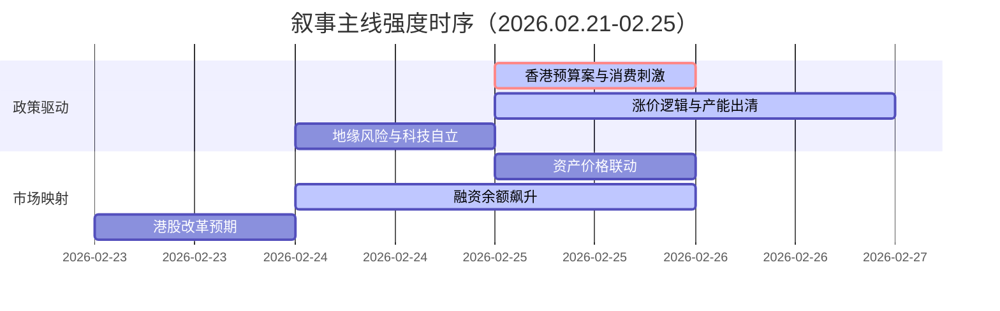

```markdown
## A股市场情绪分析报告

**数据时段**：最近5日  
**生成时间**：2025-05-21

---

### 🔥 宏观叙事焦点（24小时三级过滤）

#### 📌 叙事主线一：香港金融与产业政策系统性升级 ⭐⭐⭐
**主要事件**：香港财政预算案发布、内地消费刺激政策落地  
**筛选标签**：`国务院政策` `沪深300影响` `路透信源·权重2.0`  
**宏观逻辑**：  
> ① **归类**：区域性制度型开放+内需政策组合拳  
> ② **历史镜像**：2018年海南自贸区港政策模板（制度创新先行） + 2022年“稳增长”政策组合（信用宽松+消费补贴）  
> ③ **市场传导**：港股改革预期升温（南向资金流向分化）→ A股消费链估值修复 → 周期品涨价逻辑从 Property 转向 Policy  
> ④ **叙事强度**：多维度政策同频共振，打破“政策空窗期”市场共识  

**行业映射**：  
- 房地产链（上海公积金新政）：情绪评分 **7.2/10**  
- 香港本地金融/专业服务：情绪评分 **6.5/10**  
- 内需消费（汽车以旧换新）：情绪评分 **6.8/10**  

**交易警示**：‼️ 政策与信贷数据（融资余额+337亿）需形成共振，警惕“利好出尽”型冲高回落

---

#### 📌 叙事主线二：涨价逻辑全面爆发与产能出清加速 ⭐⭐  
**主要事件**：资源品涨价、关键矿物管制、半导体业绩分化  
**筛选标签**：`部委政策` `产业生命周期` `财新信源·权重1.5`  
**宏观逻辑**：  
> ① **归类**：供给侧改革2.0 + 地缘溢价输入  
> ② **历史镜像**：2016年煤炭钢铁去产能 + 2021年全球供应链危机  
> ③ **市场传导**：津巴布韦锂矿出口禁令 → 碳酸锂涨4% → 锂矿股涨停 → 扩散至磷化工、稀土、航运  
> ④ **叙事强度**：政策主动调控（防内卷）与地缘被动冲击（美伊、关键矿产定价权）双轮驱动  

**行业映射**：  
- 锂矿/磷化工/稀土：情绪评分 **8.5/10**  
- 航运（4天3板）：情绪评分 **7.8/10**  
- 半导体设备（业绩分化）：情绪评分 **5.5/10**  

**交易警示**：⚠️ 商品价格与股票情绪隐含波动率（VIX）背离，短期过热；关注龙头减产公告与期货持仓量变化

---

#### 📌 叙事主线三：地缘风险定价与科技自立叙事强化 ⭐  
**主要事件**：美伊冲突概率75%、德国访华深化合作、商业航天/AI突破  
**筛选标签**：`地缘政治` `债务周期` `新华社信源·权重1.5`  
**宏观逻辑**：  
> ① **归类**：风险资产波动率中枢上移 + 科技安全边际重估  
> ② **历史镜像**：2022年俄乌冲突初期（能源/粮食） + 2019年华为事件（科技国产替代）  
> ③ **市场传导**：美伊打击概率75% → 黄金突破5200 → 航运/农产品供应链溢价 → 国内商业航天/AI政策加码对冲  
> ④ **叙事强度**：风险资产（台股、韩股创新高）与避险资产（黄金）同步走强，流动性环境是关键  

**行业映射**：  
- 黄金/贵金属：情绪评分 **9.0/10**  
- 商业航天（朱雀三号）：情绪评分 **7.0/10**  
- AI算力/机器人：情绪评分 **6.5/10**  

**交易警示**：✓ 叙事逻辑清晰但强度依赖地缘升级；卫星发射失败或AI安全事件可能引发快速回调

---

### 📅 宏观叙事演化（三日趋势）

**强度衰减模型**：昨日主题×0.7 · 前日主题×0.5


```mermaid
gantt
    title 叙事主线强度时序（2026.02.21-02.25）
    dateFormat  YYYY-MM-DD
    section 政策驱动
    香港预算案与消费刺激   :crit, active, 2026-02-25, 1d
    涨价逻辑与产能出清     :active, 2026-02-25, 2d
    地缘风险与科技自立     :2026-02-24, 1d
    
    section 市场映射
    资产价格联动   :2026-02-25, 1d
    融资余额飙升   :active, 2026-02-24, 2d
    港股改革预期   :2026-02-23, 1d
```

**叙事节点关联**：
- **02/23**：沪深两市融资余额连续增加，显示杠杆资金前置布局
- **02/24**：香港预算案前瞻发酵，T+1、稳定币牌照、航天支持等政策叠加；德国总理默茨访华落地，中欧经贸缓和预期升温
- **02/25**：涨价题材全面爆发（磷化工、航运、稀土、锂矿）与地缘风险升级（美伊冲突75%概率）同步发生，黄金创历史新高；A股三大指数涨超1%，超3700股上涨，成交额达2.48万亿

---

🎯 宏观叙事三要素
1️⃣ **政策意图解码**  
顶层叙事呈现“内外兼顾”特征：对内强化“调结构”优先于“稳总量”（允许部分行业出清换取长期质量），对外通过香港平台构建“双循环”纽带（企业出海、人民币国际化）。政策工具从“总量宽松”转向“结构性精准滴灌”。

2️⃣ **市场定价偏差**  
- **过度定价**：A股涨价题材的持续性（短期情绪过热，期货贴水收窄）
- **定价不足**：产能出清的行政执行力（政策决心被低估）+ 地缘风险对供应链的长期损害（黄金仅反映部分溢价）

3️⃣ **跨市场共振**  
- 美债收益率高位震荡 → 美元指数走弱 → 人民币汇率升值（在岸收报6.8672） → 外资回流预期
- 亚太股市创新高（台、韩）与A股放量上涨形成区域风险偏好共振
- 流动性环境：央行6000亿MLF操作 + 融资余额+337亿 → 短期资金面支持结构性行情

---
```