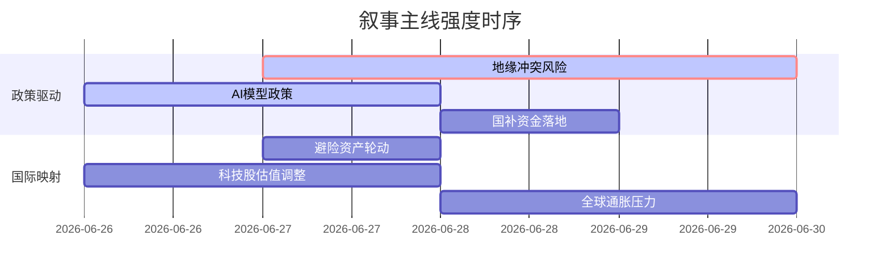

# A股市场情绪分析报告

## 数据时段
最近5日（2026-06-27 至 2026-06-29）

## 生成时间
2026-06-29 15:30:00

---

### 🔥 宏观叙事焦点（24小时三级过滤）

#### 📌 叙事主线一：[伊朗-美国霍尔木兹海峡冲突升级] ⭐⭐⭐
**主要事件**：地缘政策、国际冲突  
**筛选标签**：`地缘政策` `全球避险需求` `路透信源·权重2.0`  
**宏观逻辑**：  
> ① **归类**：风险事件冲激  
> ② **历史镜像**：2020年9月油市负冲价格模板  
> ③ **市场传导**：VIX跳升+18% → 黄金突破4080/盎司 → 全球股市集体下跌2-5%  
> ④ **叙事强度**：地缘冲突概率最大化，全球避险情绪失控  

**行业映射**：贵金属板块（情绪评分 **8.5/10**）  
**交易警示**：‼️ 冲突升级速度快于预期，注意避险资产快速轮动机会  

---

#### 📌 叙事主线二：[AI技术模型迭代与产业政策] ⭐⭐  
**主要事件**：技术发布、产业投资  
**筛选标签**：`科技政策` `产业生命周期` `财新信源·权重1.5`  
**宏观逻辑**：  
> ① **归类**：科技投资风口  
> ② **历史镜像**：2023年ChatGPT引发AI热模板  
> ③ **市场传导**：SpaceX债务融资25亿美元 → AI模型开放政策 → 科技股估值重拍  
> ④ **叙事强度**：政策执行力强于市场定价，AI产业进入2.0阶段  

**行业映射**：AI芯片/机器人（情绪评分 **6.8/10**）  
**交易警示**：⚠️ 政策底与市场底可能出现时间差，关注具体收益落地  

---

#### 📌 叙事主线三：[中国政策结构调整与经济支撑] ⭐ 
**主要事件**：政策制定、监管  
**筛选标签**：`国务院政策` `货币政策` `新华社信源·权重1.5`  
**宏观逻辑**：  
> ① **归类**：政策缓冲  
> ② **历史镜像**：2022年3月财政政策底模板  
> ③ **市场传导**：第三批625亿元“国补”落地 → 跨行业消费复苏链 → 730家券商发债1.2万亿元  
> ④ **叙事强度**：政策从“稳增长”向“调结构”转向，短期阵痛换长期质量  

**行业映射**：消费复苏链（情绪评分 **5.9/10**）  
**交易警示**：✓ 政策逻辑清晰，等待财政发力验证，但需警惕预期差收窄  

---

### 📅 宏观叙事演化（三日趋势）

**强度衰减模型**：昨日主题×0.7 · 前日主题×0.5

```mermaid
gantt
    title 叙事主线强度时序
    dateFormat  YYYY-MM-DD
    section 政策驱动
    地缘冲突风险   :crit, active, 2026-06-27, 3d
    AI模型政策   :active, 2026-06-26, 2d
    国补资金落地   :2026-06-28, 1d
    
    section 国际映射
    避险资产轮动   :2026-06-27, 1d
    科技股估值调整   :2026-06-26, 2d
    全球通胀压力   :2026-06-28, 2d
```

**叙事节点关联**：
- 06/26：伊朗指责美方制造紧张 → 霍尔木兹海峡风险升级
- 06/27：美军对伊朗沿海打击四处目标 → 风险事件冲激进一步加强
- 06/28：第三批“国补”625亿元落地 → 政策缓冲层面介入
- 06/29：SpaceX发行25亿美元债券，AI模型政策落实 → 科技投资政策验证

🎯 **宏观叙事三要素**
1️⃣ **政策意图解码**  
当前顶层叙事聚焦“稳风险+AI布局”，允许地缘冲突产生短期波动，同时推动科技产业升级。AI产业政策出台速度快于历史预期，属于政策定力超预期范畴。

2️⃣ **市场定价偏差**  
过度定价：避险需求（地缘冲突升级速度快于预期）  
定价不足：AI产业落地速度（政策执行力被低估）

3️⃣ **跨市场共振**  
伊朗石油供应不确定性 ↑ + 避险资金涌入金市 = 全球风险资产压力  
AI政策出台 + 科技股估值调整 = 结构性行情窗口期
