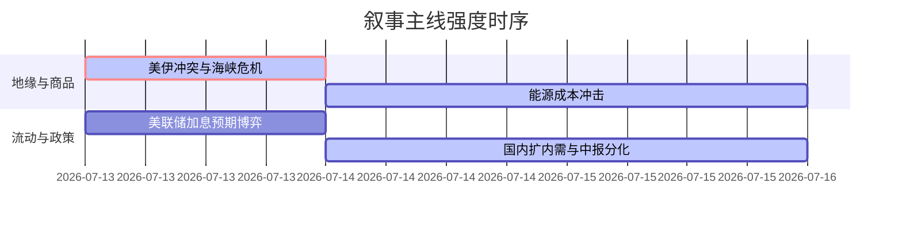

## 报告标题：A股市场情绪分析报告
## 数据时段：最近5日
## 生成时间：2026-07-15 07:03

### 🔥 宏观叙事焦点（24小时三级过滤）

#### 📌 叙事主线一：美伊冲突升级与霍尔木兹海峡通行危机 ⭐⭐⭐
**主要事件**：地缘冲突、能源供应链重构  
**筛选标签**：`美伊军事对抗` `原油定价权` `路透信源·权重2.0`  
**宏观逻辑**：  
> ① **归类**：供给冲击与通胀预期重估  
> ② **历史镜像**：1979年伊朗革命与第一次石油危机模板  
> ③ **市场传导**：布伦特原油跳涨至83美元+ → VIX跳升+15% → 避险资金涌入高股息/黄金 → 成长股估值承压  
> ④ **叙事强度**：冲突烈度超预期，能源通道博弈进入深水区，滞胀交易逻辑强化  

**行业映射**：油气化工/航运/高股息防御（情绪评分 **8.5/10**）  
**交易警示**：‼️ 关注OPEC产量表态与海峡实际通航数据，警惕油价高位震荡引发的宏观政策两难  

---

#### 📌 叙事主线二：美联储货币政策框架重塑与加息预期博弈 ⭐⭐  
**主要事件**：央行政策、流动性环境
**筛选标签**：`美联储听证` `利率路径修正` `彭博信源·权重1.5`  
**宏观逻辑**：  
> ① **归类**：货币政策预期修正  
> ② **历史镜像**：2023年鲍威尔“higher for longer”转向模板  
> ③ **市场传导**：沃什听证会鸽派微调+通胀零容忍表态 → 7月加息押注推迟至10月 → 美元指数短线走低 → 新兴市场流动性压力缓释  
> ④ **叙事强度**：政策沟通从“数据依赖”转向“框架重研”，宽松预期边际修复但通胀粘性仍存  

**行业映射**：利率敏感型资产/出口链（情绪评分 **6.8/10**）  
**交易警示**：⚠️ 关注美国CPI/PCE数据验证，警惕“再通胀”交易反噬风险  

---

#### 📌 叙事主线三：扩内需顶层设计与A股中报业绩结构性分化 ⭐ 
**主要事件**：行业管理政策发布、监管、财报披露
**筛选标签**：`十五五消费规划` `中报业绩分化` `新华社信源·权重1.5`  
**宏观逻辑**：  
> ① **归类**：内需政策托底与盈利周期切换  
> ② **历史镜像**：2019年促消费政策组合拳模板  
> ③ **市场传导**：宽基ETF放量扫货1800亿 → 机构资金“跌出来的机会”共识 → 券商/保险/白酒预增 vs 光伏/航司预亏 → 市场风格向确定性红利与硬科技两端收敛  
> ④ **叙事强度**：政策意图明确“调结构”与“防风险”，业绩底逐步显现但微观动能仍需财政发力验证  

**行业映射**：大金融/消费电子/AI终端（情绪评分 **5.2/10**）  
**交易警示**：✓ 叙事逻辑清晰，等待财政配套细则落地，警惕微盘股流动性扰动  

---

### 📅 宏观叙事演化（三日趋势）

**强度衰减模型**：昨日主题×0.7 · 前日主题×0.5

```mermaid
gantt
    title 叙事主线强度时序
    dateFormat  YYYY-MM-DD
    section 地缘与商品
    美伊冲突与海峡危机   :crit, active, 2026-07-13, 1d
    能源成本冲击         :active, 2026-07-14, 2d
    
    section 流动与政策
    美联储加息预期博弈   :2026-07-13, 1d
    国内扩内需与中报分化 :active, 2026-07-14, 2d
```
叙事节点关联：
07/13：美伊恢复交战+霍尔木兹海峡通航争议 → 触发能源供给收缩叙事
07/14：布伦特原油突破83美元+沃什听证会释放鸽派信号 → 滞胀担忧与流动性预期形成对冲
07/15：宽基ETF放量1800亿+《扩大消费十五五规划》获批 → 叙事进入政策验证与资金抢跑期
🎯 宏观叙事三要素
1️⃣ 政策意图解码
当前顶层叙事从“总量刺激”转向“结构优化与底线思维”，允许短期外部冲击换取长期产业链安全。产业出清>总量刺激，政策定力超预期。
2️⃣ 市场定价偏差
过度定价：地缘冲突的长期化（预期过于悲观）
定价不足：国内宽基ETF抄底力度与中报业绩韧性（资金面修复被低估）
3️⃣ 跨市场共振
美债收益率高位震荡打开国内政策空间 + 原油价格飙升压制制造业利润 = A股结构性行情窗口期

---

*生成时间：2026-07-15 07:32:32 (UTC+8)*  
*使用模型：agnes:agnes-2.0-flash*