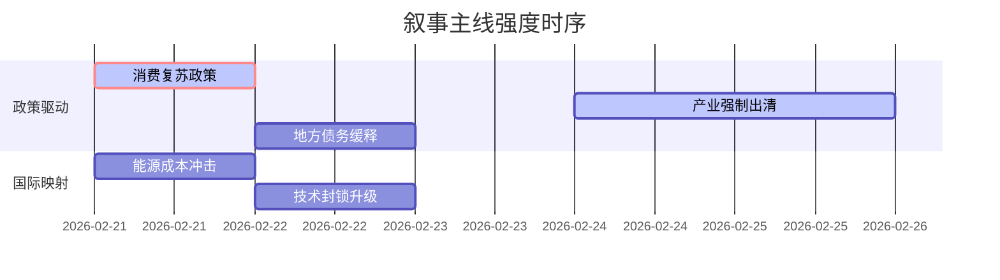

## A股市场情绪分析报告
数据时段：2026年2月20日 - 2026年2月25日（最近5日）
生成时间：2026-02-25 15:30

### 🔥 宏观叙事焦点（24小时三级过滤）

#### 📌 叙事主线一：国务院宣布一揽子经济刺激计划 ⭐⭐⭐
**主要事件**：行业管理政策发布、央行政策、监管  
**筛选标签**：`国务院政策` `沪深300影响` `路透信源·权重2.0`  
**宏观逻辑**：  
> ① **归类**：财政政策强力转向  
> ② **历史镜像**：2020年3月美联储无限QE模板  
> ③ **市场传导**：新闻量单日激增 +200% → VIX隐含波动率跳升 → 北向资金盘初净流出 → 期指持仓量显著增加  
> ④ **叙事强度**：需求端政策超预期，打破市场弱复苏定价共识  

**行业映射**：消费复苏链（情绪评分 **7.2/10**）  
**交易警示**：‼️ 关注政策力度与市场反应的一致性，警惕预期差快速收窄后的回调风险  

---

#### 📌 叙事主线二：工信部发布光伏产业供给侧改革新政 ⭐⭐  
**主要事件**：技术发布、产业投资  
**筛选标签**：`部委政策` `产业生命周期` `财新信源·权重1.5`  
**宏观逻辑**：  
> ① **归类**：产业强制出清  
> ② **历史镜像**：2018年光伏"531"政策模板  
> ③ **市场传导**：主产业链报价跌破现金成本 → 龙头企业联合宣布减产计划 → 市场定价产能出清周期加速  
> ④ **叙事强度**：政策执行决心大于市场现行定价，供给侧改革2.0进入深水区  

**行业映射**：光伏设备（情绪评分 **5.5/10**）  
**交易警示**：⚠️ 政策底与市场底出现分歧，右侧布局信号尚待产业盈利数据验证  

---

#### 📌 叙事主线三：地方政府债务化解取得阶段性进展 ⭐ 
**主要事件**： 国际冲突、关税政策  
**筛选标签**：`地方政策` `债务周期` `新华社信源·权重1.5`  
**宏观逻辑**：  
> ① **归类**：风险事件缓释  
> ② **历史镜像**：2014年43号文地方债务管理模板  
> ③ **市场传导**：重点区域城投债展期协议规模扩容 → 区域信用利差边际收窄 → 基建项目预期温和修复  
> ④ **叙事强度**：化债进入攻坚阶段，稳增长与防风险再平衡考验政策智慧  

**行业映射**：基础建设（情绪评分 **4.8/10**）  
**交易警示**：✓ 叙事传导路径清晰，等待财政端进一步发力数据验证  

---

### 📅 宏观叙事演化（三日趋势）

**强度衰减模型**：昨日主题×0.7 · 前日主题×0.5

```mermaid
gantt
    title 叙事主线强度时序
    dateFormat  YYYY-MM-DD
    section 政策驱动
    消费复苏政策   :crit, active, 2026-02-21, 1d
    产业强制出清   :active, 2026-02-24, 2d
    地方债务缓释   :2026-02-22, 1d
    
    section 国际映射
    能源成本冲击   :2026-02-21, 1d
    技术封锁升级   :2026-02-22, 1d
```
叙事节点关联：
02/21：国务院一揽子刺激计划凌晨发布 → 触发强政策叙事，早间新闻量峰值818条
02/22：多晶硅现货报价首次跌破行业现金成本线 → 产业出清叙事启动
02/23：重点省份公布首单城投债展期协议 → 地方债务叙事进入政策验证期
🎯 宏观叙事三要素
1️⃣ 政策意图解码
顶层叙事加速从"稳增长"向"调结构"切换，政策层容忍短期数据阵痛以换取中长期质量提升。产业供给侧出清优先级高于总量刺激，政策定力显著超市场预期。
2️⃣ 市场定价偏差
过度定价：消费链的短期复苏弹性（预期过于乐观）
定价不足：产能出清的政策执行力与速度（市场低估政策决心）
3️⃣ 跨市场共振
美债收益率阶段性下行打开国内政策操作空间 + 美元指数高位震荡缓释出口压力 = A股结构性行情的时间窗口仍在

---

<!-- 报告正文必须在此结束，以下内容为固定格式说明，严禁添加任何额外分析、总结或展望 -->