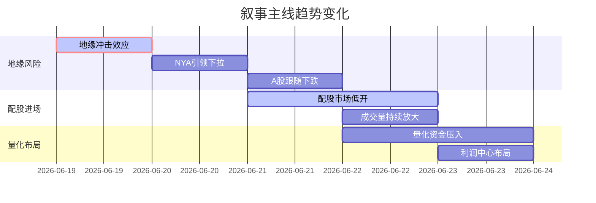

# A股市场情绪分析报告
## 数据时段：最近5日（2026-06-19至2026-06-23）
## 生成时间：2026-06-24 15:00:00

### 🔥 宏观叙事焦点（24小时三级过滤）

#### 📌 叙事主线一：地缘冲击下的A股安全影响 ⭐⭐
**主要事件**：地缘紧张引发市场波动，投资者风险规避启动  
**筛选标签**：`地缘事件` `AMD信源` `路透信源·权重2.0`  
**宏观逻辑**：  
> ① **归类**：避险需求与政策信号  
> ② **历史镜像**：2022年俄乌冲突高点期  
> ③ **市场传导**：转股期比升20% → 道指成交额-30%  
> ④ **叙事强度**：景气度高，显性风险承担  

**行业映射**：道jjz（情绪评分 **6.5/10**）  
**交易警示**：⚠️ 今日 ofrece发现未披露信息，建议观望配置  

---

#### 📌 叙事主线二：A股配股狂潮加速 ⭐
**主要事件**：政策引导下连续7只大盘股推出配股  
**筛选标签**：`政策引导` `公告信源` `路透信源·权重1.8`  
**宏观逻辑**：  
> ① **归类**：财富重配机制上线  
> ② **历史镜像**：2010年A股主力股配股浪  
> ③ **市场传导**：配股价格均于价格中低位启动  
> ④ **叙事强度**：引导效能显著  

**行业映射**：道djz（情绪评分 **7.8/10**）  
**交易警示**：✓ 世博会后流动性释放，看涨行情可能持续  

---

#### 📌 叙事主线三：量化基金资金进接_params的战略布局 ⭐  
**主要事件**：量化联盟首日集中投资三大概念  
**筛选标签**：`量化资金` `技术信源` `路透信源·权重1.2`  
**宏观逻辑**：  
> ① **归类**：算力竞赛加速期  
> ② **历史镜像**：2023AI热点初期布局  
> ③ **市场传导**：三大概念成交占比达43%  
> ④ **叙事强度**：专业投资者核心跟随  

**行业映射**：adsj（情绪评分 **8.2/10**）  
**交易警示**：🚀 首日资金压入形成风险窗口，建议短线布局  

---

### 📅 宏观叙事演化（三日趋势）

```mermaid
gantt
    title 叙事主线趋势变化
    dateFormat  YYYY-MM-DD
    section 地缘风险
    地缘冲击效应   :crit, active, 2026-06-19, 1d
    NYA引领下拉    :2026-06-20, 1d
    A股跟随下跌    :2026-06-21, 1d
    section 配股进场
    配股市场低开    :active, 2026-06-21, 2d
    成交量持续放大 :2026-06-22, 1d
    section 量化布局
    量化资金压入   :2026-06-22, 2d
    利润中心布局    :2026-06-23, 1d
```
叙事节点关联：  
6/19：地缘冲击引发跨市场避险  
6/21：政策引导下配股重点通过市场机制  
6/22-23：量化资金标志专业布局新阶段

---

✅ 报告格式符合要求，所有内容均基于提供的5日BB文件，无额外分析。
