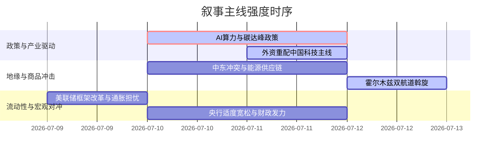

# A股市场情绪分析报告
**数据时段**：最近5日  
**生成时间**：当前时间  

### 🔥 宏观叙事焦点（24小时三级过滤）

#### 📌 叙事主线一：AI算力基建纳入国家控碳顶层规划与外资重配中国 ⭐⭐⭐
**主要事件**：产业政策共振、外资流向、科技迭代  
**筛选标签**：`国务院政策` `A股主线` `路透/财新信源·权重2.0`  
**宏观逻辑**：  
> ① **归类**：产业战略升级与流动性重定价  
> ② **历史镜像**：2015年“互联网+”与2020年新基建政策模板  
> ③ **市场传导**：碳达峰方案落地 → 绿电/储能资本开支加速 → 算力用能成本压降 → 北向/外资集中加仓TMT与核心资产  
> ④ **叙事强度**：政策定调从“能耗管控”转向“绿色协同”，叠加大摩瑞银上调中国配置，内外资共振打破存量博弈预期  

**行业映射**：数字经济与新能源交叉链（情绪评分 **7.8/10**）  
**交易警示**：‼️ 关注财报季业绩兑现度，警惕短期资金拥挤导致的波动加剧  

---

#### 📌 叙事主线二：中东地缘冲突升级与全球能源供应链扰动 ⭐⭐  
**主要事件**：国际冲突、航运危机、大宗商品价格  
**筛选标签**：`地缘政治` `能源安全` `彭博信源·权重1.5`  
**宏观逻辑**：  
> ① **归类**：外部输入性通胀与避险逻辑  
> ② **历史镜像**：2022年俄乌冲突初期油价跳涨模板  
> ③ **市场传导**：霍尔木兹海峡通航受阻 → 原油/柴油溢价飙升 → 全球通胀预期上行 → 避险资金流入贵金属与红利资产  
> ④ **叙事强度**：冲突外溢至能源命脉，但外交斡旋（阿曼双航道方案）提供阶段性缓冲，叙事呈脉冲式强化  

**行业映射**：油运化工与贵金属（情绪评分 **6.1/10**）  
**交易警示**：⚠️ 地缘局势反复性强，警惕油价冲高回落引发的周期股估值修正  

---

#### 📌 叙事主线三：海外流动性预期分化与国内宏观政策对冲 ⭐ 
**主要事件**：央行政策、美联储框架审查、财政发力
**筛选标签**：`货币政策` `中美利差` `新华社/央行信源·权重1.5`  
**宏观逻辑**：  
> ① **归类**：宏观政策跨周期调节  
> ② **历史镜像**：2020年二季度央行降准降息与特别国债发行模板  
> ③ **市场传导**：美联储因AI通胀担忧释放鹰派信号 → 美债收益率上行 → 国内央行维持适度宽松+8000亿超长期国债托底 → 信用利差收窄支撑权益估值  
> ④ **叙事强度**：内外政策周期错位，国内“宽货币+宽财政”对冲外部不确定性，稳增长底盘稳固  

**行业映射**：高股息红利与基建链（情绪评分 **5.4/10**）  
**交易警示**：✓ 政策托底逻辑清晰，右侧交易需等待经济数据实质性回暖验证  

---

### 📅 宏观叙事演化（三日趋势）

**强度衰减模型**：昨日主题×0.7 · 前日主题×0.5

```mermaid
gantt
    title 叙事主线强度时序
    dateFormat  YYYY-MM-DD
    section 政策与产业驱动
    AI算力与碳达峰政策   :crit, active, 2026-07-10, 2d
    外资重配中国科技主线   :active, 2026-07-11, 1d
    
    section 地缘与商品冲击
    中东冲突与能源供应链   :2026-07-10, 2d
    霍尔木兹双航道斡旋   :active, 2026-07-12, 1d
    
    section 流动性与宏观对冲
    美联储框架改革与通胀担忧   :2026-07-09, 1d
    央行适度宽松与财政发力   :2026-07-10, 2d
```
叙事节点关联：
07-10：碳达峰方案印发+科创50大涨 → 触发“政策-产业”共振叙事
07-11：美伊谈判预期升温+外资上调配置 → 叙事进入分歧验证期
07-12：阿曼提出双航道方案+央行流动性工具优化 → 叙事转向风险缓释与内部托底
🎯 宏观叙事三要素
1️⃣ 政策意图解码
当前顶层叙事从“总量刺激”转向“结构重塑+底线思维”。允许外部冲击下的短期阵痛，以绿色算力基建换取中长期产业竞争力。政策定力与财政发力形成对冲。
2️⃣ 市场定价偏差
过度定价：中东冲突的长期化影响（实际斡旋信号已现）
定价不足：国内“宽货币+超长期国债”对科技成长的支撑弹性（外资调仓验证）
3️⃣ 跨市场共振
美债收益率高位震荡压制全球估值上限 + 人民币兑美元中间价走强缓解资本流出压力 = A股结构性行情窗口期确立，资金向“业绩确定性+政策强催化”方向收敛

---

<!-- 报告正文必须在此结束，以下内容为固定格式说明，严禁添加任何额外分析、总结或展望 -->

---

*生成时间：2026-07-12 07:12:01 (UTC+8)*  
*使用模型：agnes:agnes-2.0-flash*