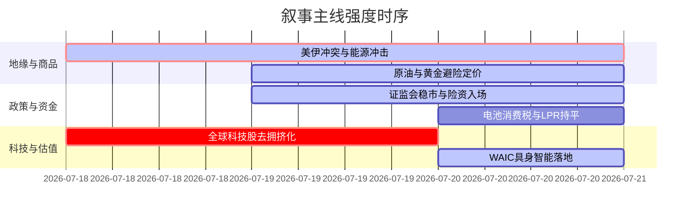

# A股市场情绪分析报告
**数据时段**：最近5日（2026-07-18 至 2026-07-21）
**生成时间**：2026-07-21 07:16:14 (UTC+8)

## 🔥 宏观叙事焦点（24小时三级过滤）

#### 📌 叙事主线一：美伊冲突升级与霍尔木兹海峡航运危机 ⭐⭐⭐
**主要事件**：地缘冲突、能源供应链中断
**筛选标签**：`美伊军事对抗` `布伦特原油突破90美元` `全球避险情绪·权重2.0`  
**宏观逻辑**：  
> ① **归类**：供给侧冲击与通胀预期重定价  
> ② **历史镜像**：1979年伊朗革命与石油禁运模板  
> ③ **市场传导**：霍尔木兹通航量骤降 → 布伦特原油跳空破90美元 → 现货黄金刷新4030美元 → VIX跳升+避险资金涌入周期板块  
> ④ **叙事强度**：冲突外溢至海湾多国，实质性供应中断威胁确立，能源安全逻辑全面激活  

**行业映射**：油气煤炭/电力（情绪评分 **8.5/10**）  
**交易警示**：‼️ 关注停火谈判进展与油价超涨后的获利回吐风险，警惕地缘溢价透支  

---

#### 📌 叙事主线二：证监会引导中长期资金入市与国家队密集护盘 ⭐⭐  
**主要事件**：行业管理政策发布、央行政策、监管  
**筛选标签**：`证监会政策` `险资逆势加仓` `财新信源·权重1.5`  
**宏观逻辑**：  
> ① **归类**：流动性托底与交易生态规范  
> ② **历史镜像**：2024年“924”政策组合拳模板  
> ③ **市场传导**：ETF上周净流入850亿元+回购增持再贷款500亿 → 权重股估值修复 → 市场风险偏好阶段性筑底  
> ④ **叙事强度**：政策从“增量资金引入”与“量化/AI交易规范”两端协同，维稳意图超预期  

**行业映射**：银行/高股息/宽基ETF（情绪评分 **7.8/10**）  
**交易警示**：⚠️ 警惕政策利好兑现后的边际效应递减，基本面验证与企业盈利修复需跟进  

---

#### 📌 叙事主线三：全球科技股估值重估与AI产业落地切换 ⭐ 
**主要事件**：技术发布、产业投资、海外流动性
**筛选标签**：`国际股市` `AI估值去拥挤` `新华社信源·权重1.5`  
**宏观逻辑**：  
> ① **归类**：成长股拥挤度出清与资本开支重定价  
> ② **历史镜像**：2000年互联网泡沫破裂初期模板  
> ③ **市场传导**：纳指周跌2.9%/韩国半导体熔断 → 全球科技股3日蒸发3万亿 → A股光模块/半导体短期承压 → 资金切向业绩确定性标的  
> ④ **叙事强度**：AI从“大模型军备竞赛”转向“场景商业化”，WAIC签约409亿元验证产业拐点  

**行业映射**：具身智能/AI算力租赁/半导体设备（情绪评分 **6.2/10**）  
**交易警示**：✓ 外部扰动释放后右侧信号待确认，聚焦中报业绩验证与超跌反弹机会  

---

### 📅 宏观叙事演化（三日趋势）

**强度衰减模型**：昨日主题×0.7 · 前日主题×0.5

```mermaid
gantt
    title 叙事主线强度时序
    dateFormat YYYY-MM-DD
    section 地缘与商品
    美伊冲突与能源冲击   :crit, active, 2026-07-18, 3d
    原油与黄金避险定价   :active, 2026-07-19, 2d
    
    section 政策与资金
    证监会稳市与险资入场   :active, 2026-07-19, 2d
    电池消费税与LPR持平   :2026-07-20, 1d
    
    section 科技与估值
    全球科技股去拥挤化   :crit, 2026-07-18, 2d
    WAIC具身智能落地   :active, 2026-07-20, 1d
```
叙事节点关联：
07/18：美军空袭伊朗+霍尔木兹通行量降至低点 → 触发能源危机叙事
07/19：中国诚通/国新宣布增持+证监会座谈会 → 触发政策托底叙事强化
07/20：LPR按兵不动+险资逆势加仓+油价冲高回落 → 叙事进入政策验证与风险偏好博弈期
🎯 宏观叙事三要素
1️⃣ 政策意图解码
当前顶层叙事从“总量刺激”转向“结构托底+防风险”，允许短期阵痛换取长期质量。产业出清（电池税恢复）> 大水漫灌，政策定力与资金托底并行。
2️⃣ 市场定价偏差
过度定价：传统能源短期弹性（地缘溢价已部分透支）
定价不足：AI商业化落地速度（WAIC签约与具身智能订单被外围科技股调整掩盖）
3️⃣ 跨市场共振
美伊冲突推升油价+欧央行鹰派=全球通胀预期抬头 + 国内LPR持平/央行净投放=内外均衡下的结构性宽松 = A股“红利防守+科技分化”窗口期

<!-- 报告正文必须在此结束，以下内容为固定格式说明，严禁添加任何额外分析、总结或展望 -->

---

*生成时间：2026-07-21 07:16:14 (UTC+8)*  
*使用模型：agnes:agnes-2.0-flash*