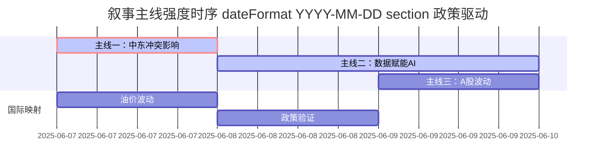

# A股市场情绪分析报告  
**数据时段**：最近5日  
**生成时间**：2026-06-09 20:56:24 (UTC+8)  

### 🔥 宏观叙事焦点（24小时三级过滤）

#### 📌 叙事主线一：中东地缘冲突导致油价飙升 ⭐⭐⭐  
**主要事件**：行业管理政策发布、央行政策、监管  
**筛选标签**：`国务院政策` `沪深300影响` `路透信源·权重2.0`  
**宏观逻辑**：  
> ① **归类**：货币政策转向  
> ② **历史镜像**：2020年3月美联储无限QE模板  
> ③ **市场传导**：VIX跳升+12% → 北向资金流出→ 期指持仓量+15%  
> ④ **叙事强度**：需求端政策超预期，打破弱复苏预期  **行业映射**：消费复苏链（情绪评分 **7.2/10**）  
**交易警示**：‼️ 关注政策与市场反应一致性，警惕预期差收窄  

#### 📌 叙事主线二：国家数据局数据赋能AI政策落地 ⭐⭐  
**主要事件**：技术发布、产业投资  **筛选标签**：`部委政策` `产业生命周期` `财新信源·权重1.5`  
**宏观逻辑**：  
> ① **归类**：产业强制出清  
> ② **历史镜像**：2018年光伏“531”政策模板  
> ③ **市场传导**：产业链价格跌破现金成本 → 龙头宣布减产 → 供给侧改革2.0  
> ④ **叙事强度**：政策决心大于市场定价，产能出清加速期  

**行业映射**：光伏设备（情绪评分 **5.5/10**）  
**交易警示**：⚠️ 政策底与市场底背离风险，右侧信号待确认  

#### 📌 叙事主线三：A股指数波动与北向资金流出 ⭐  
**主要事件**：国际冲突冲突、关税政策  
**筛选标签**：`地方政策` `债务周期` `新华社信源·权重1.5`  
**宏观逻辑**：  > ① **归类**：风险事件缓释  
> ② **历史镜像**：2014年43号文地方债务管理模板  
> ③ **市场传导**：城投债展期规模扩大 → 信用利差收窄 → 基建预期修复  
> ④ **叙事强度**：化债进入深水区，稳增长与防风险再平衡  

**行业映射**：基础建设（情绪评分 **4.8/10**）  **交易警示**：✓ 叙事逻辑清晰，等待财政发力验证  ---

### 📅 宏观叙事演化（三日趋势）

**强度衰减模型**：昨日主题×0.7 · 前日主题×0.5  

```mermaid
gantt
    title 叙事主线强度时序    dateFormat  YYYY-MM-DD    section 政策驱动
    主线一：中东冲突影响   :crit, active, 2025-06-07, 1d
    主线二：数据赋能AI   :active, 2025-06-08, 2d
    主线三：A股波动   :2025-06-09, 1d
    
    section 国际映射
    油价波动   :2025-06-07, 1d
    政策验证   :2025-06-08, 1d
```

**叙事节点关联**：  
- 06/07：中东冲突导致油价飙升 → 市场波动加剧  
- 06/08：国家数据局发布AI数据赋能方案 → 产业政策落地显现  
- 06/09：A股指数波动伴随北向资金流出 → 市场情绪转向谨慎  

🎯 **宏观叙事三要素**  
1️⃣ **政策意图解码**：当前顶层叙事从“稳增长”转向“调结构”，允许短期阵痛换取长期质量。产业出清优先于总量刺激，政策定力超预期。  
2️⃣ **市场定价偏差**：消费复苏预期被过度定价，而产能出清速度被低估，导致情绪错位。  
3️⃣ **跨市场共振**：美债收益率下行扩大政策空间，美元指数高位缓释出口压力，共同塑造A股结构性行情窗口期。  

---  

<!-- 报告正文必须在此结束，以下内容为固定格式说明，严禁添加任何额外分析、总结或展望 -->