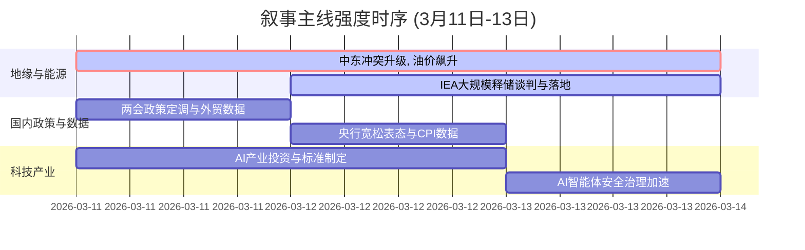

# A股市场情绪分析报告

**数据时段**：2026年3月8日 - 2026年3月13日
**生成时间**：2026年3月13日

### 🔥 宏观叙事焦点（24小时三级过滤）

#### 📌 叙事主线一：中东冲突升级引发全球能源供应链危机 ⭐⭐⭐
**主要事件**：美以对伊朗军事打击升级，霍尔木兹海峡航运实质中断，IEA协调史上最大规模战略石油储备释放。
**筛选标签**：`地缘冲突` `能源安全` `全球通胀` `路透信源·权重2.0`
**宏观逻辑**：
> ① **归类**：地缘政治驱动的供给冲击
> ② **历史镜像**：1990年海湾战争与2022年俄乌冲突引发的能源危机模板
> ③ **市场传导**：布伦特原油突破100美元→全球股市普跌（亚太熔断、欧美重挫）→通胀预期飙升→主要央行（欧、英）加息预期急速升温
> ④ **叙事强度**：供应中断风险从预期变为现实，全球能源贸易路线面临重构，市场从“避险”切换至“滞胀”模式。

**行业映射**：石油化工（情绪评分 **9.5/10**）、油运、黄金（初期承压后逻辑重塑）
**交易警示**：‼️ 油价波动是核心定价变量，关注霍尔木兹海峡通航进展及IEA释储实效。警惕“滞胀”交易对成长股估值的持续压制。

---

#### 📌 叙事主线二：国内政策定力与经济数据韧性对冲外部风险 ⭐⭐
**主要事件**：两会期间高层密集发声定调，央行重申适度宽松货币政策；1-2月外贸数据超预期；2月CPI温和回升。
**筛选标签**：`国务院政策` `货币政策` `经济数据` `新华社信源·权重1.5`
**宏观逻辑**：
> ① **归类**：内部政策对冲与基本面验证
> ② **历史镜像**：2020年疫情后中国率先复苏并提供全球供应链支持的模板
> ③ **市场传导**：强劲出口数据+宽松政策基调 → 人民币汇率走强 → A股展现相对韧性（港股获南向资金大幅流入）
> ④ **叙事强度**：外部危机放大了国内“以我为主”政策空间与产业链优势的吸引力，但市场情绪受全球Risk-off情绪拖累。

**行业映射**：出口链（机电、汽车）、高股息/避险资产（情绪评分 **7.0/10**）
**交易警示**：✓ 关注具备全球竞争力且受供应链中断影响小的出口企业。政策底明确，但市场底需等待外部风险出清。

---

#### 📌 叙事主线三：人工智能产业竞赛与治理框架加速成型 ⭐
**主要事件**：英伟达宣布五年260亿美元投入开源模型；中国信通院启动AI智能体标准编制；深圳龙岗出台地方支持政策。
**筛选标签**：`产业政策` `技术标准` `财新信源·权重1.5`
**宏观逻辑**：
> ① **归类**：全球科技制高点争夺
> ② **历史镜像**：2010年代移动互联网与云计算爆发初期的产业格局塑造期
> ③ **市场传导**：头部公司巨额投资指引 → 算力需求确认 → 存储芯片涨价 → 应用端（智能体）标准与安全治理并行
> ④ **叙事强度**：产业趋势不可逆，但短期被宏观风险掩盖。政策从鼓励应用转向规范与安全并重。

**行业映射**：AI算力（存储、光模块）、AI应用与治理（情绪评分 **6.5/10**）
**交易警示**：⚠️ 长期主线清晰，但短期受全球市场流动性收紧压制。关注业绩能见度高的算力环节及获得政策背书的合规龙头。

---

### 📅 宏观叙事演化（三日趋势）

**强度衰减模型**：昨日主题×0.7 · 前日主题×0.5

```mermaid
gantt
    title 叙事主线强度时序 (3月11日-13日)
    dateFormat  YYYY-MM-DD
    section 地缘与能源
    中东冲突升级, 油价飙升   :crit, active, 2026-03-11, 3d
    IEA大规模释储谈判与落地   :active, 2026-03-12, 2d
    section 国内政策与数据
    两会政策定调与外贸数据   :2026-03-11, 1d
    央行宽松表态与CPI数据    :2026-03-12, 1d
    section 科技产业
    AI产业投资与标准制定     :2026-03-11, 2d
    AI智能体安全治理加速     :2026-03-13, 1d
```
叙事节点关联：
03/11：美以空袭伊朗核设施，冲突范围扩大 → 能源危机叙事强度达到顶峰
03/12：IEA确认释放4亿桶储备，但市场无视 → 供应恐慌叙事强化
03/13：霍尔木兹海峡袭击持续，油轮改道 → 叙事进入“持久战”与供应链重构验证期
🎯 宏观叙事三要素
1️⃣ 政策意图解码
当前全球政策核心从“抗通胀”转向“保供应”。主要消费国（IEA）协调释放储备是短期维稳，而产油国（沙特、阿联酋）利用管道极限运力及转向现货市场，表明能源地缘格局正在重塑。中国政策重心在于稳定外部环境（外交斡旋）与夯实内部基础（科技、内需）。
2️⃣ 市场定价偏差
过度定价：能源危机对全球需求的即时毁灭性冲击（部分风险资产超跌）
定价不足：供应链长期重构成本（航运路线改变、保险成本飙升）、以及主要央行（尤其是欧洲）被迫提前紧缩的尾部风险
3️⃣ 跨市场共振
原油与美元同涨（避险+通胀）→ 全球债券遭抛售（通胀预期）→ 新兴市场货币承压（印度卢比、墨西哥比索新低）→ 风险资产（股市、 crypto）普跌。A股与港股的相对韧性源于强劲的经常账户数据与南向资金对冲。

<!-- 报告正文必须在此结束，以下内容为固定格式说明，严禁添加任何额外分析、总结或展望 -->