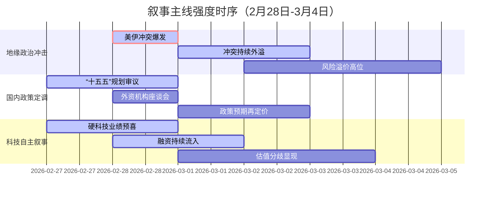

## A股市场情绪分析报告

**报告标题**：A股市场情绪分析报告  
**数据时段**：最近5日（2026年2月27日 - 2026年3月4日）  
**生成时间**：2026年3月4日  

---

### 🔥 宏观叙事焦点（24小时三级过滤）

#### 📌 叙事主线一：美伊冲突升级引爆全球能源供应链危机 ⭐⭐⭐
**主要事件**：地缘军事冲突、能源价格剧烈波动、全球航运中断  
**筛选标签**：`地缘黑天鹅` `能源安全` `全球避险`  
**宏观逻辑**：  
> ① **归类**：地缘政治黑天鹅事件  
> ② **历史镜像**：2022年2月俄乌冲突模板——能源价格脉冲式上涨、全球风险资产抛售、供应链担忧重燃  
> ③ **市场传导**：霍尔木兹海峡航运受阻 → 布伦特原油单日涨超9%突破85美元 → 全球股市普跌（日韩指数单日跌超3%-7%）→ A股油气板块逆势涨停，“三桶油”连续两日涨停  
> ④ **叙事强度**：短期冲击极大（VIX跳升、资金涌入避险资产），但冲突持续时间与范围高度不确定，市场存在“预期差透支”风险  

**行业映射**：油气开采（情绪评分 **9.2/10**）、航运物流（**7.5/10**）、国防军工（**6.8/10**）  
**交易警示**：‼️ 油价波动剧烈，地缘溢价随时可能逆转；注意政策干预（如美国SPR释放）及外交缓和信号  

---

#### 📌 叙事主线二：“十五五”规划定调与稳增长政策再平衡 ⭐⭐  
**主要事件**：中央政治局会议部署“十五五”规划，证监会召开外资机构座谈会，多部委集中释放政策信号  
**筛选标签**：`国务院政策` `沪深300影响` `政策定调`  
**宏观逻辑**：  
> ① **归类**：中长期政策框架确立  
> ② **历史镜像**：2020年“十四五”开局政策组合——积极财政+稳健货币+科技自立  
> ③ **市场传导**：政治局会议强调“新质生产力”与“防范风险” → 机构中长期信心修复 → 但短期被地缘冲突压制，A股仅结构性响应（政策主题ETF放量）  
> ④ **叙事强度**：需求端政策力度符合预期，但市场期待更明确的“增量工具”，政策底与市场底存在背离  

**行业映射**：新质生产力/科技自立（情绪评分 **7.5/10**）、基建/建材（**6.8/10**）、消费复苏链（**6.5/10**）  
**交易警示**：⚠️ 两会前政策空窗期，市场对“十五五”细则的定价可能过早；关注3月4日政协新闻发布会线索  

---

#### 📌 叙事主线三：科技自主突破与AI产业化加速 ⭐  
**主要事件**：AI芯片企业业绩集体爆发、人形机器人获大基金投资、国产算力需求上升  
**筛选标签**：`产业强制出清` `科技自立` `财新信源·权重1.5`  
**宏观逻辑**：  
> ① **归类**：产业升级与自主可控  
> ② **历史镜像**：2018年中美贸易战后的半导体国产化浪潮  
> ③ **市场传导**：寒武纪/摩尔线程业绩大幅预增 → 杠杆资金回流电子板块（融资净买入额居首） → 但估值已高，市场分歧显现（英伟达合作 vs 算力租赁回调）  
> ④ **叙事强度**：产业趋势明确，但二级市场短期涨幅过大，面临业绩验证与资金轮动压力  

**行业映射**：半导体设备/材料（情绪评分 **8.0/10**）、AI算力与应用（**7.8/10**）、机器人/具身智能（**7.5/10**）  
**交易警示**：✓ 业绩兑现期，警惕估值泡沫；关注订单持续性及毛利率变化  

---

### 📅 宏观叙事演化（三日趋势）

**强度衰减模型**：昨日主题×0.7 · 前日主题×0.5

```mermaid
gantt
    title 叙事主线强度时序（2月28日-3月4日）
    dateFormat  YYYY-MM-DD
    section 地缘政治冲击
    美伊冲突爆发   :crit, active, 2026-02-28, 1d
    冲突持续外溢   :active, 2026-03-01, 2d
    风险溢价高位   :2026-03-02, 3d
    
    section 国内政策定调
    “十五五”规划审议  :active, 2026-02-27, 2d
    外资机构座谈会   :2026-02-28, 1d
    政策预期再定价   :2026-03-01, 2d
    
    section 科技自主叙事
    硬科技业绩预喜  :active, 2026-02-27, 2d
    融资持续流入   :active, 2026-02-28, 2d
    估值分歧显现   :2026-03-01, 3d
```

**叙事节点关联**：  
- **2/27**：政治局会议审议“十五五”规划草案，政策主线确立；寒武纪等硬科技业绩预喜带动融资资金回流  
- **2/28**：美以联合空袭伊朗，地缘叙事瞬间主导；油价跳涨、全球股市重挫，A股油气板块逆势涨停  
- **3/1-3/2**：冲突持续，霍尔木兹海峡航运受阻；A股“三桶油”连续两日涨停，但全市场超4800只个股下跌，地缘虹吸效应显著  
- **3/3-3/4**：外交斡旋重启，伊朗核问题重回谈判轨道；地缘叙事强度边际递减，政策与科技主线重新被定价  

---

🎯 **宏观叙事三要素**  
1️⃣ **政策意图解码**  
   顶层叙事从“稳增长”转向“调结构+高水平自立”，允许短期阵痛换取长期质量。产业出清 > 总量刺激，政策定力超预期。十五五规划重心在新质生产力、科技安全与能源自主。

2️⃣ **市场定价偏差**  
   - **过度定价**：地缘冲突持续时间与油价上行空间（市场计入“长期封锁”极端情景）  
   - **定价不足**：产能出清速度（政策执行力被低估）、国产算力需求持续性（AI商业化进度）

3️⃣ **跨市场共振**  
   - **外部环境**：美联储降息预期推迟、美元指数走强 → 人民币汇率承压 → 限制国内货币政策空间  
   - **内部条件**：央行2月净投放流动性2295亿元，保持合理充裕；地缘风险倒逼能源、半导体国产化加速 → A股结构性行情窗口期  
   - **资金流向**：南向资金持续流入港股高股息资产，北向资金小幅波动，两融余额回升显示杠杆资金偏好科技与能源主题  

<!-- 报告正文必须在此结束，以下内容为固定格式说明，严禁添加任何额外分析、总结或展望 -->