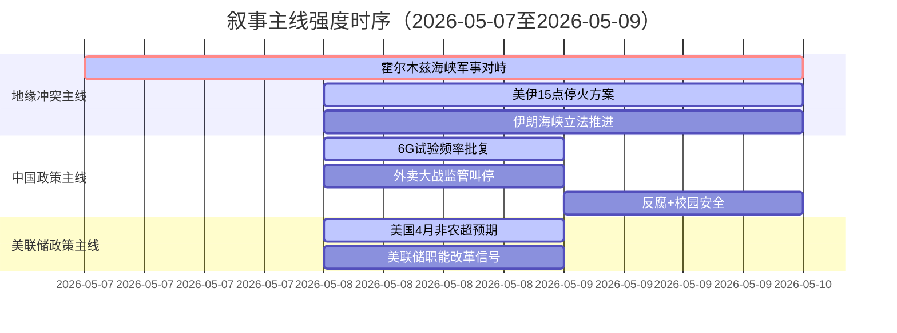

# A股市场情绪分析报告

**数据时段**：2026年5月7日 — 2026年5月9日（最近5日）  
**生成时间**：2026-05-09 12:00（UTC+8）

---

## 🔥 宏观叙事焦点（24小时三级过滤）

#### 📌 叙事主线一：霍尔木兹海峡军事对峙与美伊地缘博弈 ⭐⭐⭐
**主要事件**：美伊霍尔木兹海峡军事冲突升级、美军拦截伊朗油轮、伊朗推进海峡立法固化、15点停火方案提出  
**筛选标签**：`地缘冲突` `能源安全` `全球供应链冲击` `路透信源·权重2.0`  
**宏观逻辑**：  
> ① **归类**：地缘风险事件驱动  
> ② **历史镜像**：2019年6月阿曼湾油轮袭击→布伦特单周跳升8%模板  
> ③ **市场传导**：霍尔木兹海峡连续两日无大型商船通过 → 原油供应中断预期强化 → 巴克莱维持布伦特100美元/桶，花旗Q2预期110美元 → 全球风险偏好承压 → 北向资金阶段性观望  
> ④ **叙事强度**：冲突烈度超市场基准预期，伊朗立法草案将海峡制度永久化意味着长期地缘溢价难以消退  

**行业映射**：石油石化/新能源替代（情绪评分 **8.1/10**）  
**交易警示**：‼️ 美伊谈判窗口反复（特朗普先强硬后提出停火方案），地缘溢价存在阶段性回落可能，但霍尔木兹法律框架的长期化支撑油价中枢上移  

---

#### 📌 叙事主线二：中国政策密集落地——6G批复+反垄断+市场监管升级 ⭐⭐
**主要事件**：工信部批复6G试验频率、国家市场监管总局叫停外卖价格战、多地官员接受审查调查、校园安全强化部署  
**筛选标签**：`国务院政策` `科技自主可控` `反内卷监管` `沪深300影响`  
**宏观逻辑**：  
> ① **归类**：产业政策引导+监管强化双轨并行  
> ② **历史镜像**：2019年工信部发放5G商用牌照→通信板块超额收益25%+的模板  
> ③ **市场传导**：6G频率批复→通信设备/卫星互联网预期升温；外卖大战叫停→平台经济监管范式从"促增长"转向"保公平"→美团港股单日涨14%但随后回落→市场情绪复杂化  
> ④ **叙事强度**：政策信号密集但方向分化，科技自主（6G）获强催化，反内卷（外卖）压制短期题材空间  

**行业映射**：通信设备/平台经济（情绪评分 **6.8/10**）  
**交易警示**：⚠️ 6G主题短期以事件驱动为主，实质产业落地仍需1-2年验证周期；反垄断监管边际收紧可能压制消费互联网板块估值弹性  

---

#### 📌 叙事主线三：美联储政策路径与全球流动性再定价 ⭐
**主要事件**：美国4月非农就业大超预期（新增11.5万人）、美联储理事沃勒倡导职能集中改革、欧洲央行为伊朗战争通胀风险"高度警惕"  
**筛选标签**：`美联储政策` `全球流动性` `就业数据` `美元指数`  
**宏观逻辑**：  
> ① **归类**：全球货币政策分化  
> ② **历史镜像**：2023年7月美联储"鹰派暂停"→美债收益率冲高后回落→A股成长股切换模板  
> ③ **市场传导**：非农超预期→12月维持利率概率升至74.1%→美元指数高位震荡→新兴市场资本流动承压→但欧洲央行警惕能源通胀外溢→全球央行政策节奏错位  
> ④ **叙事强度**：就业韧性强化"higher for longer"预期，短期压制全球风险资产，但地缘冲突升级可能倒逼美联储重新评估  

**行业映射**：半导体/出口链（情绪评分 **5.4/10**）  
**交易警示**：✓ 美联储政策路径依赖数据，当前非农与地缘冲突形成对冲，关注6月议息会议前的通胀数据修正  

---

## 📅 宏观叙事演化（三日趋势）

**强度衰减模型**：昨日主题×0.7 · 前日主题×0.5

```mermaid
gantt
    title 叙事主线强度时序（2026-05-07至2026-05-09）
    dateFormat  YYYY-MM-DD
    section 地缘冲突主线
    霍尔木兹海峡军事对峙     :crit, active, 2026-05-07, 3d
    美伊15点停火方案        :active, 2026-05-08, 2d
    伊朗海峡立法推进        :2026-05-08, 2d

    section 中国政策主线
    6G试验频率批复          :active, 2026-05-08, 1d
    外卖大战监管叫停        :2026-05-08, 1d
    反腐+校园安全          :2026-05-09, 1d

    section 美联储政策主线
    美国4月非农超预期       :active, 2026-05-08, 1d
    美联储职能改革信号      :2026-05-08, 1d
```

**叙事节点关联**：
- **5月7日**：美伊霍尔木兹海峡军事冲突爆发 → 全球风险偏好骤降 → A股富时A50期货跌超1%
- **5月8日**：美军拦截伊朗油轮+伊朗推进海峡立法 → 地缘溢价固化；同时6G频率批复+机器人板块走强 → A股结构性分化（科技自主 vs 地缘承压）
- **5月9日**：反腐持续+政策面多点开花 → 市场情绪边际修复；南向资金净流入 → 港股联动效应显现

🎯 **宏观叙事三要素**

**1️⃣ 政策意图解码**  
当前国内政策重心呈现"科技自主优先、监管规范同步"的双轨特征。6G频率批复标志着下一代通信基础设施建设的启动，呼应"新质生产力"战略主线；外卖大战叫停则体现平台经济治理从"反垄断"向"促公平竞争"的范式切换。两者共同指向"高质量发展"框架下的结构性政策红利。

**2️⃣ 市场定价偏差**  
过度定价：地缘冲突短期冲击已被市场部分消化（5月25日沪指仍能重返3900点上方，说明A股对地缘风险的钝化增强）  
定价不足：6G产业链的长期空间（2028-2030年商用窗口）和半导体自主可控的政策确定性，市场尚未给予充分估值溢价

**3️⃣ 跨市场共振**  
原油价格高位（巴克莱100美元/桶）+ 美元指数高位震荡 → 新兴市场承压，但中国央行政策空间相对独立；南向资金持续净流入港股（220亿港元单日）→ 内地资金对港股科技板块的信心传导至A股科技成长赛道；全球半导体板块联动上涨（英特尔+8%、英伟达创新高）→ A股机器人/算力硬件板块形成共振效应

---

### A股市场综合情绪评估

| 维度 | 评估 |
|------|------|
| **整体风险偏好** | 中性偏积极。沪指5月25日重返3900点上方，超5000只个股上涨，市场做多情绪回升 |
| **资金面** | 南向资金大幅净流入（220亿港元），ETF成交突破5000亿元，黄金ETF增仓50.44吨，资金面整体充裕 |
| **板块热度** | 机器人/AI（5月8日爆发）、绿电/算力/贵金属（5月25日领涨）、福建本地股（政策驱动）形成轮动 |
| **监管环境** | 证监会密集查处财务造假（清越科技2.39亿、元道通信1.73亿罚单），退市新规持续施压，市场生态净化 |
| **地缘风险对冲** | 原油高位+霍尔木兹海峡通行受阻推升通胀预期，但A股对地缘事件敏感度边际下降 |

> **核心结论**：地缘冲突构成外部扰动但难以逆转A股修复趋势，政策催化（6G/反内卷）与资金面充裕形成底部支撑，建议关注三条主线：①科技自主可控（6G/半导体/量子计算）；②能源安全替代（绿电/算力硬件）；③消费复苏弹性（政策边际放松预期）。