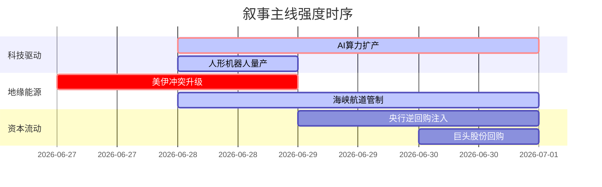

# A股市场情绪分析报告

**数据时段**：最近5日  
**生成时间**：2026-07-01

---

### 🔥 宏观叙事焦点（24小时三级过滤）

#### 📌 叙事主线一：AI算力与半导体产业链扩产 ⭐⭐⭐
**主要事件**：国务院常务会议听取AI发展汇报、韩国政府大规模投资芯片厂、DeepSeek V4官宣上线、寒武纪市值破万亿  
**筛选标签**：`国务院政策` `产业生命周期` `权重2.0`  
**宏观逻辑**：  
> ① **归类**：新质生产力驱动  
> ② **历史镜像**：2018-2019年国产替代加速模板  
> ③ **市场传导**：顶层政策背书 $\rightarrow$ 韩国等全球供应链联动扩产 $\rightarrow$ A股CPO/半导体板块成交额激增（中际旭创/京东方A成交破百亿）  
> ④ **叙事强度**：极强。从单纯的“模型预期”转向“算力基建+国产芯片”的实物投资阶段。

**行业映射**：AI芯片、CPO、存储芯片（情绪评分 **8.5/10**）  
**交易警示**：‼️ 警惕华尔街发出的“算力泡沫”预警，关注业绩兑现与估值匹配度。

---

#### 📌 叙事主线二：中东地缘冲突与能源供应风险 ⭐⭐  
**主要事件**：美伊相互空袭、伊朗监管霍尔木兹海峡、以军准备独立打击伊朗  
**筛选标签**：`地缘风险` `原油定价` `权重1.5`  
**宏观逻辑**：  
> ① **归类**：外部风险冲击  
> ② **历史镜像**：2019年霍尔木兹海峡危机模板  
> ③ **市场传导**：航道管制 $\rightarrow$ WTI原油上涨（站稳70美元）$\rightarrow$ 能源板块短期避险资金流入  
> ④ **叙事强度**：中强。冲突在“外交博弈”与“军事威胁”之间反复，波动率高。

**行业映射**：石油天然气、航运（情绪评分 **6.2/10**）  
**交易警示**：⚠️ 叙事易受外交消息面瞬间反转，建议以短线波动率交易为主。

---

#### 📌 叙事主线三：资本市场流动性与回购修复 ⭐  
**主要事件**：央行开展大规模隔夜逆回购、腾讯/小米等巨头密集回购、券商融资规模突破万亿  
**筛选标签**：`央行政策` `资本运作` `权重1.2`  
**宏观逻辑**：  
> ① **归类**：流动性底部支撑  
> ② **历史镜像**：2014年“牛市起点”流动性宽松模板  
> ③ **市场传导**：央行精准滴灌 $\rightarrow$ 权重股回购支撑 $\rightarrow$ 北证50/创业板指阶段性反弹  
> ④ **叙事强度**：中等。处于“防守反击”阶段，缺乏强力向上驱动力。

**行业映射**：非银金融、蓝筹权重（情绪评分 **5.1/10**）  
**交易警示**：✓ 关注成交量能否持续维持在2万亿以上，验证流动性是否转化为趋势性上涨。

---

### 📅 宏观叙事演化（三日趋势）

**强度衰减模型**：昨日主题×0.7 · 前日主题×0.5

```mermaid
gantt
    title 叙事主线强度时序
    dateFormat  YYYY-MM-DD
    section 科技驱动
    AI算力扩产     :crit, active, 2026-06-28, 3d
    人形机器人量产 :active, 2026-06-28, 1d
    
    section 地缘能源
    美伊冲突升级   :crit, 2026-06-27, 2d
    海峡航道管制   :active, 2026-06-28, 3d
    
    section 资本流动
    央行逆回购注入 :2026-06-29, 2d
    巨头股份回购   :2026-06-30, 1d
```

**叙事节点关联**：
- **06/28**：智元人形机器人量产 $\rightarrow$ 触发具身智能规模化叙事 $\rightarrow$ 带动AI硬件预期。
- **06/29**：央行实施大规模隔夜逆回购 $\rightarrow$ 缓解流动性压力 $\rightarrow$ 支撑科技股高成交量。
- **06/30**：国务院常务会议强调AI与外贸 $\rightarrow$ 叙事从“技术突破”升维至“国家战略”。

🎯 **宏观叙事三要素**
1️⃣ **政策意图解码**
顶层逻辑已明确：通过“AI+贸易强国”双轮驱动，试图在外部环境不确定的情况下，利用技术代差实现产业升级，且允许在资本市场通过回购等方式维持估值底线。
2️⃣ **市场定价偏差**
- **过度定价**：部分AI概念股（如市值破万亿的芯片股）短期涨幅过快，情绪溢价较高。
- **定价不足**：地缘冲突引发的能源长周期逻辑，以及国内“新质生产力”在制造业端的实际渗透率。
3️⃣ **跨市场共振**
纳指强势上涨 + 韩国芯片大规模投资 + A股半导体板块活跃 = 全球科技共振周期，短期内资金对AI赛道的容忍度极高。

---