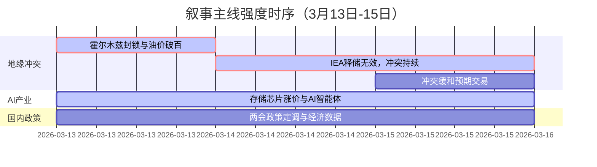

# A股市场情绪分析报告

**数据时段**：最近5日（2026-03-11 至 2026-03-15）
**生成时间**：2026-03-15

### 🔥 宏观叙事焦点（24小时三级过滤）

#### 📌 叙事主线一：中东地缘冲突升级，霍尔木兹海峡航运几近中断 ⭐⭐⭐
**主要事件**：美以与伊朗军事对抗持续升级，关键能源通道霍尔木兹海峡航运严重受阻，国际油价剧烈波动。
**筛选标签**：`地缘冲突` `能源安全` `沪深300影响` `路透信源·权重2.0`
**宏观逻辑**：
> ① **归类**：全球性供给冲击与避险情绪升温
> ② **历史镜像**：1973年石油危机、2022年俄乌冲突后的能源与通胀冲击
> ③ **市场传导**：油价飙升 → 全球通胀预期上修 → 主要央行降息预期推迟/加息预期升温 → 全球股市（除能源股）承压、VIX指数冲高 → 避险资金涌入黄金、美元 → 新兴市场货币与资产承压
> ④ **叙事强度**：冲突烈度与范围超预期，关键航运通道面临历史性中断风险，市场从交易“冲突溢价”转向交易“供应危机”。

**行业映射**：石油石化（情绪评分 **8.5/10**）、油运（情绪评分 **7.8/10**）、黄金（情绪评分 **7.5/10**）
**交易警示**：‼️ 高度关注霍尔木兹海峡通航状态及冲突各方表态，油价与通胀预期是核心变量。警惕能源价格冲击对全球央行政策路径的颠覆性影响。

---

#### 📌 叙事主线二：AI产业催化持续，存储芯片涨价与智能体生态爆发 ⭐⭐
**主要事件**：AI算力需求推动存储芯片价格进入上行周期，国内外AI大模型及智能体（“龙虾”）应用生态快速扩张。
**筛选标签**：`产业周期` `科技政策` `财新信源·权重1.5`
**宏观逻辑**：
> ① **归类**：产业趋势强化与供应链紧张
> ② **历史镜像**：2020-2021年半导体超级周期初期
> ③ **市场传导**：AI巨头资本开支持续 → 存储芯片需求结构性增长（HBM/DDR5） → 供应链产能紧张、价格传导至下游 → 相关科技板块盈利预期上调 → 但受制于全球流动性收紧预期，估值扩张受限
> ④ **叙事强度**：英伟达等巨头需求指引强劲，国内政策密集支持，从概念进入业绩验证期。

**行业映射**：半导体（存储/封测）（情绪评分 **7.0/10**）、AI算力（服务器/光模块）（情绪评分 **6.8/10**）
**交易警示**：⚠️ 产业链涨价持续性与下游承受能力需观察。部分概念股估值已高，需甄别真实受益标的。

---

#### 📌 叙事主线三：中国内部政策定力与超预期经济数据提供支撑 ⭐
**主要事件**：两会政策定调积极，后续公布的1-2月外贸数据大幅超预期，显示经济韧性。
**筛选标签**：`国内政策` `经济数据` `新华社信源·权重1.5`
**宏观逻辑**：
> ① **归类**：政策托底与基本面修复
> ② **历史镜像**：2023年初疫后复苏预期
> ③ **市场传导**：积极政策信号 + 超预期经济数据 → 提振市场对国内经济复苏信心 → 对冲部分外部风险 → 外资流向出现边际变化 → 利好大盘价值与部分科技成长
> ④ **叙事强度**：政策空间充足，数据改善，但市场对持续性存疑，叙事强度弱于外部地缘冲击。

**行业映射**：出口链（机电、汽车）（情绪评分 **6.5/10**）、受益于政策的科技成长板块（情绪评分 **6.0/10**）
**交易警示**：✓ 内部环境相对稳定，关注后续政策落地效果及高频数据验证。

---

### 📅 宏观叙事演化（三日趋势）

**强度衰减模型**：昨日主题×0.7 · 前日主题×0.5

```mermaid
gantt
    title 叙事主线强度时序（3月13日-15日）
    dateFormat  YYYY-MM-DD
    section 地缘冲突
    霍尔木兹封锁与油价破百   :crit, active, 2026-03-13, 1d
    IEA释储无效，冲突持续   :crit, active, 2026-03-14, 2d
    冲突缓和预期交易   :2026-03-15, 1d
    section AI产业
    存储芯片涨价与AI智能体   :active, 2026-03-13, 3d
    section 国内政策
    两会政策定调与经济数据   :2026-03-13, 3d
```

**叙事节点关联**：
- 3月13日：地缘冲突白热化（伊朗袭击美军航母），油价突破100美元，成为主导叙事。
- 3月14日：冲突持续，但市场部分交易特朗普“战争很快结束”言论带来的缓和预期，油价回落，但供应中断风险未除。
- 3月15日：冲突仍是绝对主线，AI与国内政策作为结构性叙事提供支撑。

### 🧠 宏观叙事三要素

1.  **政策意图解码**：
    *   **中国**：顶层叙事聚焦“高质量发展”和“科技创新”（两会定调），对外部冲击（地缘、贸易）保持战略定力，以内部政策空间（财政、货币）和产业升级对冲风险。
    *   **美国/全球**：货币政策首要目标仍是抗击通胀，地缘冲突导致的油价飙升迫使美联储等央行推迟宽松，全球流动性环境趋于紧张。

2.  **市场定价偏差**：
    *   **过度定价**：市场可能过度计价了地缘冲突的短期恐慌与供应中断的持久性（尤其在油价已大幅波动后），以及全球央行集体转向紧缩的幅度。
    *   **定价不足**：市场可能低估了中国在AI等高端制造领域的产业政策力度与企业进展，以及超预期经济数据所反映的经济内生韧性。

3.  **跨市场共振**：
    *   **能源-通胀-利率轴心**：原油→通胀预期→国债收益率→央行利率路径，是当前最核心的传导链。美债收益率上行压制全球成长股估值。
    *   **避险资产联动**：黄金、美元同步走强，反映极致的避险情绪。
    *   **A股相对韧性**：相较于受能源危机直接冲击的欧洲和受利率敏感压制的美股科技股，A股因内部政策支撑和部分板块（如资源、出口）逻辑，表现出一定相对韧性，但整体受外部风险情绪压制。