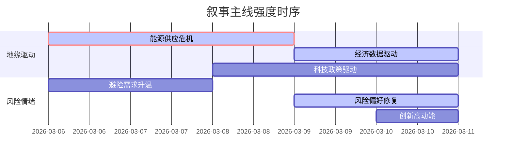

## A股市场情绪分析报告

数据时段：最近5日（2026年3月6日-2026年3月10日）  
生成时间：2026年3月10日

### 🔥 宏观叙事焦点（24小时三级过滤）

#### 📌 叙事主线一：**中东地缘冲突升级与能源供应危机** ⭐⭐⭐
**主要事件**：美以对伊朗军事行动持续，伊朗反击并威胁封锁霍尔木兹海峡，引发全球能源供应担忧与油价剧烈波动。
**筛选标签**：`地缘政治风险` `能源安全` `国际信源·权重2.0`
**宏观逻辑**：  
> ① **归类**：地缘政治风险事件  
> ② **历史镜像**：2022年俄乌冲突导致能源价格剧烈波动与全球通胀重定价模板  
> ③ **市场传导**：油价飙升→全球通胀预期升温→央行加息预期强化（欧央行7月加息概率50%）→风险资产抛售→黄金先跌后涨（避险属性受抑于通货再膨胀担忧）  
> ④ **叙事强度**：冲突持续时间与供应中断程度超预期，地缘风险溢价持续计入资产价格，但3月10日随着缓和迹象出现，强度边际减弱  

**行业映射**：能源设备与油服（情绪评分 **8.0/10**）、化工（价格上调，情绪评分 **7.5/10**）  
**交易警示**：‼️ 关注冲突演化与油价背离风险，警惕地缘风险溢价收窄导致的资产价格反转  

---

#### 📌 叙事主线二：**中国外贸数据超预期强化复苏叙事** ⭐⭐  
**主要事件**：海关总署公布1-2月出口同比增21.8%（美元计）、进口增19.8%，贸易顺差2136.2亿美元；人民币兑美元中间价升至6.8982创近一年新高。
**筛选标签**：`经济数据` `政策支持` `财新信源·权重1.5`  
**宏观逻辑**：  
> ① **归类**：需求端政策与数据超预期  
> ② **历史镜像**：2020年中国出口疫情期间V型反弹与人民币走强模板  
> ③ **市场传导**：外贸数据强劲→人民币升值预期→北向资金流入（3月10日港股通净流入）→A股大盘蓝筹与出口链估值修复→期指持仓量增加  
> ④ **叙事强度**：数据验证政策效果，打破市场对弱复苏的悲观预期，但内需仍需进一步确认  

**行业映射**：出口制造链（家电、机械）、航运（情绪评分 **7.2/10**）  
**交易警示**：⚠️ 关注政策与市场反应一致性，警惕预期差收窄；后续需验证内需复苏持续性  

---

#### 📌 叙事主线三：**科技产业政策定调与算力需求爆发** ⭐ 
**主要事件**：政府工作报告首次将商业航天定位为“新兴支柱产业”；算力租赁板块融资资金持续净流入；AI大模型应用落地加速。
**筛选标签**：`产业政策` `科技自立` `新华社信源·权重1.5`  
**宏观逻辑**：  
> ① **归类**：产业中长期规划与需求爆发  
> ② **历史镜像**：2018年新能源产业政策支持与产能扩张模板  
> ③ **市场传导**：政策定调→板块估值修复→杠杆资金加仓（融资买入科技股）→交易活跃度提升→机构调研密集（如顺络电子）  
> ④ **叙事强度**：政策持续加码，科技自立自强成为核心，但业绩兑现仍需时间，短期情绪波动较大  

**行业映射**：商业航天、AI算力、液冷服务器（情绪评分 **6.8/10**）  
**交易警示**：✓ 政策方向明确，但需跟踪订单落地与毛利率改善，右侧信号待确认  

---

### 📅 宏观叙事演化（三日趋势）

**强度衰减模型**：昨日主题×0.7 · 前日主题×0.5

```mermaid
gantt
    title 叙事主线强度时序
    dateFormat  YYYY-MM-DD
    section 地缘驱动
    能源供应危机   :crit, active, 2026-03-06, 3d
    经济数据驱动   :active, 2026-03-09, 2d
    科技政策驱动   :2026-03-08, 3d
    
    section 风险情绪
    避险需求升温   :2026-03-06, 2d
    风险偏好修复   :active, 2026-03-09, 2d
    创新高动能     :2026-03-10, 1d
```
叙事节点关联：
03/06：美以空袭伊朗、霍尔木兹海峡受阻 → 触发能源供应危机叙事，油价暴涨  
03/09：1-2月外贸数据超预期、人民币走强 → 打破弱复苏预期，风险偏好修复  
03/10：科技板块延续强势、地缘缓和迹象出现 → 叙事强度边际切换，市场聚焦国内增长动能  

🎯 宏观叙事三要素  
1️⃣ 政策意图解码  
当前顶层叙事从“稳增长”转向“调结构”，允许短期阵痛换取长期质量。产业出清（如光伏）>总量刺激，政策定力超预期。两会释放信号：财政金融协同促内需、人工智能产业规模目标10万亿、商业航天成为支柱产业。  
2️⃣ 市场定价偏差  
过度定价：地缘冲突导致油价长期高企（预期过于乐观，3月10日已回落）  
定价不足：中国内需复苏弹性（出口强但消费待验证，政策工具充足但传导需时）  
3️⃣ 跨市场共振  
美债收益率因非农疲软下行打开全球政策宽松窗口 + 美元指数高位缓释出口压力 + 中东局势缓和缓解通胀担忧 = A股结构性行情窗口期，科技与高端制造占优