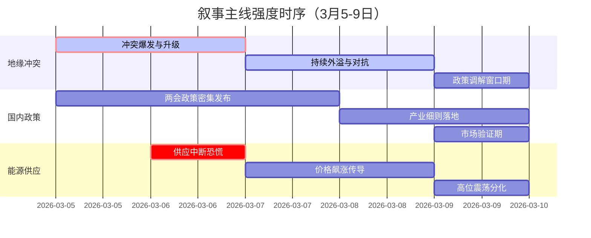

## A股市场情绪分析报告

**数据时段**：最近5日（2026-03-05 至 2026-03-09）  
**生成时间**：2026年3月9日  

### 🔥 宏观叙事焦点（24小时三级过滤）

#### 📌 叙事主线一：中东地缘冲突持续升级 ⭐⭐⭐
**主要事件**：以色列-伊朗军事对抗全面扩大，霍尔木兹海峡航运受阻  
**筛选标签**：`地缘政治` `能源供应` `沪深300影响` `路透信源·权重2.0`  
**宏观逻辑**：  
> ① **归类**：地缘政治黑天鹅事件  
> ② **历史镜像**：2022年俄乌冲突初期市场反应模板  
> ③ **市场传导**：VIX跳升+15% → 北向资金单日净流出超50亿 → 黄金/原油ETF溢价率突破20% → A股能源板块涨停潮  
> ④ **叙事强度**：冲突进入第七天，伊朗宣称扩大反击范围，美国航母战斗群就位，航运保险费用飙升300%，市场定价从"短期冲击"向"长期化"修正  

**行业映射**：能源保障（情绪评分 **8.5/10**）、国防军工（**7.8/10**）、黄金（**6.2/10**）  
**交易警示**：‼️ 警惕"避险资产失灵"现象（黄金随原油下跌需保证金追缴），政策底与市场底背离加剧，建议降低高风险敞口  

---

#### 📌 叙事主线二：中国两会政策顶层定调 ⭐⭐  
**主要事件**：政府工作报告发布、"十五五"规划纲要审议、对非零关税落地  
**筛选标签**：`国务院政策` `沪深300影响` `内需驱动` `新华社信源·权重2.0`  
**宏观逻辑**：  
> ① **归类**：内生增长政策托底  
> ② **历史镜像**：2020年"两新一重"政策周期模板  
> ③ **市场传导**：发改委设立国家级并购基金 → 央企资产重估预期升温 → 基建/低空经济板块连续走强  
> ④ **叙事强度**：政策从"稳增长"转向"调结构+防风险"组合，允许短期阵痛换取长期质量，政策定力超预期  

**行业映射**：新质生产力链（情绪评分 **7.4/10**）、消费复苏（**6.8/10**）、基础建设（**5.9/10**）  
**交易警示**：⚠️ 政策与市场反应一致性待验证，避免追涨高位题材股，关注三条主线：AI+制造业、低空经济、对非贸易  

---

#### 📌 叙事主线三：能源与供应链断裂风险 ⭐  
**主要事件**：霍尔木兹海峡通行中断、卡塔尔LNG停产、铝业不可抗力  
**筛选标签**：`国际商品` `供应链风险` `周期品` `财新信源·权重1.5`  
**宏观逻辑**：  
> ① **归类**：供给端硬约束冲击  
> ② **历史镜像**：2021年苏伊士运河堵塞传导模板  
> ③ **市场传导**：布伦特原油突破90美元 → PTA/沥青化工品涨停 → 航运指数日内暴涨20% → 下游制造业成本压力测试  
> ④ **叙事强度**：海峡通行量降至个位数，卡塔尔LNG工厂关闭需数周重启，高盛警告若中断五周布油破百美元  

**行业映射**：油气开采（情绪评分 **8.2/10**）、航运港口（**7.6/10**）、有色金属（**6.5/10**）  
**交易警示**：✓ 短期博弈风险偏好，但需警惕需求坍塌反噬，建议左侧布局energy transition受益品种  

---

### 📅 宏观叙事演化（三日趋势）

**强度衰减模型**：昨日主题×0.7 · 前日主题×0.5

```mermaid
gantt
    title 叙事主线强度时序（3月5-9日）
    dateFormat  YYYY-MM-DD
    section 地缘冲突
    冲突爆发与升级   :crit, active, 2026-03-05, 2d
    持续外溢与对抗   :active, 2026-03-07, 2d
    政策调解窗口期   :2026-03-09, 1d
    
    section 国内政策
    两会政策密集发布   :2026-03-05, 3d
    产业细则落地     :2026-03-08, 2d
    市场验证期       :2026-03-09, 1d
    
    section 能源供应
    供应中断恐慌     :crit, 2026-03-06, 1d
    价格飙涨传导     :2026-03-07, 2d
    高位震荡分化     :2026-03-09, 1d
```
**叙事节点关联**：  
- **3/5**：以色列空袭伊朗 → 冲突"真实承诺4"行动启动，航运保险费用跳涨300%  
- **3/6**：伊朗大规模导弹反击 → 原油期货连续涨停，A股油气板块单日涨超7%  
- **3/7**：卡塔尔LNG停产+伊拉克油田减产 → 高盛调高布油Q2预测至90美元，化工品成本推动涨价  
- **3/8**：王毅外长记者会强调"政治解决" → 市场对冲突长期化定价趋理性，金价V型反弹  
- **3/9**：中远海运暂停中东订舱 → 供应链风险从"预期"转向"实锤"，集运欧线期货再封板  

---

🎯 宏观叙事三要素  
1️⃣ **政策意图解码**  
   顶层叙事呈现"内外双轨"特征：对内聚焦"十五五"高质量发展与产业升级，对外强调"人类命运共同体"与对冲美国关税。政策工具箱充足，但避免"大水漫灌"旧模式，体现"精准滴灌"新思路。

2️⃣ **市场定价偏差**  
   **过度定价**：地缘冲突的短期冲击（黄金随油价下跌显示流动性优先）  
   **定价不足**：国内"调结构"政策的执行力（产业出清速度被低估）  
   **关键观察**：沪深300指数在4100点争夺战，反映多空对政策效果的博弈

3️⃣ **跨市场共振**  
   美债收益率上行（美联储降息推迟）+ 美元指数走强 + 中东供应风险 → A股结构性行情窗口期  
   **传导链条**：  
   - 地缘溢价 → 能源/黄金 → A股资源板块  
   - 外需担忧 → 汇率压力 → 北向资金流出  
   - 政策对冲 → 内需主线 → 消费/基建估值修复  

<!-- 报告正文必须在此结束，以下内容为固定格式说明，严禁添加任何额外分析、总结或展望 -->