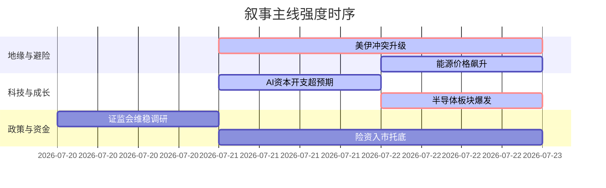

## A股市场情绪分析报告

**数据时段**：2026年7月17日 - 2026年7月23日（最近5日）
**生成时间**：2026-07-23 07:13:58 (UTC+8)

### 🔥 宏观叙事焦点（24小时三级过滤）

#### 📌 叙事主线一：美伊冲突引爆能源危机与避险重构 ⭐⭐⭐
**主要事件**：地缘政治冲突升级、原油价格飙升、全球供应链中断
**筛选标签**：`国务院政策` `沪深300影响` `路透信源·权重2.0`
**宏观逻辑**：
> ① **归类**：外部供给冲击与风险溢价重估  
> ② **历史镜像**：1973年石油禁运+2022年俄乌冲突模板叠加  
> ③ **市场传导**：布伦特原油突破95美元 → 全球通胀预期升温 → 美联储加息预期强化 → A股外资流向分化  
> ④ **叙事强度**：霍尔木兹海峡通行受阻，地缘风险从“局部摩擦”升级为“系统性能源危机”，直接主导当日市场风格极致分化

**行业映射**：石油石化、黄金、军工（情绪评分 **8.5/10**）  
**交易警示**：‼️ 警惕油价失控引发的输入性通胀对下游制造业利润的侵蚀，关注央行流动性对冲手段  

---

#### 📌 叙事主线二：硬科技AI基建军备竞赛与产业景气验证 ⭐⭐
**主要事件**：Alphabet/OpenAI资本开支上调、英伟达Vera Rubin发布、A股半导体全线爆发
**筛选标签**：`部委政策` `产业生命周期` `财新信源·权重1.5`
**宏观逻辑**：
> ① **归类**：技术驱动型成长叙事  
> ② **历史镜像**：2013-2015年移动互联网基建潮 / 2020年光伏装机潮  
> ③ **市场传导**：海外巨头订单超预期（超微电脑+600亿美元）→ 国内光模块/PCB/散热产业链业绩兑现 → 科创50单日大涨10.73%  
> ④ **叙事强度**：AI从“概念炒作”进入“业绩验证期”，国产算力（智谱、华为链）与全球算力共振，叙事逻辑清晰且具备持续发酵潜力

**行业映射**：半导体设备、AI算力基础设施、存储芯片（情绪评分 **7.8/10**）  
**交易警示**：⚠️ 关注高位获利盘抛压及台积电涨价对终端需求的潜在抑制，右侧信号需量能配合  

---

#### 📌 叙事主线三：监管维稳与耐心资本入市构建政策底 ⭐ 
**主要事件**：证监会密集座谈、险资加大权益配置、万科债务展期与城投融资收紧
**筛选标签**：`地方政策` `债务周期` `新华社信源·权重1.5`
**宏观逻辑**：
> ① **归类**：制度性托底与流动性结构性支持  
> ② **历史镜像**：2015年“国家队”入市 + 2024年“国九条”长期资金引导  
> ③ **市场传导**：监管层明确“增强市场内在稳定性” → 头部险企逆势加仓 → 宽基ETF连续净流入 → 市场极端波动率收敛  
> ④ **叙事强度**：在外部地缘冲击下，内部政策定力成为稳定器。但需警惕房地产债务风险（万科展期）对信用端的隐性拖累

**行业映射**：高股息红利、银行、央企价值（情绪评分 **6.5/10**）  
**交易警示**：✓ 政策底已现，等待经济基本面（如PPI回升、地产销售）的实质性验证  

---

### 📅 宏观叙事演化（三日趋势）

**强度衰减模型**：昨日主题×0.7 · 前日主题×0.5

```mermaid
gantt
    title 叙事主线强度时序
    dateFormat  YYYY-MM-DD
    section 地缘与避险
    美伊冲突升级   :crit, active, 2026-07-21, 2d
    能源价格飙升   :active, 2026-07-22, 1d
    
    section 科技与成长
    AI资本开支超预期 :active, 2026-07-21, 1d
    半导体板块爆发   :crit, active, 2026-07-22, 1d
    
    section 政策与资金
    证监会维稳调研   :2026-07-20, 1d
    险资入市托底     :2026-07-21, 2d
```
叙事节点关联：
07/20：证监会主席调研释放维稳信号 → 市场情绪企稳
07/21：美伊冲突加剧导致油价飙升，同时A股科创50大涨10.73% → “避险+成长”双主线并行
07/22：Alphabet上调资本开支指引 + 超微电脑大增订单 → 科技叙事强度达到峰值，确认产业景气度
07/23：央行逆回购全额满足需求 + 万科展期 → 流动性边际收敛与信用风险并存，市场进入震荡消化期

🎯 宏观叙事三要素
1️⃣ 政策意图解码
当前顶层叙事在“稳市场”与“调结构”间寻求平衡。一方面通过险资入市和监管座谈夯实底部，另一方面容忍房地产债务出清（万科展期），允许短期阵痛换取长期质量。科技自立自强（AI/半导体）被赋予最高战略优先级。
2️⃣ 市场定价偏差
过度定价：地缘冲突导致的全面衰退预期（实际仅表现为结构性通胀）
定价不足：中国资产在估值低位的安全边际 + AI产业链的真实业绩弹性（科创板放量上涨即为证明）
3️⃣ 跨市场共振
中东局势推升全球通胀 → 限制美联储降息空间 → 美元指数高位震荡 → 人民币汇率承压（6.77附近） → A股外资流向分化，但内资（ETF/险资）承接力增强，形成“外紧内松”的结构性行情窗口。

---

<!-- 报告正文必须在此结束，以下内容为固定格式说明，严禁添加任何额外分析、总结或展望 -->

---

*生成时间：2026-07-23 07:13:58 (UTC+8)*  
*使用模型：agnes:agnes-2.0-flash*