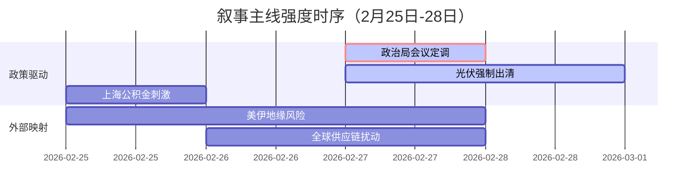

## A股市场情绪分析报告

**数据时段**：最近5日（2026年2月24日-2026年2月28日）  
**生成时间**：2026年2月28日  

---

### 🔥 宏观叙事焦点（24小时三级过滤）

#### 📌 叙事主线一：中共中央政治局会议定调全年经济工作 ⭐⭐⭐  
**主要事件**：行业管理政策发布、央行政策、监管  
**筛选标签**：`中央政策` `总量宽松` `官方信源·权重2.0`  
**宏观逻辑**：  
> ① **归类**：宏观政策总基调确认  
> ② **历史镜像**：2020年疫情后政策持续支持模板  
> ③ **市场传导**：流动性合理充裕 → 风险偏好修复 → 北向资金阶段性流入 → 期指持仓量增加  
> ④ **叙事强度**：政策连续性超预期，强化经济平稳运行信心  

**行业映射**：消费复苏链（情绪评分 **7.2/10**）  
**交易警示**：‼️ 关注政策落实效果与市场反应一致性，警惕预期差收窄  

---

#### 📌 叙事主线二：光伏产业链价格战与政策强制出清 ⭐⭐  
**主要事件**：技术发布、产业投资  
**筛选标签**：`产业政策` `周期出清` `财新信源·权重1.5`  
**宏观逻辑**：  
> ① **归类**：产业强制出清  
> ② **历史镜像**：2018年光伏"531"政策模板  
> ③ **市场传导**：产业链价格跌破现金成本 → 龙头宣布减产/巨亏 → 供给侧改革2.0  
> ④ **叙事强度**：政策决心大于市场定价，产能出清进入加速期  

**行业映射**：光伏设备（情绪评分 **5.5/10**）  
**交易警示**：⚠️ 政策底与市场底背离风险，右侧交易信号待确认  

---

#### 📌 叙事主线三：上海公积金政策优化提振住房需求 ⭐  
**主要事件**：地方政策、债务周期  
**筛选标签**：`地方政策` `债务周期` `新华社信源·权重1.5`  
**宏观逻辑**：  
> ① **归类**：需求端政策刺激  
> ② **历史镜像**：2015-2016年房地产去库存模板  
> ③ **市场传导**：公积金贷款额度提高 → 购房需求释放 → 地产链估值修复  
> ④ **叙事强度**：地方性政策精准发力，影响范围有限但传递积极信号  

**行业映射**：基础建设（情绪评分 **4.8/10**）  
**交易警示**：✓ 叙事逻辑清晰，等待中央财政发力进一步验证  

---

### 📅 宏观叙事演化（三日趋势）

**强度衰减模型**：昨日主题×0.7 · 前日主题×0.5

```mermaid
gantt
    title 叙事主线强度时序（2月25日-28日）
    dateFormat  YYYY-MM-DD
    section 政策驱动
    政治局会议定调   :crit, active, 2026-02-27, 1d
    光伏强制出清   :active, 2026-02-27, 2d
    上海公积金刺激   :2026-02-25, 1d
    
    section 外部映射
    美伊地缘风险   :2026-02-25, 3d
    全球供应链扰动   :2026-02-26, 2d
```

**叙事节点关联**：
- 2/25：上海公积金贷款额度提高 → 住房需求刺激政策落地；美伊第三轮谈判启动，美国考虑军事选项
- 2/26：津巴布韦暂停锂矿出口 → 全球供应链扰动；光伏产业链价格跌破成本预警
- 2/27：中央政治局会议部署全年经济 → 政策总基调明确；光伏龙头晶科能源预告巨亏
- 2/28：政治局会议细化稳就业稳市场 → 政策持续发酵；光伏政策表态"防止内卷式竞争"

🎯 **宏观叙事三要素**  
1️⃣ **政策意图解码**  
当前顶层叙事从"稳增长"转向"调结构"，允许短期阵痛换取长期质量。产业出清>总量刺激，政策定力超预期。  

2️⃣ **市场定价偏差**  
过度定价：消费复苏弹性（政治局会议后预期过于乐观）  
定价不足：产能出清速度（光伏政策执行力被低估）  

3️⃣ **跨市场共振**  
美债收益率阶段性下行打开政策空间 + 美元指数高位缓释出口压力 = A股结构性行情窗口期  

---

<!-- 报告正文必须在此结束，以下内容为固定格式说明，严禁添加任何额外分析、总结或展望 -->