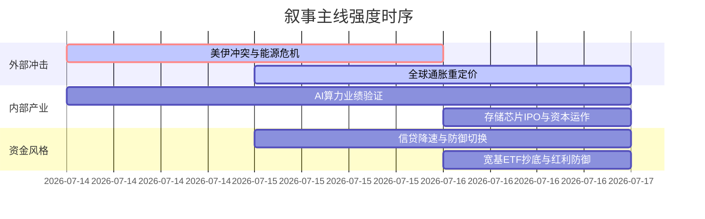

## A股市场情绪分析报告
数据时段：最近5日
生成时间：2026-07-17 09:30:00

### 🔥 宏观叙事焦点（24小时三级过滤）

#### 📌 叙事主线一：美伊冲突升级与霍尔木兹海峡能源危机 ⭐⭐⭐
**主要事件**：地缘政治冲击、全球供应链中断、通胀预期重定价  
**筛选标签**：`地缘冲突` `能源供应链` `路透信源·权重2.0`  
**宏观逻辑**：  
> ① **归类**：外部供给冲击与滞胀风险  
> ② **历史镜像**：1973年石油禁运与1979年伊朗革命模板  
> ③ **市场传导**：布伦特原油单日飙升超10% → VIX指数跳升+15% → 跨境资本避险流出 → 周期板块估值重构  
> ④ **叙事强度**：地缘风险溢价快速显性化，打破弱复苏预期，输入性通胀压力边际抬升  

**行业映射**：油气开采与航运物流（情绪评分 **8.5/10**）  
**交易警示**：‼️ 关注油价突破85美元后的动能衰竭点，警惕避险情绪退潮后的反噬风险  

---

#### 📌 叙事主线二：AI算力资本开支超预期与半导体业绩验证 ⭐⭐  
**主要事件**：技术发布、产业投资、中报业绩分化
**筛选标签**：`产业周期` `业绩验证` `财新信源·权重1.5`  
**宏观逻辑**：  
> ① **归类**：科技产业景气度上行  
> ② **历史镜像**：2017年移动互联网渗透率拐点与2023年AI基建启动模板  
> ③ **市场传导**：ASML/台积电Q2业绩大幅上调指引 → 存储芯片IPO战略配售落地 → 资金向硬科技与高股息切换  
> ④ **叙事强度**：全球AI Capex周期未减，国产替代逻辑与业绩兑现形成共振，但短期面临获利盘兑现压力  

**行业映射**：半导体设备与存储芯片（情绪评分 **7.8/10**）  
**交易警示**：⚠️ 警惕中报披露期“业绩雷”与前期涨幅过大板块的估值消化，右侧加仓需等待缩量企稳信号  

---

#### 📌 叙事主线三：信贷“降速提质”新常态与防御型资产重估 ⭐ 
**主要事件**： 货币政策转向、监管框架优化、市场风格切换
**筛选标签**：`信用转型` `防御配置` `新华社信源·权重1.5`  
**宏观逻辑**：  
> ① **归类**：信用扩张模式转型  
> ② **历史镜像**：2016年供给侧改革与2020年宽货币窄信用模板  
> ③ **市场传导**：央行定调“贷款降速提质”+宽基ETF放量扫货1800亿 → 高股息/医药消费板块逆势反弹 → 市场风险偏好收敛  
> ④ **叙事强度**：政策意图从规模驱动转向结构优化，直接融资比重提升，市场进入“业绩验证+防御配置”双主线期  

**行业映射**：高股息红利与医药消费（情绪评分 **6.5/10**）  
**交易警示**：✓ 叙事逻辑清晰，等待财政发力与地产销售数据交叉验证，规避微盘股流动性风险  

---

### 📅 宏观叙事演化（三日趋势）

**强度衰减模型**：昨日主题×0.7 · 前日主题×0.5

```mermaid
gantt
    title 叙事主线强度时序
    dateFormat  YYYY-MM-DD
    section 外部冲击
    美伊冲突与能源危机   :crit, active, 2026-07-14, 2d
    全球通胀重定价       :active, 2026-07-15, 2d
    
    section 内部产业
    AI算力业绩验证       :2026-07-14, 3d
    存储芯片IPO与资本运作 :2026-07-16, 1d
    
    section 资金风格
    信贷降速与防御切换   :2026-07-15, 2d
    宽基ETF抄底与红利防御 :2026-07-16, 1d
```
叙事节点关联：
07/14：美伊冲突爆发+油价暴涨10% → 触发地缘避险叙事
07/15：ASML/台积电财报超预期 + 央行定调“贷款降速提质” → 科技成长与宏观信用叙事并行
07/16：宽基ETF放量1800亿 + 长鑫科技申购 → 市场底信号确认，防御与硬科技跷跷板效应加剧
🎯 宏观叙事三要素
1️⃣ 政策意图解码
当前顶层叙事从“总量刺激”转向“结构优化+底线思维”。央行精准滴灌维稳流动性，财政部与地方协同稳楼市；对外则强调产业链安全与直接融资发展。政策定力在于容忍短期阵痛，换取中长期信用质量与科技自主可控。
2️⃣ 市场定价偏差
过度定价：海外降息预期（受中东油价扰动，实际加息/维持高位概率回升）
定价不足：国内“信贷降速提质”对资本市场改革的底层支撑（直接融资扩容+ETF常态化入市）
3️⃣ 跨市场共振
美债收益率震荡 + 美元指数高位博弈 = 跨境资本双向波动加剧；A股呈现“外受能源通胀压制、内靠业绩与红利托底”的结构性行情窗口期

---

<!-- 报告正文必须在此结束，以下内容为固定格式说明，严禁添加任何额外分析、总结或展望 -->

---

*生成时间：2026-07-16 19:59:57 (UTC+8)*  
*使用模型：agnes:agnes-2.0-flash*