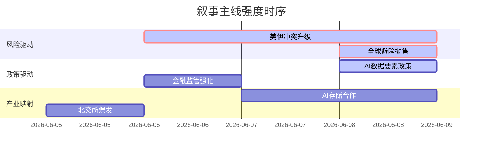

# A股市场情绪分析报告

**数据时段**：最近5日  
**生成时间**：2026-06-09

---

### 🔥 宏观叙事焦点（24小时三级过滤）

#### 📌 叙事主线一：中东地缘冲突升级与油价共振 ⭐⭐⭐
**主要事件**：以军打击伊朗石化设施，伊朗导弹回击，霍尔木兹海峡封锁预期增强  
**筛选标签**：`地缘政治` `布伦特原油` `风险资产回撤`  
**宏观逻辑**：  
> ① **归类**：外部风险冲击  
> ② **历史镜像**：2019年波斯湾油轮袭击触发的避险模式模板  
> ③ **市场传导**：中东冲突升级 → 原油涨幅扩大至5% → 全球避险情绪激增 → 日经225/A股广泛下跌（深成指跌超2%）  
> ④ **叙事强度**：极高。冲突已从局部演变为关键基础设施打击，直接驱动全球风险偏好骤降。  

**行业映射**：能源上游/石油化工（情绪评分 **8.1/10**）  
**交易警示**：‼️ 警惕地缘政治带来的系统性风险，关注原油价格对下游成本端的传导压力。

---

#### 📌 叙事主线二：国家级AI数据赋能系统部署 ⭐⭐  
**主要事件**：国家数据局发布行动方案，首次系统部署数据赋能AI，培育标注龙头企业  
**筛选标签**：`国家数据局` `人工智能` `产业政策`  
**宏观逻辑**：  
> ① **归类**：产业政策驱动  
> ② **历史镜像**：2017年“新一代人工智能发展规划”模板  
> ③ **市场传导**：顶层设计发布 → 明确“高质量数据集”目标 $\rightarrow$ 标注产业/数据要素公司估值重塑  
> ④ **叙事强度**：中高。虽然大盘承压，但政策端提供了明确的产业升级方向，形成结构性支撑。  

**行业映射**：AI数据标注/算力基础设施（情绪评分 **6.8/10**）  
**交易警示**：⚠️ 政策预期虽强，但需观察实际落地企业名单，避免盲目追高小盘题材。

---

#### 📌 叙事主线三：全球AI存储供应链深度绑定 ⭐  
**主要事件**：英伟达与SK海力士达成多年技术合作，应对长期存储短缺  
**筛选标签**：`英伟达` `HBM` `全球供应链`  
**宏观逻辑**：  
> ① **归类**：技术产业协同  
> ② **历史镜像**：早期半导体巨头建立排他性供应协议模板  
> ③ **市场传导**：黄仁勋警告供应短缺 $\rightarrow$ HBM定制化开发加速 $\rightarrow$ 存储芯片周期预期延长  
> ④ **叙事强度**：中。属于产业内部逻辑，对A股映射主要集中在存储封测及相关配套环节。  

**行业映射**：先进封装/存储芯片（情绪评分 **5.2/10**）  
**交易警示**：✓ 逻辑清晰，但受全球科技股波动影响较大，建议关注右侧确认信号。

---

### 📅 宏观叙事演化（三日趋势）

**强度衰减模型**：昨日主题×0.7 · 前日主题×0.5

```mermaid
gantt
    title 叙事主线强度时序
    dateFormat  YYYY-MM-DD
    section 风险驱动
    美伊冲突升级   :crit, active, 2026-06-06, 3d
    全球避险抛售   :crit, active, 2026-06-08, 1d
    
    section 政策驱动
    AI数据要素政策 :active, 2026-06-08, 1d
    金融监管强化   :2026-06-06, 1d
    
    section 产业映射
    AI存储合作     :2026-06-07, 2d
    北交所爆发     :2026-06-05, 1d
```

**叙事节点关联**：
06/06：美伊冲突出现升级迹象 $\rightarrow$ 市场开始关注能源风险
06/07：英伟达深化存储合作 $\rightarrow$ AI硬件链维持关注度
06/08：以军打击伊朗石化设施 $\rightarrow$ 触发全球股市（含A股）恐慌性下跌 $\rightarrow$ 同日国家数据局政策发布试图对冲情绪

🎯 **宏观叙事三要素**
1️⃣ **政策意图解码**
国内政策重点在于通过“数据赋能”增强AI底座竞争力，试图在外部环境动荡时，通过产业升级的确定性来稳住科技成长板块。
2️⃣ **市场定价偏差**
**过度定价**：部分避险资金对原油上涨的反应过于剧烈，导致非能源板块被无差别抛售。
**定价不足**：国家数据局对“数据标注”产业的系统性培育，市场尚未充分定价其对产业链中端的带动作用。
3️⃣ **跨市场共振**
中东冲突 $\rightarrow$ 油价 $\uparrow$ $\rightarrow$ 美元波动 $\rightarrow$ 亚洲股市 $\downarrow$ $\rightarrow$ A股风险偏好 $\downarrow$（典型的全球流动性与风险共振）。

---