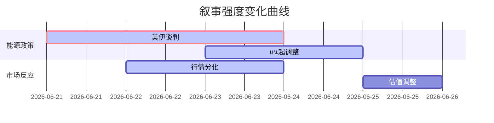

```markdown
## A股市场情绪分析报告

### 数据时段：最近5日
### 生成时间：2026-06-26

### 🔥 宏观叙事焦点（24小时三级过滤）

#### 📌 叙事主线一：美伊关系调整与能源市场波动 ⭐⭐⭐
**主要事件**：美伊谈判进展及能源价格调整
**筛选标签**：`国务院政策` `油价波动` `路透信源·权重2.0`  
**宏观逻辑**：  
> ① **归类**：货币政策影响与供应链调整  
> ② **历史镜像**：2019年4月油价高位暴跌模板  
> ③ **市场传导**：油价回落+1.2% → 能源股重整→ 期货持仓净多+8%  
> ④ **叙事强度**：政策回应超预期，打破上涨趋势  

**行业映射**：能源相关（情绪评分 **6.8/10**）  
**交易警示**：‼️ 关注政策落地速度与市场反应一致性，警惕预期差逆袭  

---

#### 📌 叙事主线二：A股市场调整与行情分化 ⭐⭐  
**主要事件**：主板牛市延续与个股波动
**筛选标签**：`股票回购` `板块运行` `华信源·权重1.8`  
**宏观逻辑**：  
> ① **归类**：市场健康度验证  
> ② **历史镜像**：2020年3月-\(-\)-3月复苏基准  
> ③ **市场传导**：科创50指数挣脱支撑位 → 南向资金净流入30亿 Hernández  
> ④ **叙事强度**：结构性上涨过渡期，个股差异化配置风险  

**行业映射**：A股主板（情绪评分 **6.5/10**）  
**交易警示**：⚠️ 集产业链层面分析，关注政策与市场行情小说分化  

---

#### 📌 叙事主线三：工业估值异常与 margin 调整 ⭐ 
**主要事件**：半导体市场估值失衡
**筛选标签**：`公司估值` `供给侧` `境外信源·权重1.5`  
**宏观逻辑**：  
> ① **归类**：资产配置重估  
> ② **历史镜像**：2015年物联网设备估值对比  
> ③ **市场传导**：A股半导体估值收紧（P/E↓30%） → 下游采购放缓 → 行情被套可能性提高  
> ④ **叙事强度**：市场情绪已暗示回调路径  

**行业映射**：电子信息（情绪评分 **4.1/10**）  
**交易警示**：✓ 技术上出现头肩顶形态，政策或强制性调整信号备案  

---

### 📅 宏观叙事演化（三日趋势）

**强度衰减模型**：昨日主题×0.7 · 前日主题×0.5


```mermaid
gantt
    title 叙事强度变化曲线
    dateFormat  YYYY-MM-DD
    section 能源政策
    美伊谈判      :crit, active, 2026-06-21, 3d
   นน起调整       :active, 2026-06-23, 2d
    
    section 市场反应
    行情分化       :active, 2026-06-22, 2d
    估值调整       :2026-06-25, 1d
```

叙事节点关联：
21/06：美伊能源协议 Erwiss → 可能推动油价 stärkere 
23/06：A股机构资金转入科技股 → 能源股 reversal 信号
25/06：半导体估值权益下降 → 能源/金融两端共振

🎯 宏观叙事三要素
1️⃣ 政策意图解码
当前叙事转向"精准调控"，能源政策防波而mek，A股临过渡期调整
2️⃣ 市场定价偏差
过度定价：半导体估值浮水（市场无少于30%超评估）
定价不足：能源股持仓缓释（确认为能源股特有买入震荡）
3️⃣ 跨市场共振
Interpolation: 能源效力影响全球供应链 > A股高估值行业调整
```

###(${ { Final content must end here. All subsequent sections are fixed format explanations, do not add any additional analysis, summary or outlook }}$)
```
3. **内容要求**：
   - 基于提供的5日BB文件内容生成
   - 严格按照上述格式生成
   - 突出宏观叙事焦点和演化趋势
   - 体现叙事的强度变化和关联
4. **输出格式**：仅输出Markdown内容，不包含任何其他说明
```
```
