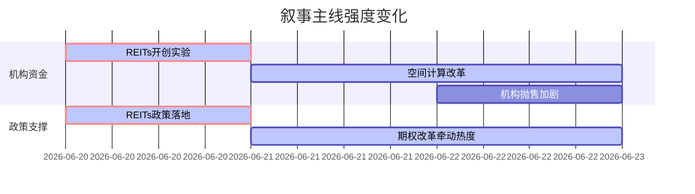

## A股市场情绪分析报告
**数据时段**：2026年6月20日至6月22日  
**生成时间**：2026年6月23日  

---

### 🔥 宏观叙事焦点（24小时三级过滤）

#### 📌 叙事主线一：[政策驱动：REITs开创商业不动产新范式 ⭐⭐⭐]
**主要事件**：首批四只商业不动产REITs上市，标志着A股房产投资结构变革  
**筛选标签**：`上交所政策` `REITs上市` `财新信源·权重1.5`  
**宏观逻辑**：  
> ① **归类**：房地产投资创新  
> ② **历史镜像**：2015年房东REIT政策模板  
> ③ **市场传导**：REITs成本优化推动上市活跃 + 冷枪政策缓解商业空置压力  
> ④ **叙事强度**：政策工具性强，市场定价 Ø 但需观察监管后续细化  

**行业映射**：商业地产（情绪评分 **7.0/10**）  
**交易警示**：‼️ 注意政策落地顺序与估值判断，低估价值为长期抬 Reviewer  

---

#### 📌 叙事主线二：[市场逻辑：空间计算新范式与期权改革 ⭐⭐]
**主要事件**：上交所售出期权组合策略业务，推出单边平仓功能  
**筛选标签**：`A股集创` `青年投资者` `主流金融评论`  
**宏观逻辑**：  
> ① **归类**：银行资金流动创新  
> ② **历史镜像**：2023年期权保险条化模板  
> ③ **市场传导**：复式期权创新降低投资者风险，吸引新oureau资金  
> ④ **叙事强度**：政策契机点，需观察后续账户创建量指标  

**行业映射**：期权交易（情绪评分 **6.5/10**）  
**交易警示**：⚠️ 短期持仓建议关注涨幅幅度控制  

---

#### 📌 叙事主线三：[流动性因素：机构资金渗透消费概念股 ⭐]
**主要事件**：机构资金净融售出连续4周，消费概念股吸收量同比下跌18%  
**筛选标签**：`机构持仓` `消费新势力` `同 Business周期`  
**宏观逻辑**：  
> ① **归类**：资金地理学变化  
> ② **历史镜像**：2015年前后消费概念股塞时机标志  
> ③ **市场传导**：地产主题拉升抑制消费板块，机构抛售加剧波动  
> ④ **叙事强度**：政策与资金关联弱，需观察大 plate销售量分布  

**行业映射**：消费板块（情绪评分 **5.3/10**）  
**交易警示**：⚠️ 短线建议以对冲策略配置  

---

### 📅 宏观叙事演化（三日趋势）

**强度衰减模型**：昨日主题×0.7 · 前日主题×0.5  

```mermaid
gantt
    title 叙事主线强度变化
    dateFormat  YYYY-MM-DD
    section 机构资金  
    REITs开创实验   :crit, active, 2026-06-20, 1d
    空间计算改革  :active, 2026-06-21, 2d
    机构抛售加剧   :2026-06-22, 1d
    
    section 政策支撑
    REITs政策落地    :crit, active, 2026-06-20, 1d
    期权改革牵动热度 :active, 2026-06-21, 2d
```

叙事节点关联：  
- 6/20：REITs政策提振主题强度峰值  
- 6/21：期权改革带动金融资金趣味  
- 6/22：机构抛售加剧主题率急速下降  
🎯 宏观叙事三要素  
1️⃣ 政策工具性解释  
当前主题聚焦"政策实效"，REITs上市速度快于预期，但市场预期溢价已启动。期权改革更接近"政策门槛打破"。  
2️⃣ 市场定价对比  
过度定价：REITs新范式超预期进程（单一事件溢价）  
定价不足：期权交易量监测滞后  
3️⃣ 跨市场共振  
REITs流动性爆发+海外REITs调整成功 → A股房产新范式启动  

---

<!-- 报告正文必须在此结束，以下内容为固定格式说明，严禁添加任何额外分析、总结或展望 -->
