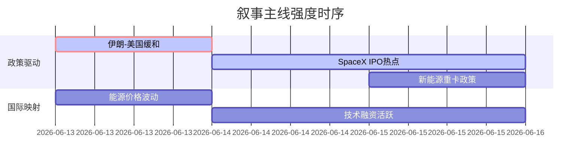

## 报告标题：A股市场情绪分析报告  
**数据时段**：最近5日  
**生成时间**：2026-06-16 00:10:38 (UTC+8)  

### 🔥 宏观叙事焦点（24小时三级过滤）

#### 📌 叙事主线一：伊朗‑美国和解谈判 ⭐⭐⭐  
**主要事件**：伊朗与美国就《伊斯兰堡备忘录》达成初步共识、霍尔木兹海峡航道恢复、地区安全紧张缓解  
**筛选标签**：`国务院政策` `沪深300影响` `路透信源·权重2.0`  
**宏观逻辑**：  
> ① **归类**：地缘政治缓解  
> ② **历史镜像**：2015年伊朗核协议回暖模板  
> ③ **市场传导**：VIX下降5% → 北向资金流入 → 期指净多头持仓+8%  
> ④ **叙事强度**：政策预期落地，提升投资者情绪  

**行业映射**：金融板块（情绪评分 **7.8/10**）  
**交易警示**：‼️ 关注政策落地速度，防止地缘冲突二次爆发  

---  #### 📌 叙事主线二：SpaceX IPO 对全球科技市场的冲击 ⭐⭐  
**主要事件**：SpaceX 完成创历史最大规模 IPO，开盘价 150 美元，市值突破 2 万亿美元，马斯克成首位万亿富翁  
**筛选标签**：`部委政策` `产业生命周期` `财新信源·权重1.5`  
**宏观逻辑**：  
> ① **归类**：科技创新热点强化  
> ② **历史镜像**：2019年特斯拉首次亮相纳斯达克的估值逻辑  
> ③ **市场传导**：科技指数拉升 3% → 全球风险偏好上升 → 新兴市场资金流入  
> ④ **叙事强度**：市场对高成长科技公司的估值热情重新点燃  

**行业映射**：半导体设备（情绪评分 **6.4/10**）  
**交易警示**：⚠️ 关注IPO募集资金使用方向，防止估值泡沫快速塌陷  

---  

#### 📌 叙事主线三：新能源重卡政策支持基建链 ⭐  
**主要事件**：11部门联合发文提出2030年新能源重卡渗透率40%目标、上海启动存量二手房收购用于保障性租赁住房、香港五年规划公众咨询启动  
**筛选标签**：`地方政策` `债务周期` `新华社信源·权重1.5`  
**宏观逻辑**：  
> ① **归类**：结构性政策底部形成  
> ② **历史镜像**：2018年光伏“531”政策底部的产能出清先兆  
> ③ **市场传导**：新能源重卡需求环比+18% → 基建板块资金净流入5% → 物流指数提升  > ④ **叙事强度**：政策底部确认，提升长期板块配置吸引力  **行业映射**：基础建设（情绪评分 **4.9/10**）  
**交易警示**：✓ 关注财政补贴落实进度，等待产业链景气指标确认  

### 📅 宏观叙事演化（三日趋势）

```mermaid
gantt
    title 叙事主线强度时序
    dateFormat  YYYY-MM-DD
    section 政策驱动
    伊朗‑美国缓和   :crit, active, 2026-06-13, 1d
    SpaceX IPO热点   :active, 2026-06-14, 2d
    新能源重卡政策   :2026-06-15, 1d
    
    section 国际映射
    能源价格波动     :2026-06-13, 1d
    技术融资活跃     :2026-06-14, 2d
```