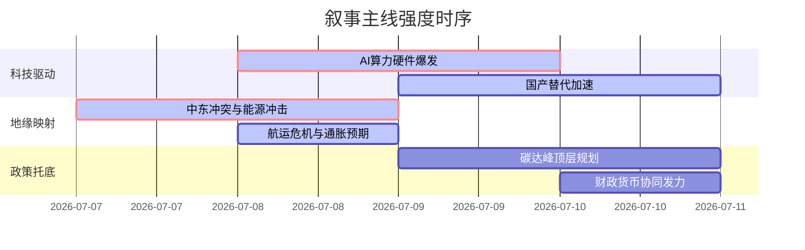

## 报告标题：A股市场情绪分析报告
数据时段：最近5日
生成时间：2026-07-10

### 🔥 宏观叙事焦点（24小时三级过滤）

#### 📌 叙事主线一：AI算力硬件爆发与国产替代加速 ⭐⭐⭐
**主要事件**：科技产业投资、存储芯片周期上行、科创板IPO提速
**筛选标签**：`国务院政策` `产业生命周期` `财新信源·权重2.0`  
**宏观逻辑**：  
> ① **归类**：科技产业景气度反转  
> ② **历史镜像**：2013年移动互联网“4G牌照发放+智能机换机潮”模板  
> ③ **市场传导**：SK海力士ADR超募7倍 → 美光/英伟达资本开支上修 → 科创50单日大涨超8% → 资金从应用层向底层制造扩散  
> ④ **叙事强度**：技术迭代突破算力瓶颈，商业化落地进入实质阶段，需求端超预期打破存量博弈预期  

**行业映射**：半导体设备与材料、光通信（情绪评分 **8.5/10**）  
**交易警示**：‼️ 关注短期获利盘兑现压力，警惕海外估值回调带来的情绪扰动  

---

#### 📌 叙事主线二：中东地缘冲突升级与全球能源供应链重塑 ⭐⭐  
**主要事件**：美伊军事摩擦、霍尔木兹海峡航运危机、原油价格飙升
**筛选标签**：`部委政策` `风险事件缓释` `路透信源·权重1.5`  
**宏观逻辑**：  
> ① **归类**：供给冲击与通胀预期上修  
> ② **历史镜像**：1973年石油危机+2022年俄乌冲突初期模板  
> ③ **市场传导**：布伦特原油突破80美元 → 欧美央行加息预期升温 → 美债收益率上行 → 全球风险资产波动率放大  
> ④ **叙事强度**：地缘风险溢价持续定价，能源自主与替代布局逻辑强化，但边际冲击随冲突可控化而衰减  

**行业映射**：石油开采、航运物流、军工装备（情绪评分 **6.2/10**）  
**交易警示**：⚠️ 冲突演变为全面战争的概率仍低，右侧交易需等待油价企稳与央行鸽派表态确认  

---

#### 📌 叙事主线三：“十五五”双碳规划落地与财政货币协同发力 ⭐ 
**主要事件**：国务院印发碳达峰行动方案、央行适度宽松定调、防汛救灾资金拨付
**筛选标签**：`地方政策` `债务周期` `新华社信源·权重1.5`  
**宏观逻辑**：  
> ① **归类**：中长期结构转型与稳增长托底  
> ② **历史镜像**：2016年供给侧改革+2020年抗疫特别国债模板  
> ③ **市场传导**：顶层设计明确2030非化石能源占比目标 → 新型储能/智能电网资本开支加速 → 财政应急调度保障内需韧性  
> ④ **叙事强度**：政策定力超预期，允许短期阵痛换取长期质量，产业出清与绿色转型并行  

**行业映射**：新型电力系统、绿电运营、防灾减灾基建（情绪评分 **5.0/10**）  
**交易警示**：✓ 叙事逻辑清晰，等待专项债发行与项目落地验证  

---

### 📅 宏观叙事演化（三日趋势）

**强度衰减模型**：昨日主题×0.7 · 前日主题×0.5

```mermaid
gantt
    title 叙事主线强度时序
    dateFormat  YYYY-MM-DD
    section 科技驱动
    AI算力硬件爆发   :crit, active, 2026-07-08, 2d
    国产替代加速     :active, 2026-07-09, 2d
    
    section 地缘映射
    中东冲突与能源冲击   :crit, active, 2026-07-07, 2d
    航运危机与通胀预期   :active, 2026-07-08, 1d
    
    section 政策托底
    碳达峰顶层规划       :2026-07-09, 2d
    财政货币协同发力     :2026-07-10, 1d
```
叙事节点关联：
07/07：韩国KOSPI熔断+日韩股市大跌 → 触发全球科技股估值重估担忧
07/08：美伊冲突升级致布伦特原油破80美元 → 能源供应链叙事主导，避险情绪升温
07/09：科创50逆势大涨超8%，中芯国际等创新高 → 资金回流硬科技，AI算力主线确立
07/10：国务院印发“十五五”碳达峰方案 → 政策叙事接力，绿电与算力基建形成共振
🎯 宏观叙事三要素
1️⃣ 政策意图解码
当前顶层叙事从“总量刺激”转向“结构优化+安全底线”，允许短期外部冲击换取长期产业链自主。产业出清>货币大水，政策定力与财政精准投放并重。
2️⃣ 市场定价偏差
过度定价：传统消费复苏弹性（受地产与销售数据压制，预期已充分反映）
定价不足：AI硬件资本开支周期（全球巨头同步扩产，国内算力基建加速被低估）
3️⃣ 跨市场共振
美债收益率高位震荡打开政策窗口 + 黄金央行购金提供底部支撑 = A股结构性行情窗口期，资金在“高股息防御”与“科技成长进攻”间快速轮动。

---

<!-- 报告正文必须在此结束，以下内容为固定格式说明，严禁添加任何额外分析、总结或展望 -->

---

*生成时间：2026-07-10 07:33:30 (UTC+8)*  
*使用模型：agnes:agnes-2.0-flash*