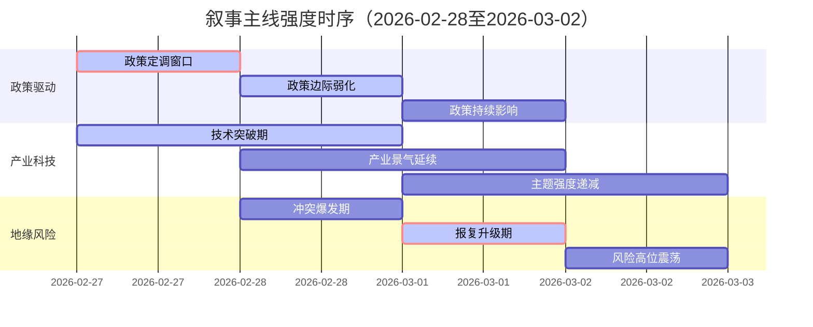

## A股市场情绪分析报告

数据时段：最近5日（2026年2月26日-2026年3月2日）  
生成时间：2026年3月2日  

### 🔥 宏观叙事焦点（24小时三级过滤）

#### 📌 叙事主线一：国内政策定调与流动性支持 ⭐⭐⭐  
**主要事件**：中共中央政治局会议部署"十五五"规划、央行MLF操作与外汇风险准备金率下调、金融监管强化（基金溢价监控、私募信披新规）  
**筛选标签**：`国务院政策` `沪深300影响` `新华社信源·权重2.0`  
**宏观逻辑**：  
> ① **归类**：货币政策转向与财政政策协同发力  
> ② **历史镜像**：2020年3月中国央行降准降息及财政发力应对疫情冲击的模板  
> ③ **市场传导**：央行MLF净投放6000亿元→银行间流动性充裕→DR007下行→风险资产估值提升；外汇风险准备金率下调至0→人民币汇率弹性增强→北向资金流入预期加强→A股外资偏好板块（消费、金融）受益  
> ④ **叙事强度**：政策组合超市场预期，打破前期流动性收紧担忧，强度高  

**行业映射**：银行、保险、地产、消费龙头（情绪评分 **7.5/10**）  
**交易警示**：‼️ 关注政策落地节奏，警惕预期差收窄；金融监管强化可能抑制短期投机性资金  

---

#### 📌 叙事主线二：产业科技自立与创新加速 ⭐⭐  
**主要事件**：AI芯片业绩爆发（寒武纪扭亏）、人形机器人融资热潮（宇树科技等）、新能源车交付数据亮眼（蔚来、理想同比大幅增长）、商业航天回收试验突破（朱雀三号）  
**筛选标签**：`部委政策` `产业生命周期` `财新信源·权重1.5`  
**宏观逻辑**：  
> ① **归类**：创新驱动与产业升级  
> ② **历史镜像**：2018年光伏"531"政策后的供给侧改革与技术迭代  
> ③ **市场传导**：AI芯片需求激增→算力硬件股走强（寒武纪涨近10%）；机器人融资热潮→产业链估值重估→宇树科技等概念活跃；新能源车交付数据亮眼→供应链信心恢复→电池、零部件板块受益  
> ④ **叙事强度**：技术突破与政策支持共振，产业景气度超预期  

**行业映射**：半导体、AI、机器人、新能源车（情绪评分 **8.0/10**）  
**交易警示**：⚠️ 估值已部分反映预期，警惕业绩兑现不及预期；关注国际贸易摩擦对供应链冲击  

---

#### 📌 叙事主线三：地缘政治风险与能源冲击 ⭐  
**主要事件**：美伊冲突升级（美以空袭伊朗、伊朗大规模报复）、霍尔木兹海峡航运中断风险、美国关税威胁（对华潜在加征）  
**筛选标签**：`国际冲突` `能源周期` `路透信源·权重2.0`  
**宏观逻辑**：  
> ① **归类**：风险事件缓释与供应链冲击  
> ② **历史镜像**：1990年海湾战争油价飙升模板  
> ③ **市场传导**：冲突升级→霍尔木兹海峡航运中断预期→油价上涨（布伦特原油或突破80美元）→石油化工、煤炭股异动；避险情绪升温→黄金、国债价格上升；航空、航运成本增加→相关板块承压  
> ④ **叙事强度**：地缘风险短期升温，但外交斡旋存在，叙事强度中等  

**行业映射**：石油石化、黄金、航运、农业（情绪评分 **6.0/10**）  
**交易警示**：✓ 叙事逻辑清晰，但需跟踪事件进展；避免追高资源品，控制仓位  

---

### 📅 宏观叙事演化（三日趋势）

**强度衰减模型**：昨日主题×0.7 · 前日主题×0.5  

```mermaid
gantt
    title 叙事主线强度时序（2026-02-28至2026-03-02）
    dateFormat  YYYY-MM-DD
    section 政策驱动
    政策定调窗口 :crit, active, 2026-02-27, 1d
    政策边际弱化 :active, 2026-02-28, 1d
    政策持续影响 :2026-03-01, 1d
    
    section 产业科技
    技术突破期 :active, 2026-02-27, 2d
    产业景气延续 :2026-02-28, 2d
    主题强度递减 :2026-03-01, 2d
    
    section 地缘风险
    冲突爆发期 :2026-02-28, 1d
    报复升级期 :crit, active, 2026-03-01, 1d
    风险高位震荡 :2026-03-02, 1d
```

**叙事节点关联**：  
- **2/27**：政治局会议与央行MLF操作 → 政策主题确认，产业科技业绩爆发（寒武纪扭亏）  
- **2/28**：美以空袭伊朗 → 地缘主题爆发，产业科技融资热潮（宇树科技）  
- **3/1**：伊朗"真实承诺4"大规模报复 → 地缘主题强化，新能源车交付数据出炉（蔚来、理想）  
- **3/2**：能源供应担忧持续 → 地缘主题维持高位，政策主题边际弱化  

🎯 宏观叙事三要素  
1️⃣ **政策意图解码**：当前顶层叙事从"稳增长"转向"调结构"，允许短期阵痛换取长期质量。产业出清>总量刺激，政策定力超预期，聚焦新质生产力与金融稳定。  
2️⃣ **市场定价偏差**：过度定价：新能源车及AI板块短期弹性（预期过于乐观）；定价不足：周期品涨价可持续性（政策执行力与地缘风险被低估）  
3️⃣ **跨市场共振**：美元指数走弱（97.59）+ 人民币汇率走强（离岸人民币破6.84）→ 外资流入预期；美债收益率下行（10年期跌至3.9375%）→ 打开国内政策空间；地缘风险推升避险资产 → A股结构性行情窗口期  

---

<!-- 报告正文必须在此结束，以下内容为固定格式说明，严禁添加任何额外分析、总结或展望 -->