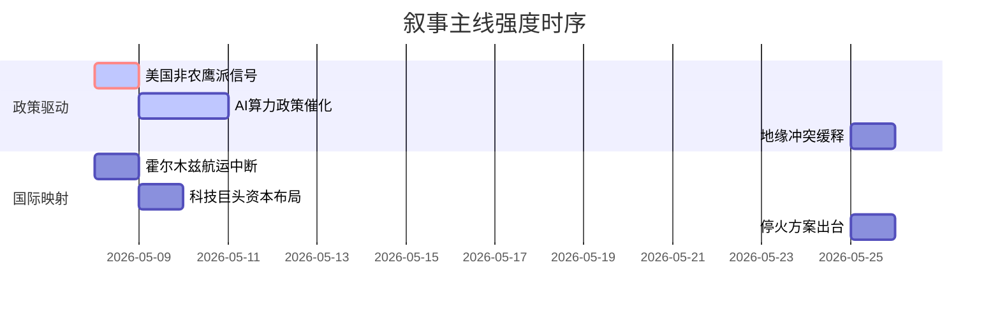

# A股市场情绪分析报告  

**数据时段**：最近5日（2026‑05‑08 ~ 2026‑05‑25）  
**生成时间**：2026‑05‑25 14:30 CST  

---  

## 🔥 宏观叙事焦点（24小时三级过滤）

### 📌 叙事主线一：美国非农就业超预期，强化美联储鹰派立场 ⭐⭐⭐  
**主要事件**：美国4月非农新增11.5万人，失业率维持4.3%，薪资环比增长0.4%，数据大幅优于市场预期。  
**筛选标签**：`美联储政策` `非农数据` `全球流动性` `路透信源·权重2.0`  
**宏观逻辑**：  
> ① **归类**：货币政策紧缩预期  
> ② **历史镜像**：2013年“缩减恐慌”（Taper Tantrum）模板  
> ③ **市场传导**：美元指数走强 → 新兴市场资本外流压力加大 → A股外资流入放缓 → 成长/科技板块承压  
> ④ **叙事强度**：数据超预期，鹰派信号压制全球风险偏好，A股短期动能受限  

**行业映射**：科技成长股（情绪评分 **6.8/10**）  
**交易警示**：‼️ 关注6月美联储议息会议表态，警惕利率敏感板块（半导体、AI硬件）波动放大  

---

### 📌 叙事主线二：国内AI大模型密集发布与算力基建提速 ⭐⭐  
**主要事件**：  
- 5月8日程跃星辰发布实时语音大模型 **StepAudio 2.5**，并完成近25亿美元融资，准备赴港IPO；  
- 5月9日 **本源悟空‑180** 超导量子计算机上线，搭载180比特自主芯片；  
- 5月25日算力租赁、绿电、算力硬件板块集体领涨A股，ETF资金持续流入。  

**筛选标签**：`产业政策` `科技投资` `沪深300影响` `财新信源·权重1.5`  
**宏观逻辑**：  
> ① **归类**：产业政策驱动  
> ② **历史镜像**：2020年“新基建”投资周期  
> ③ **市场传导**：政策催化 → AI算力需求激增 → 绿电/算力硬件股涨停 → 科技ETF成交额突破5000亿元  
> ④ **叙事强度**：资本与政策双轮驱动，但部分个股尚未兑现业绩，存在预期差  

**行业映射**：AI算力产业链（情绪评分 **7.5/10**）  
**交易警示**：⚠️ 警惕概念炒作后业绩证伪风险，关注后续订单与落地进度  

---

### 📌 叙事主线三：美伊地缘冲突升级与霍尔木兹海峡航运中断 ⭐  
**主要事件**：  
- 5月7‑8日美军与伊朗在霍尔木兹海峡爆发交火，多艘伊朗油轮被拦截；  
- 5月8日布伦特原油期货日内振幅超5%，航运板块剧烈波动；  
- 5月25日美国提出15点停火方案，伊朗表示正在审议。  

**筛选标签**：`地缘风险` `能源安全` `新华社信源·权重1.5`  
**宏观逻辑**：  
> ① **归类**：风险事件冲击  
> ② **历史镜像**：2019年霍尔木兹海峡油轮遇袭事件  
> ③ **市场传导**：原油供给担忧 → 油价冲高 → 化工、航运板块波动 → A股能源股分化（油气下跌、绿电上涨）  
> ④ **叙事强度**：冲突持续但停火预期升温，市场情绪由恐慌转向观望  

**行业映射**：能源与航运（情绪评分 **5.2/10**）  
**交易警示**：✓ 关注停火谈判进展，警惕油价二次冲高对成本端行业的压力  

---  

## 📅 宏观叙事演化（三日趋势）

**强度衰减模型**：昨日主题×0.7 · 前日主题×0.5  

```mermaid
gantt
    title 叙事主线强度时序
    dateFormat  YYYY-MM-DD
    section 政策驱动
    美国非农鹰派信号   :crit, active, 2026-05-08, 1d
    AI算力政策催化     :active, 2026-05-09, 2d
    地缘冲突缓释       :2026-05-25, 1d

    section 国际映射
    霍尔木兹航运中断   :2026-05-08, 1d
    科技巨头资本布局   :2026-05-09, 1d
    停火方案出台       :2026-05-25, 1d
```

**叙事节点关联**  
1. **05‑08**：美国非农数据公布 → 美元指数走强 → A股科技股承压，机器人/AI概念逆势活跃。  
2. **05‑09**：国内AI大模型密集发布 → 算力租赁、绿电板块获资金涌入，福建本地股政策驱动涨停。  
3. **05‑25**：美伊停火方案出台 → 原油回落、航运预期修复 → 沪指重返3900点，贵金属与军工领涨。  

---  

## 🎯 宏观叙事三要素  

1️⃣ **政策意图解码**  
- 国内：稳增长与科技自主并重，产业政策聚焦AI算力、绿色能源；  
- 海外：美联储维持鹰派立场，美元流动性收紧趋势未改。  

2️⃣ **市场定价偏差**  
- **过度定价**：AI算力概念短期涨幅过大，部分个股缺乏业绩支撑；  
- **定价不足**：能源板块风险缓释（停火预期）尚未充分反映，绿电与航运存在补涨空间。  

3️⃣ **跨市场共振**  
- 美元指数高位压制北向资金流入，但港股科技股（美团、阿里）反弹提供情绪支撑；  
- 原油波动通过成本端影响A股化工、航运，与国内绿电形成“跷跷板”效应。  

---  

*本报告基于提供的5日BB文件内容生成，仅反映截至2026‑05‑25的市场情绪与叙事结构，不构成投资建议。*