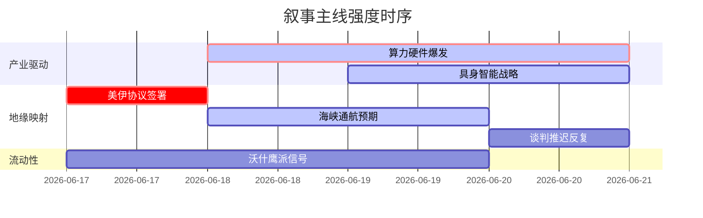

# A股市场情绪分析报告

**数据时段**：最近5日  
**生成时间**：2026-06-21

### 🔥 宏观叙事焦点（24小时三级过滤）

#### 📌 叙事主线一：AI算力基建与具身智能国家战略 ⭐⭐⭐
**主要事件**：科创50刷新历史新高，北京、广东等地密集发布具身智能与AI产业链建设指引，国家发改委推动“六张网”万亿级基建投资。  
**筛选标签**：`国务院政策` `沪深300影响` `财新信源·权重2.0`  
**宏观逻辑**：  
> ① **归类**：产业升级驱动的资本支出（Capex）扩张  
> ② **历史镜像**：2015年“一带一路”基建预期 + 2020年国产替代逻辑叠加  
> ③ **市场传导**：算力权重股（中际旭创、寒武纪）市值突破 $\rightarrow$ 成交量突破3万亿 $\rightarrow$ 资金从单纯软件端向硬件/物理AI（具身智能）扩散  
> ④ **叙事强度**：顶层设计（十五五规划）与市场热钱共振，强度极高，已形成趋势性行情  

**行业映射**：AI算力硬件、光通信、具身智能机器人（情绪评分 **9.2/10**）  
**交易警示**：‼️ 板块处于高位震荡期，关注基本面分化，警惕短期获利盘回吐风险  

---

#### 📌 叙事主线二：美伊谅解备忘录与全球能源定价重构 ⭐⭐  
**主要事件**：美伊签署MoU临时协议，霍尔木兹海峡恢复通行，美方解除海上封锁，但后续瑞士会谈因地缘冲突反复而推迟。  
**筛选标签**：`路透信源·权重2.0` `全球大宗商品` `地缘风险溢价`  
**宏观逻辑**：  
> ① **归类**：地缘风险缓释 $\rightarrow$ 供应预期改善  
> ② **历史镜像**：2015年伊核协议达成后的能源市场波动模板  
> ③ **市场传导**：霍尔木兹海峡通航 $\rightarrow$ 乌拉尔原油贴水收窄 $\rightarrow$ 能源避险资金撤出 $\rightarrow$ 影响全球风险资产定价  
> ④ **叙事强度**：协议签署带来短期乐观，但执行层面的“罗生门”导致叙事强度在“缓解”与“焦虑”之间快速切换  

**行业映射**：能源资源、航运物流（情绪评分 **6.5/10**）  
**交易警示**：⚠️ 政策博弈剧烈，关注美伊谈判的实质进展，警惕地缘突发事件引发的V型反转  

---

#### 📌 叙事主线三：美元指数强势突破与全球流动性承压 ⭐ 
**主要事件**：美联储主席沃什释放超预期鹰派信号，抛弃前瞻指引，美元指数涨破101关口，创2025年5月以来最高。  
**筛选标签**：`美联储政策` `流动性周期` `外汇市场权重`  
**宏观逻辑**：  
> ① **归类**：货币政策转向（鹰派超预期）  
> ② **历史镜像**：2013年Taper Tantrum（缩减恐慌）模板  
> ③ **市场传导**：美债波动率上升 $\rightarrow$ 美元指数走强 $\rightarrow$ 新兴市场货币（韩元等）承压 $\rightarrow$ A股外资流动性预期收紧  
> ④ **叙事强度**：流动性压力在后台持续积聚，对风险资产构成潜在压制，但目前被国内产业叙事覆盖  

**行业映射**：跨境金融、出口贸易、高分红低波动资产（情绪评分 **4.2/10**）  
**交易警示**：✓ 关注美元指数101-102关键压力位，警惕流动性收紧导致的估值回调  

---

### 📅 宏观叙事演化（三日趋势）

**强度衰减模型**：昨日主题×0.7 · 前日主题×0.5

```mermaid
gantt
    title 叙事主线强度时序
    dateFormat  YYYY-MM-DD
    section 产业驱动
    算力硬件爆发   :crit, active, 2026-06-18, 3d
    具身智能战略   :active, 2026-06-19, 2d
    
    section 地缘映射
    美伊协议签署   :crit, 2026-06-17, 1d
    海峡通航预期   :active, 2026-06-18, 2d
    谈判推迟反复   :2026-06-20, 1d
    
    section 流动性
    沃什鹰派信号   :2026-06-17, 3d
```
叙事节点关联：
06/17：美伊签署MoU $\rightarrow$ 触发全球能源风险溢价下行 $\rightarrow$ 风险资产信心回升
06/18：科创50创新高 + 沃什鹰派发言 $\rightarrow$ 形成“产业强驱动”与“流动性压制”的对抗格局
06/20：具身智能政策落地 $\rightarrow$ 叙事重心从纯算力转向“物理AI”，逻辑由虚拟转向实体

🎯 宏观叙事三要素
1️⃣ 政策意图解码
国内政策重心已明确转向“新质生产力”的硬件实操层，通过“六张网”基建将AI能力转化为物理生产力，意图在外部压力下构建自主可控的产业闭环。
2️⃣ 市场定价偏差
过度定价：AI纯软件应用端的短期弹性（估值透支）
定价不足：物理AI（具身智能）的产业化落地速度及配套基建的规模效应
3️⃣ 跨市场共振
美联储鹰派立场（压制整体估值） + 国内万亿基建计划（支撑特定赛道） = 极端的结构性行情，资金向具有“政策确定性”的硬科技集中。

---