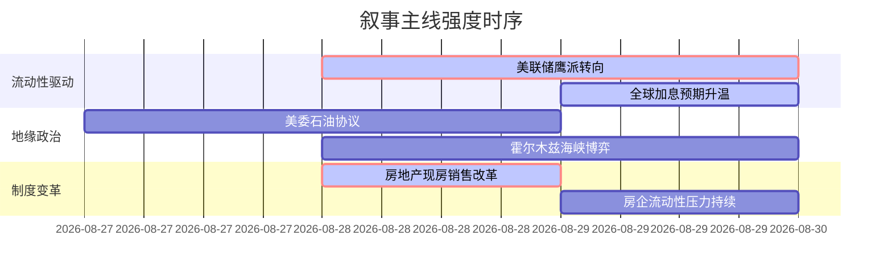

# A股市场情绪分析报告

**数据时段**：最近5日（2026年8月26日-8月30日）  
**生成时间**：2026-08-30 08:06

---

### 🔥 宏观叙事焦点（24小时三级过滤）

#### 📌 叙事主线一：美联储鹰派转向引爆全球资产重定价 ⭐⭐⭐
**主要事件**：沃什杰克逊霍尔首秀释放强鹰信号，9月加息概率升至六成
**筛选标签**：`美联储政策` `全球流动性` `汇率波动` `路透信源·权重2.0`
**宏观逻辑**：
> ① **归类**：货币政策转向  
> ② **历史镜像**：2018年美联储加息周期模板  
> ③ **市场传导**：2年期美债收益率飙升至4.35% → 美元指数触及一周高点 → 现货黄金暴跌近3%跌破4500美元 → 全球风险资产承压  
> ④ **叙事强度**：沃什明确"通胀未死、别急着庆祝"，市场重新定价加息路径，流动性收紧预期升温

**行业映射**：贵金属/银行业（情绪评分 **6.8/10**）  
**交易警示**：‼️ 关注美元走强对A股北向资金流向影响，警惕流动性收紧带来的估值压力

---

#### 📌 叙事主线二：美委石油协议重塑全球能源格局 ⭐⭐
**主要事件**：特朗普宣布美国获得委内瑞拉650亿桶石油控制权
**筛选标签**：`地缘政治` `原油供应` `OPEC变局` `财新信源·权重1.5`
**宏观逻辑**：
> ① **归类**：地缘供给冲击  
> ② **历史镜像**：1973年石油危机模板  
> ③ **市场传导**：美委石油协议达成 → 委内瑞拉评估退出OPEC → 霍尔木兹海峡仍处博弈 → 布伦特原油周跌、天然气暗盘波动  
> ④ **叙事强度**：美国深度介入拉美能源格局，中东-拉美双重心的供应重组加速

**行业映射**：石油石化/能源（情绪评分 **5.5/10**）  
**交易警示**：⚠️ 关注霍尔木兹海峡通行风险，地缘溢价与协议落地预期博弈激烈

---

#### 📌 叙事主线三：中国房地产制度重构开启现房销售时代 ⭐⭐
**主要事件**：三部门提高商品住房预售门槛，新出让土地优先现房销售
**筛选标签**：`国务院政策` `房地产改革` `金融监管` `新华社信源·权重2.0`
**宏观逻辑**：
> ① **归类**：制度性供给侧改革  
> ② **历史镜像**：2015年房地产供给侧改革模板  
> ③ **市场传导**：预售门槛提高+主办银行制+房贷期限延长至40年 → 贝壳美股盘前涨12% → 房企流动性压力分化 → 存量去化加速  
> ④ **叙事强度**：政策决心超预期，"防风险"优先于"稳增长"，行业出清加速

**行业映射**：房地产/建筑（情绪评分 **4.2/10**）  
**交易警示**：✓ 政策底已现，但市场底仍需验证，关注销售数据改善信号

---

### 📅 宏观叙事演化（三日趋势）

**强度衰减模型**：昨日主题×0.7 · 前日主题×0.5

```mermaid
gantt
    title 叙事主线强度时序
    dateFormat  YYYY-MM-DD
    section 流动性驱动
    美联储鹰派转向   :crit, active, 2026-08-28, 2d
    全球加息预期升温   :active, 2026-08-29, 1d
    
    section 地缘政治
    美委石油协议   :2026-08-27, 2d
    霍尔木兹海峡博弈   :2026-08-28, 2d
    
    section 制度变革
    房地产现房销售改革   :crit, active, 2026-08-28, 1d
    房企流动性压力持续   :2026-08-29, 1d
```

**叙事节点关联**：
- **08/27**：英伟达财报引爆AI行情 → 美加贸易摩擦升级（安大略湖更名事件）
- **08/28**：沃什杰克逊霍尔鹰派讲话 → 中国房地产制度重大改革（现房销售+主办银行制）
- **08/29**：美委石油协议达成 → 黄金大跌/锂价反弹 → 长鑫存储营收增9倍

🎯 **宏观叙事三要素**

1️⃣ **政策意图解码**  
当前顶层叙事从"稳增长"转向"防风险+调结构"，房地产现房销售改革是制度性出清的关键一步。美联储鹰派转向压制全球风险资产估值，A股需在内外部流动性收紧背景下寻找结构性机会。

2️⃣ **市场定价偏差**  
过度定价：消费复苏弹性（预期过于乐观）  
定价不足：美联储加息对新兴市场的溢出效应（美元走强+资本回流美国）

3️⃣ **跨市场共振**  
美债收益率飙升 → 美元走强 → 黄金大跌 + 人民币汇率承压 = A股外资流向波动加剧；能源地缘风险对冲需求支撑油气板块，与科技成长形成跷跷板效应。

---

*生成时间：2026-08-30 08:07:49 (UTC+8)*  
*使用模型：agnes:agnes-2.0-flash*