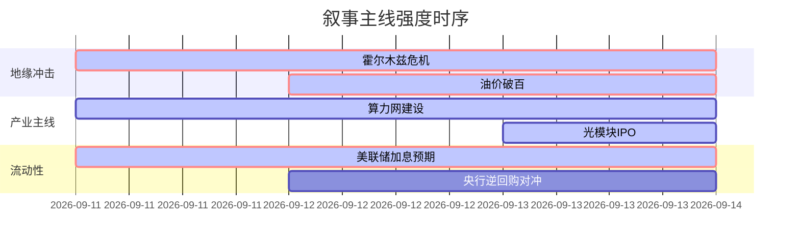

```markdown
# A股市场情绪分析报告

**数据时段**：2026年9月11日-9月14日（最近5日）  
**生成时间**：2026年9月14日 08:05

---

### 🔥 宏观叙事焦点（24小时三级过滤）

#### 📌 叙事主线一：霍尔木兹危机与能源价格冲击 ⭐⭐⭐
**主要事件**：沙特输油管道遇袭、霍尔木兹海峡通航磋商、油价涨穿100美元  
**筛选标签**：`国务院政策` `地缘风险` `路透信源·权重2.0`  
**宏观逻辑**：  
> ① **归类**：能源供给冲击  
> ② **历史镜像**：1973年石油禁运+1990年海湾战争模板  
> ③ **市场传导**：WTI涨破100美元→美国柴油均价创新高→CPI预期升温→美联储加息概率飙升至90%  
> ④ **叙事强度**：地缘冲突外溢至能源通道，油价风险溢价持续定价中  

**行业映射**：能源化工链（情绪评分 **7.5/10**）  
**交易警示**：‼️ 关注油价突破100美元后对A股通胀链的传导，警惕能源成本上行压缩中游制造业利润  

---

#### 📌 叙事主线二：AI算力基建与国产替代加速 ⭐⭐  
**主要事件**：中国推进算力网建设、光模块向6.4T演进、海信光模块资产IPO  
**筛选标签**：`工信部政策` `产业生命周期` `财新信源·权重1.5`  
**宏观逻辑**：  
> ① **归类**：新基建政策驱动  
> ② **历史镜像**：2015年"互联网+"政策模板  
> ③ **市场传导**：词元需求爆发（2026年达10亿亿）→ 光模块龙头产能利用率95% → 机构密集调研（176家调研安集科技）  
> ④ **叙事强度**：国产算力产业链景气度持续验证，有效算力成竞争核心  

**行业映射**：光通信设备/AI算力（情绪评分 **7.0/10**）  
**交易警示**：⚠️ 光模块龙头估值已处高位，关注业绩兑现与估值匹配的持续性，警惕OpenAI推迟IPO带来的情绪扰动  

---

#### 📌 叙事主线三：美联储超级央行周与全球流动性收紧 ⭐  
**主要事件**：G7央行密集议息、美联储加息概率90%、欧央行警告高油价或进一步加息  
**筛选标签**：`美联储政策` `全球流动性` `彭博信源·权重1.5`  
**宏观逻辑**：  
> ① **归类**：货币政策转向  
> ② **历史镜像**：2018年美联储加息周期模板  
> ③ **市场传导**：加息预期升温→美债收益率上行→全球风险资产估值承压→A股外资流向扰动  
> ④ **叙事强度**：能源价格推升通胀粘性，美联储"higher for longer"叙事强化  

**行业映射**：金融/成长股（情绪评分 **5.8/10**）  
**交易警示**：✓ 国内央行逆回购精准投放对冲外部收紧，A股独立性增强，但港股银行估值分化风险需关注  

---

### 📅 宏观叙事演化（三日趋势）

**强度衰减模型**：昨日主题×0.7 · 前日主题×0.5


```mermaid
gantt
    title 叙事主线强度时序
    dateFormat  YYYY-MM-DD
    section 地缘冲击
    霍尔木兹危机     :crit, active, 2026-09-11, 3d
    油价破百         :crit, active, 2026-09-12, 2d
    
    section 产业主线
    算力网建设       :active, 2026-09-11, 3d
    光模块IPO        :active, 2026-09-13, 1d
    
    section 流动性
    美联储加息预期   :crit, active, 2026-09-11, 3d
    央行逆回购对冲   :2026-09-12, 2d
```

**叙事节点关联**：
- 09/11：沙特输油管道遇袭→胡塞武装控制曼德海峡→能源通道风险升级
- 09/12：油价涨穿100美元→美联储加息概率跳升至90%→G7央行超级周开启
- 09/13：伊朗与阿曼磋商霍尔木兹通航→油价短线承压但趋势未改
- 09/14：中国算力平台汇聚超万家企业→光模块龙头产能目标实现→AI主线持续验证

**🎯 宏观叙事三要素**

1️⃣ **政策意图解码**  
当前顶层叙事从"稳增长"转向"强科技+防风险"，算力网建设纳入国务院常务会议议程，产业政策定向发力。地缘风险外溢倒逼能源安全战略升级。

2️⃣ **市场定价偏差**  
- 过度定价：美联储加息对A股的冲击（国内流动性对冲+金砖合作缓冲）
- 定价不足：算力产业链景气度持续性（词元需求爆发式增长）
- 定价不足：能源成本上行对化工链的利润分化（龙头受益、中游承压）

3️⃣ **跨市场共振**  
霍尔木兹危机→油价飙升→全球通胀预期升温→美联储鹰派→美元走强→新兴市场资本流出压力。但A股通过央行逆回购精准投放+金砖多边合作形成局部缓冲，结构性行情窗口期延续。
```

---

*生成时间：2026-09-14 08:09:29 (UTC+8)*  
*使用模型：agnes:agnes-2.0-flash*