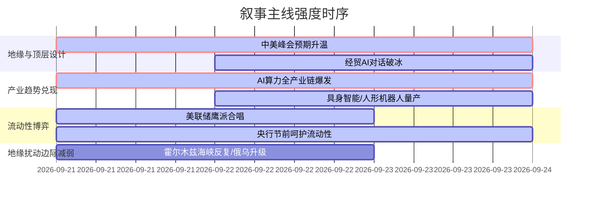

# A股市场情绪分析报告

**数据时段**：2026-09-19 至 2026-09-23（最近5日）  
**生成时间**：2026-09-23 08:30

---

### 🔥 宏观叙事焦点（24小时三级过滤）

#### 📌 叙事主线一：中美元首外交启幕与经贸AI对话破冰 ⭐⭐⭐
**主要事件**：习近平主席对美国事访问（9.23-25）、中美经贸磋商同步就AI安全举行对话、美方提议建立中美AI安全通报机制  
**筛选标签**：`国务院政策` `沪深300影响` `新华社信源·权重2.0`  
**宏观逻辑**：  
> ① **归类**：地缘政治缓和与科技治理合作  
> ② **历史镜像**：2017海湖庄园会晤/2019大阪G20重启谈判模板  
> ③ **市场传导**：离岸人民币升破7.10 → 港股科网股领涨3%+ → 北向资金净买入超百亿 → A股硬科技情绪修复  
> ④ **叙事强度**：超预期纳入AI治理议题，芯片出口管制暂不在谈判桌，为科技估值重塑提供政策锚  

**行业映射**：半导体产业链（情绪评分 **8.5/10**）、人工智能应用端（情绪评分 **7.8/10**）、港股互联网（情绪评分 **8.0/10**）  
**交易警示**：‼️ 关注联合声明措辞力度，警惕“利好出尽”短期获利盘离场，重点观察AI合作落地细则  

---

#### 📌 叙事主线二：AI算力与具身智能产业趋势强兑现 ⭐⭐
**主要事件**：AMD市值破万亿美元、Meta Muse引爆智能体行情、国产AI芯片7连阳（海光/摩尔/澜起）、长鑫G5量产、特斯拉Optimus供应链审厂、人形机器人帕西尼启动IPO  
**筛选标签**：`部委政策` `产业生命周期` `证券时报信源·权重1.5`  
**宏观逻辑**：  
> ① **归类**：新质生产力核心赛道业绩兑现期  
> ② **历史镜像**：2020年“新基建”5G/数据中心建设周期、2015年“互联网+”产业互联网化  
> ③ **市场传导**：科创50指数5日+9% → 机构调研家数创年内新高 → 近40家三季报预增六成集中算力链 → 融资余额连续净买入  
> ④ **叙事强度**：从“预期炒作”转向“业绩验证”，政策端“十五五”规划北斗/低空/具身智能万亿级产业目标明确  

**行业映射**：AI算力硬件（情绪评分 **9.0/10**）、高速连接/PCB/液冷（情绪评分 **8.2/10**）、人形机器人本体与零部件（情绪评分 **7.5/10**）  
**交易警示**：⚠️ 连板高度股（如旋极/双星）面临监管风险提示，警惕题材股业绩兑现节奏与估值剪刀差  

---

#### 📌 叙事主线三：美联储“高位更久”对峙央行“适度宽松”流动性博弈 ⭐
**主要事件**：美联储穆萨莱姆/古尔斯比/卡什卡利集体鹰派、芝商所10月加息概率一度超56%、美债收益率曲线平坦化、央行连续投放逆回购（1650亿+350亿+350亿）维持1.4%利率、LPR连续16月按兵不动  
**筛选标签**：`央行政策` `债务周期` `华尔街见闻信源·权重1.5`  
**宏观逻辑**：  
> ① **归类**：中美货币政策周期错位与汇率锚定  
> ② **历史镜像**：2018年中美利差倒挂引发资本外流、2022年美联储激进加息期  
> ③ **市场传导**：10年期美债逼近4.8% → 美元指数强势回升 → 黄金失守4300美元/盎司 → A股估值中枢承压但流动性托底 → 银行间利率稳定  
> ④ **叙事强度**：外部约束条件未变，国内“以价换量”稳汇率意图明确，财政发力节奏成破局关键  

**行业映射**：高股息红利/银行/公用事业（情绪评分 **6.5/10**）、黄金/贵金属（情绪评分 **5.0/10**）、出口链/汽车零部件（情绪评分 **6.0/10**）  
**交易警示**：✓ 叙事逻辑清晰但处于僵持期，等待美联储11月会议指引与国内人大常委会财政增量信号  

---

### 📅 宏观叙事演化（三日趋势）

**强度衰减模型**：昨日主题×0.7 · 前日主题×0.5

```mermaid
gantt
    title 叙事主线强度时序
    dateFormat  YYYY-MM-DD
    section 地缘与顶层设计
    中美峰会预期升温       :crit, active, 2026-09-21, 3d
    经贸AI对话破冰           :active, 2026-09-22, 2d
    
    section 产业趋势兑现
    AI算力全产业链爆发       :crit, active, 2026-09-21, 3d
    具身智能/人形机器人量产  :active, 2026-09-22, 2d
    
    section 流动性博弈
    美联储鹰派合唱           :active, 2026-09-21, 2d
    央行节前呵护流动性       :active, 2026-09-21, 3d
    
    section 地缘扰动边际减弱
    霍尔木兹海峡反复/俄乌升级 :2026-09-21, 2d
```
**叙事节点关联**：
- **09/21**：美股AI狂欢（Meta/AMD/Intel）溢出 → A股芯片领涨开启修复；美联储鹰派言论密集 → 美元/美债双升压制风险偏好。
- **09/22**：官方正式宣布习近平访美 → 地缘溢价快速消退，港股/中概股强势反弹；伊朗核谈判信号释放 → 油价回落缓解输入性通胀预期；央行大额逆回购锁定节前流动性。
- **09/23**：元首外交启动、经贸AI对话同步 → 硬科技叙事上升至国家战略高度；国内超大型铜金矿发现 → 资源安全叙事增强；美债收益率小幅回落 → 短期资金面压力缓释。

🎯 **宏观叙事三要素**

1️⃣ **政策意图解码**  
当前顶层叙事核心为**“对外稳预期、对内强产业、托底保流动性”**。中美峰会旨在管控分歧、避免误判、为科技合作留出窗口；国内政策从“稳增长”向“调结构”深化，允许房地产阵痛换取产业升级空间，“新质生产力”落地显性化为AI算力、低空经济、具身智能、生物制造四大万亿级赛道。财政政策处于“蓄势待发”状态，等待人大常委会授权增发特殊国债/专项债。

2️⃣ **市场定价偏差**  
- **过度定价**：短期AI题材投机股（20cm连板、概念蹭热点）、消费复苏弹性（白酒次高端分化、社零增速弱于预期）。  
- **定价不足**：央企市值管理考核落地带来的分红回购确定性收益、产业并购重组“含金量”提升（现金收购/核心资产注入）、出口链汇率红利与成本优势共振（汽车/机电/家电）。  
- **关键变量**：美联储终端利率定价是否充分、国内财政赤字率突破3%幅度、房地产销售端止跌信号确认。

3️⃣ **跨市场共振**  
**美债收益率见顶回落 + 美元指数高位企稳 + 国际油价地缘溢价剥离 = A股“独立行情”结构性窗口期打开**。  
当前共振路径：外围流动性边际改善（美债实收益率下行） → 港股估值修复（互联网/硬科技） → 北向资金回流 → A股硬科技/高股息双轮驱动。需警惕：若中美峰会无实质成果 或 美10月意外加息，共振链条将中断，市场退守“红利防御+超跌反弹”低波策略。

---

*生成时间：2026-09-23 08:20:59 (UTC+8)*  
*使用模型：openrouter:nvidia/nemotron-3-ultra-550b-a55b:free*