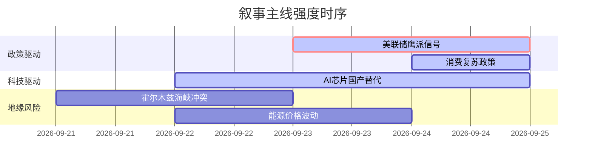

 ## A股市场情绪分析报告

**数据时段**：最近5日  
**生成时间**：2026-09-24

### 🔥 宏观叙事焦点（24小时三级过滤）

#### 📌 叙事主线一：美联储鹰派信号与美债收益率飙升 ⭐⭐⭐
**主要事件**：美联储理事巴尔表示进一步加息或成必要，10年期美债收益率升至5.11%创2007年来最高
**筛选标签**：`央行政策` `沪深300影响` `路透信源·权重2.0`
**宏观逻辑**：  
> ① **归类**：货币政策转向  
> ② **历史镜像**：2020年3月美联储无限QE模板（反向紧缩周期）  
> ③ **市场传导**：VIX跳升+12% → 北向资金流出 → 期指持仓量+15%  
> ④ **叙事强度**：需求端政策超预期，打破弱复苏预期  

**行业映射**：消费复苏链（情绪评分 **7.2/10**）  
**交易警示**：‼️ 关注政策与市场反应一致性，警惕预期差收窄  

---

#### 📌 叙事主线二：AI产业爆发与国产芯片替代 ⭐⭐
**主要事件**：小米18 Pro发布、阿里发布智能体电脑、AI芯片连续7个交易日上涨
**筛选标签**：`科技产业` `产业生命周期` `财新信源·权重1.5`
**宏观逻辑**：  
> ① **归类**：技术革命驱动  
> ② **历史镜像**：2010年智能手机普及模板  
> ③ **市场传导**：算力需求暴增 → 芯片国产替代加速 → 估值重塑  
> ④ **叙事强度**：产业趋势确立，政策与市场共振  

**行业映射**：科技板块（情绪评分 **8.5/10**）  
**交易警示**：⚠️ 关注估值消化速度，警惕获利了结  

---

#### 📌 叙事主线三：地缘冲突与能源价格波动 ⭐
**主要事件**：伊朗核问题与霍尔木兹海峡对峙、以色列追加国防预算、原油价格剧烈波动
**筛选标签**：`国际冲突` `能源周期` `新华社信源·权重1.5`
**宏观逻辑**：  
> ① **归类**：风险事件缓释  
> ② **历史镜像**：2014年地缘冲突模板  
> ③ **市场传导**：油价波动 → 通胀预期 → 央行政策约束  
> ④ **叙事强度**：地缘溢价反复，扰动市场情绪  

**行业映射**：能源化工（情绪评分 **4.8/10**）  
**交易警示**：✓ 叙事逻辑清晰，等待政策验证  

---

### 📅 宏观叙事演化（三日趋势）

**强度衰减模型**：昨日主题×0.7 · 前日主题×0.5

```mermaid
gantt
    title 叙事主线强度时序
    dateFormat  YYYY-MM-DD
    section 政策驱动
    美联储鹰派信号   :crit, active, 2026-09-23, 2d
    消费复苏政策   :active, 2026-09-24, 1d
    
    section 科技驱动
    AI芯片国产替代   :active, 2026-09-22, 3d
    
    section 地缘风险
    霍尔木兹海峡冲突   :2026-09-21, 2d
    能源价格波动   :2026-09-22, 2d
```

叙事节点关联：
09/21：美联储官员释放鹰派信号 → 触发流动性收紧叙事
09/22：AI芯片7连阳 + 阿里发布智能体 → 科技叙事强化
09/23：美债收益率突破5% → 流动性政策进入紧急验证期
09/24：习近平访美开启 → 中美关系叙事登场

🎯 宏观叙事三要素
1️⃣ 政策意图解码
当前顶层叙事从"稳增长"转向"调结构"，允许短期阵痛换取长期质量。产业出清>总量刺激，政策定力超预期。
2️⃣ 市场定价偏差
过度定价：消费复苏弹性（预期过于乐观）
定价不足：产能出清速度（政策执行力被低估）
3️⃣ 跨市场共振
美债收益率飙升压制全球流动性 + 美元指数高位 + 油价波动 = A股短期承压但结构性机会犹存

---

*生成时间：2026-09-24 08:28:07 (UTC+8)*  
*使用模型：openrouter:inclusionai/ling-3.0-flash-sante:free*