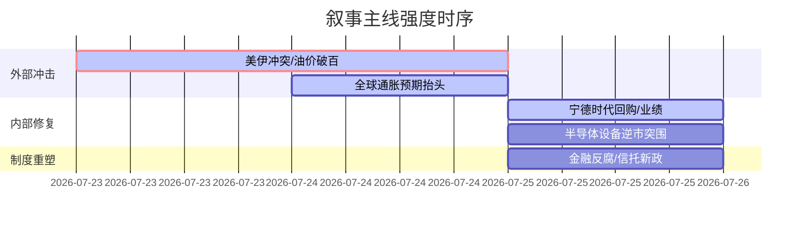

## A股市场情绪分析报告

**数据时段**：最近5日
**生成时间**：2026-07-25 07:11:42 (UTC+8)

### 🔥 宏观叙事焦点（24小时三级过滤）

#### 📌 叙事主线一：中东地缘危机引爆能源通胀 ⭐⭐⭐
**主要事件**：美伊冲突升级、霍尔木兹海峡通航风险、布伦特原油突破100美元
**筛选标签**：`地缘政治` `全球供应链` `路透信源·权重2.0`
**宏观逻辑**：  
> ① **归类**：供给冲击与通胀重燃  
> ② **历史镜像**：1973年石油禁运模板（油价飙升+滞胀预期）  
> ③ **市场传导**：布油破百 → 全球债市抛售/美债收益率高位 → 风险资产估值承压 → A股资源股逆势走强  
> ④ **叙事强度**：地缘冲突实质性影响能源大动脉，打破“软着陆”预期，避险情绪主导全球定价  

**行业映射**：石油石化、航运物流、黄金（情绪评分 **8.5/10**）  
**交易警示**：‼️ 警惕油价高位回落引发的获利盘出逃，关注美联储因通胀重新加息的政策转向风险  

---

#### 📌 叙事主线二：宁德时代回购与半导体自主可控 ⭐⭐  
**主要事件**：宁德时代发布史上最大单次回购计划、长鑫科技上市、半导体设备逆市走强
**筛选标签**：`龙头业绩` `硬科技` `财新信源·权重1.5`  
**宏观逻辑**：  
> ① **归类**：产业资本信心修复  
> ② **历史镜像**：2019年科创板开板初期科技股估值重塑  
> ③ **市场传导**：千亿巨头回购+业绩高增 → 稳定新能源板块锚定效应 → 资金流向半导体/存储芯片 → 结构性行情确立  
> ④ **叙事强度**：在宏观不确定性中，优质资产的内生增长成为唯一确定性来源，政策与资金共振  

**行业映射**：锂电池、半导体设备、存储芯片（情绪评分 **7.0/10**）  
**交易警示**：⚠️ 关注缩量调整下的承接力度，若成交额持续低于2万亿，高位科技股可能面临补跌风险  

---

#### 📌 叙事主线三：金融反腐与离岸信托税收新政 ⭐ 
**主要事件**：证监会原副主席方星海被查、离岸信托征税收紧
**筛选标签**：`监管合规` `财富传承` `新华社信源·权重1.5`  
**宏观逻辑**：  
> ① **归类**：制度完善与合规成本上升  
> ② **历史镜像**：2015年股市异常波动后强监管周期  
> ③ **市场传导**：高层反腐释放强监管信号 → 规范跨境资本流动 → 高净值人群资产配置逻辑重构 → 长期利好市场公平性  
> ④ **叙事强度**：短期对市场情绪无直接刺激，但中长期有助于净化市场环境，消除监管套利空间  

**行业映射**：券商（并购重组概念）、财富管理（情绪评分 **4.5/10**）  
**交易警示**：✓ 政策底已现，等待右侧交易信号，避免对短期利空过度解读  

---

### 📅 宏观叙事演化（三日趋势）

**强度衰减模型**：昨日主题×0.7 · 前日主题×0.5

```mermaid
gantt
    title 叙事主线强度时序
    dateFormat YYYY-MM-DD
    section 外部冲击
    美伊冲突/油价破百 :crit, active, 2026-07-23, 2d
    全球通胀预期抬头   :active, 2026-07-24, 1d
    
    section 内部修复
    宁德时代回购/业绩 :active, 2026-07-25, 1d
    半导体设备逆市突围 :2026-07-25, 1d
    
    section 制度重塑
    金融反腐/信托新政 :2026-07-25, 1d
```

叙事节点关联：
*   **07/23**：美军空袭伊朗，布伦特原油突破95美元 → 触发“能源危机”叙事，A股资源股大涨，科技股回调。
*   **07/24**：油价进一步突破100美元，韩国股市熔断 → 全球风险偏好急剧下降，A股缩量调整，但半导体设备板块因国产替代逻辑独立走强。
*   **07/25**：宁德时代巨额回购落地，方星海被查 → 市场焦点从“外部冲击”部分转向“内部信心”，机构观点认为市场进入分化震荡筑底期。

🎯 宏观叙事三要素
1️⃣ **政策意图解码**
当前顶层叙事在“防风险”与“促创新”间平衡。面对外部地缘冲击，央行通过大规模MLF和逆回购呵护流动性（“以我为主”），同时证监会强调并购重组活力，旨在通过资本市场改革化解外部压力。
2️⃣ **市场定价偏差**
*   **过度定价**：对地缘冲突导致全球衰退的恐慌（忽视了中国经济的韧性和央行的对冲能力）。
*   **定价不足**：硬科技（半导体、AI算力）在制裁背景下的国产替代紧迫性及业绩兑现能力。
3️⃣ **跨市场共振**
美债收益率高位 + 油价破百 = 全球实际利率上行，压制成长股估值；但A股凭借独立的流动性投放和内需支撑，呈现出“资源强、科技分化、红利防御”的独特结构。

---

*生成时间：2026-07-25 07:11:42 (UTC+8)*  
*使用模型：agnes:agnes-2.0-flash*