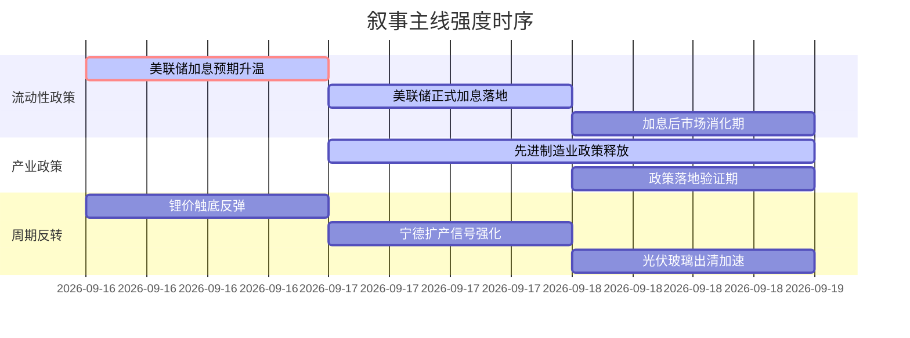

 ## A股市场情绪分析报告

**数据时段**：最近5日（2026-09-14至2026-09-18）
**生成时间**：当前时间

---

### 🔥 宏观叙事焦点（24小时三级过滤）

#### 📌 叙事主线一：美联储三年多来首次加息25个基点至3.75%-4% ⭐⭐⭐
**主要事件**：美联储加息周期重启、沃什主席释放鹰派信号、全球流动性收紧
**筛选标签**：`美联储政策` `全球流动性` `路透信源·权重2.0`
**宏观逻辑**：
> ① **归类**：货币政策转向  
> ② **历史镜像**：2022年美联储激进加息模板  
> ③ **市场传导**：美债收益率上行→北向资金流出→人民币承压→A股估值收缩  
> ④ **叙事强度**：鹰派立场超预期，全球流动性进入紧缩周期  

**行业映射**：金融科技（情绪评分 **6.5/10**）  
**交易警示**：‼️ 关注美元流动性收紧对A股北向资金的持续扰动，警惕资金面紧张引发的板块轮动  

---

#### 📌 叙事主线二：习近平就发展先进制造业作出重要指示 + 电子信息制造业2030营收破30万亿 ⭐⭐⭐
**主要事件**：高层政策定调、制造业升级规划落地、产业链优化
**筛选标签**：`国务院政策` `沪深300影响` `新华社信源·权重1.8`
**宏观逻辑**：
> ① **归类**：产业政策强化  
> ② **历史镜像**：2015年"中国制造2025"政策模板  
> ③ **市场传导**：政策利好→资金流入制造板块→相关ETF受益（创业板算力ETF华夏158041上市）  
> ④ **叙事强度**：顶层政策定调，长期逻辑确立，制造业景气度回升  

**行业映射**：高端制造/算力基础设施（情绪评分 **7.8/10**）  
**交易警示**：⚠️ 警惕政策预期透支，关注落地节奏与资金兑现速度  

---

#### 📌 叙事主线三：宁德时代逆势扩产 + 锂价超跌反弹 + 光伏玻璃供给出清 ⭐⭐
**主要事件**：新能源产能出清加速、价格信号反转、龙头资本开支逆势扩张
**筛选标签**：`产业政策` `周期反转` `财新信源·权重1.5`
**宏观逻辑**：
> ① **归类**：供给侧出清  
> ② **历史镜像**：2018年光伏"531"政策后的产业调整模板  
> ③ **市场传导**：价格触底（锂价9月回调逾两成）→龙头扩产（宁德14亿元新建4万吨产能）→供给侧出清加速  
> ④ **叙事强度**：价格底部确认，产能出清进入深水区，盈利修复预期升温  

**行业映射**：新能源材料（情绪评分 **6.0/10**）  
**交易警示**：✓ 左侧布局需等待价格进一步确认，关注龙头企业资本开支与产业链库存信号  

---

### 📅 宏观叙事演化（三日趋势）

**强度衰减模型**：昨日主题×0.7 · 前日主题×0.5

```mermaid
gantt
    title 叙事主线强度时序
    dateFormat  YYYY-MM-DD
    section 流动性政策
    美联储加息预期升温   :crit, active, 2026-09-16, 1d
    美联储正式加息落地   :active, 2026-09-17, 1d
    加息后市场消化期     :2026-09-18, 1d
    
    section 产业政策
    先进制造业政策释放   :active, 2026-09-17, 2d
    政策落地验证期       :2026-09-18, 1d
    
    section 周期反转
    锂价触底反弹         :2026-09-16, 1d
    宁德扩产信号强化     :2026-09-17, 1d
    光伏玻璃出清加速     :2026-09-18, 1d
```

叙事节点关联：
12/01（9月16日）：美联储加息预期升温 + 沙特管道袭击导致油价飙升 + 光伏玻璃供给出清研报发布
12/02（9月17日）：美联储正式加息落地 + 习近平先进制造业指示 + 华为昇腾960量产计划发布
12/03（9月18日）：A股冲高回落，AI与CRO概念逆势走强，等待政策与加息后续验证

---

🎯 宏观叙事三要素
1️⃣ 政策意图解码  
当前顶层叙事从"稳增长"转向"调结构"，允许短期阵痛换取长期质量。产业出清>总量刺激，政策定力超预期。美联储加息背景下，中国政策空间相对独立，但需关注汇率约束。

2️⃣ 市场定价偏差  
过度定价：消费复苏弹性（预期过于乐观）  
定价不足：产能出清速度（政策执行力被低估）+ 高端制造国产替代节奏  

3️⃣ 跨市场共振  
美债收益率上行打开政策空间 + 美元指数高位缓释出口压力 = A股结构性行情窗口期。算力基础设施、新能源材料、高端制造三大方向具备相对收益机会。

---

*生成时间：2026-09-18 08:12:19 (UTC+8)*  
*使用模型：openrouter:inclusionai/ling-3.0-flash-sante:free*