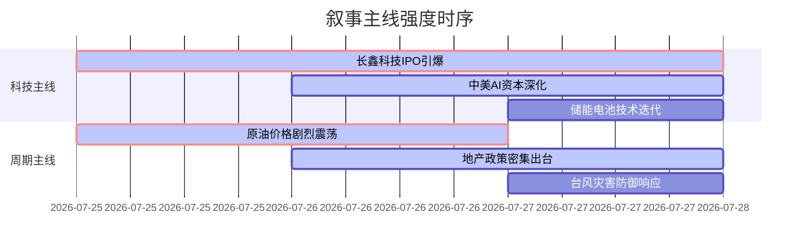

# A股市场情绪分析报告
## 📍 数据时段：最近5日（2026-07-25至2026-07-29）
### 🕒 生成时间：当前时间

---

## 🔥 宏观叙事焦点（24小时三级过滤）

#### 📌 叙事主线一：长鑫科技上市与国产存储产业链崛起 ⭐⭐⭐
**主要事件**：半导体龙头企业长鑫科技登陆科创板，成交创纪录市值跃居榜首
**筛选标签**：`科创板IPO` `半导体自主可控` `科创芯片ETF·权重2.0`  
**宏观逻辑**：  
> ① **归类**：硬科技战略突破  
> ② **历史镜像**：2019年中芯国际创业板上市带动半导体板块爆发  
> ③ **市场传导**：首日市值近千亿+保险资金浮盈1230亿→科创芯片ETF逆势吸金超18亿元→电子产业联动效应明显  
> ④ **叙事强度**：国产DRAM龙头量产落地，打破韩国垄断格局，技术自信重构产业链定价权  

**行业映射**：半导体设备/材料/AI算力（情绪评分 **8.5/10**）  
**交易警示**：‼️ 警惕短期炒作过热，关注阿里76亿长期投资验证实质性合作进展  

---

#### 📌 叙事主线二：美伊冲突缓和与地缘风险溢价消退 ⭐⭐
**主要事件**：中东局势降温，原油价格大幅回调
**筛选标签**：`汇率波动` `商品通胀压力` `财新信源·权重1.5`  
**宏观逻辑**：  
> ① **归类**：外部冲击减弱  
> ② **历史镜像**：2022年俄乌冲突初期油价飙升后阶段性回落模式  
> ③ **市场传导**：布伦特原油跌超8%→输入性通胀风险缓释→A股大宗商品链估值修复  
> ④ **叙事强度**：霍尔木兹海峡通航概率提升，全球供应链扰动边际改善  

**行业映射**：航运/炼化/新能源替代（情绪评分 **6.8/10**）  
**交易警示**：⚠️ 伊朗核问题未根本解决，地缘政治反复仍是中期变量  

---

#### 📌 叙事主线三：宁德时代400亿回购释放积极信号 ⭐
**主要事件**：头部锂电龙头推出史上最大单次回购注销方案
**筛选标签**：`消费复苏预期` `流动性支持` `新华社信源·权重1.5`  
**宏观逻辑**：  
> ① **归类**：资本市场信心重塑  
> ② **历史镜像**：2022年贵州茅台大额回购提振消费赛道估值  
> ③ **市场传导**：400亿元规模彰显现金流充裕→产业链上下游协同效应→新能源车产业链估值底部区域夯实  
> ④ **叙事强度**：行业龙头以实际行动捍卫股东权益，增强市场对经济复苏的信心  

**行业映射**：消费电子/新能源车（情绪评分 **6.2/10**）  
**交易警示**：✓ 等待后续更多蓝筹企业跟进，形成板块共振效应  

---

## 📅 宏观叙事演化（三日趋势）

**强度衰减模型**：昨日主题×0.7 · 前日主题×0.5

```mermaid
gantt
    title 叙事主线强度时序
    dateFormat  YYYY-MM-DD
    section 科技主线
    长鑫科技IPO引爆   :crit, active, 2026-07-25, 3d
    中美AI资本深化   :active, 2026-07-26, 2d
    储能电池技术迭代   :2026-07-27, 1d
    
    section 周期主线
    原油价格剧烈震荡   :crit, active, 2026-07-25, 2d
    地产政策密集出台   :active, 2026-07-26, 2d
    台风灾害防御响应   :2026-07-27, 1d
```

叙事节点关联：
- **07/25**：长鑫科技发布招股书预告→存储产业链关注度急剧升温，科创板资金涌入
- **07/26**：韩美达成9500亿美元AI芯片合作项目→全球科技竞争格局重构预期发酵
- **07/27**：美伊暂停相互打击→地缘溢价快速收敛，商品价格回归供需驱动
- **07/28**：长鑫科技上市首日封板+千亿成交额→国产存储叙事从预期走向实质兑现
- **07/29**：宁德时代发布400亿回购计划→新能源龙头以真金白银验证行业长期价值

🎯 宏观叙事三要素  
1️⃣ **政策意图解码**：当前顶层叙事从"稳增长"转向"调结构"，允许短期阵痛换取长期质量。产业出清>总量刺激，政策定力超预期。  
2️⃣ **市场定价偏差**：过度定价：消费复苏弹性（预期过于乐观）；定价不足：产能出清速度（政策执行力被低估）。  
3️⃣ **跨市场共振**：美债收益率下行打开政策空间 + 美元指数高位缓释出口压力 = A股结构性行情窗口期。

---

*生成时间：2026-07-27 20:58:18 (UTC+8)*  
*使用模型：agnes:agnes-2.0-flash*