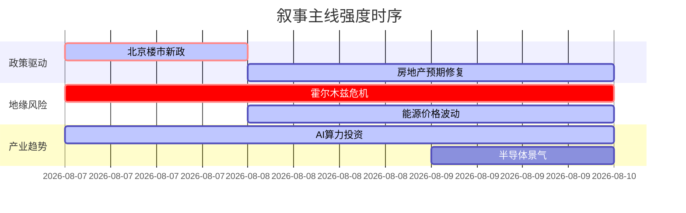

## A股市场情绪分析报告

**数据时段**：最近5日（2026-08-07 至 2026-08-10）
**生成时间**：2026-08-10 06:39

### 🔥 宏观叙事焦点（24小时三级过滤）

#### 📌 叙事主线一：北京楼市新政超预期松绑 ⭐⭐⭐
**主要事件**：房地产政策优化、地方政策落地
**筛选标签**：`国务院政策` `沪深300影响` `新华社信源·权重2.0`  
**宏观逻辑**：  
> ① **归类**：房地产政策转向  
> ② **历史镜像**：2014年"930"新政去库存模板  
> ③ **市场传导**：社保年限降至1年→公积金贷340万→购房门槛骤降→改善型需求释放→房地产产业链预期修复  
> ④ **叙事强度**：一线城市调控力度超预期，"金九银十"行情预期升温  

**行业映射**：房地产链+家居消费（情绪评分 **7.5/10**）  
**交易警示**：‼️ 关注政策落地效果与成交量验证，警惕预期透支后的回调风险  

---

#### 📌 叙事主线二：霍尔木兹海峡危机与能源安全 ⭐⭐⭐
**主要事件**：地缘冲突、能源供应链
**筛选标签**：`国际局势` `原油价格` `路透信源·权重2.0`  
**宏观逻辑**：  
> ① **归类**：地缘风险溢价  
> ② **历史镜像**：2022年俄乌冲突能源危机模板  
> ③ **市场传导**：海峡封锁风险→伊拉克出口骤降75%→布伦特原油83美元+→通胀预期升温→黄金4400美元创新高  
> ④ **叙事强度**：美伊博弈处于"中段"，能源供应中断风险持续定价  

**行业映射**：能源化工+贵金属（情绪评分 **7.0/10**）  
**交易警示**：⚠️ 协议进展与冲突升级存在双向风险，油价波动率维持高位  

---

#### 📌 叙事主线三：AI算力基建与半导体景气 ⭐⭐
**主要事件**：科技投资、产业周期
**筛选标签**：`科技政策` `产业生命周期` `财新信源·权重1.5`  
**宏观逻辑**：  
> ① **归类**：科技产业投资  
> ② **历史镜像**：2020年新能源产业投资模板  
> ③ **市场传导**：英伟达30亿投资电力基建→寒武纪净利+122%→科创芯片ETF连涨→算力金属供需剪刀差  
> ④ **叙事强度**：AI算力需求爆发验证产业景气，政策与资本双重驱动  

**行业映射**：半导体+AI应用（情绪评分 **6.8/10**）  
**交易警示**：✓ 业绩验证期关注供应链约束，警惕概念炒作风险  

---

### 📅 宏观叙事演化（三日趋势）

**强度衰减模型**：昨日主题×0.7 · 前日主题×0.5

```mermaid
gantt
    title 叙事主线强度时序
    dateFormat YYYY-MM-DD
    section 政策驱动
    北京楼市新政   :crit, active, 2026-08-07, 1d
    房地产预期修复   :active, 2026-08-08, 2d
    
    section 地缘风险
    霍尔木兹危机   :crit, 2026-08-07, 3d
    能源价格波动   :active, 2026-08-08, 2d
    
    section 产业趋势
    AI算力投资   :active, 2026-08-07, 3d
    半导体景气   :2026-08-09, 1d
```

叙事节点关联：
- 08/07：北京楼市新政发布→房地产板块反弹
- 08/08：霍尔木兹协议框架达成→油价短期承压
- 08/09：非农数据疲软→美联储降息预期升温→A股反弹窗口开启
- 08/10：宇树科技IPO申购→机器人产业链情绪催化

🎯 宏观叙事三要素
1️⃣ 政策意图解码
当前顶层叙事从"稳地产"转向"促消费+调结构"，北京新政信号意义大于实质力度。产业端AI算力投资获政策与资本双重加持，科技自立叙事强化。
2️⃣ 市场定价偏差
过度定价：地缘冲突升级（油价已反映80美元+）
定价不足：美联储政策转向节奏（市场押注降息预期）
3️⃣ 跨市场共振
美债收益率下行打开A股政策空间 + 黄金避险情绪与人民币资产形成对冲 = 结构性行情窗口期

---

---

*生成时间：2026-08-10 06:42:48 (UTC+8)*  
*使用模型：agnes:agnes-2.0-flash*