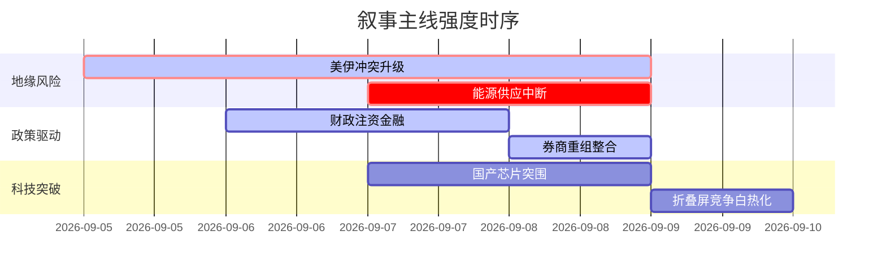

```markdown
## A股市场情绪分析报告
**数据时段**：2026年9月5日-9月9日（最近5日）
**生成时间**：2026年9月9日

### 🔥 宏观叙事焦点（24小时三级过滤）

#### 📌 叙事主线一：美伊军事冲突升级，全球能源供应风险飙升 ⭐⭐⭐
**主要事件**：地缘冲突、能源危机、航运中断
**筛选标签**：`地缘风险事件` `原油供应冲击` `路透信源·权重2.0`  
**宏观逻辑**：  
> ① **归类**：地缘风险事件  
> ② **历史镜像**：1973年石油禁运+2022年俄乌冲突能源冲击模板  
> ③ **市场传导**：布伦特原油触及97-100美元 → 通胀预期升温 → 美联储加息概率回升至59.4% → 美债收益率上行 → 全球风险资产承压  
> ④ **叙事强度**：霍尔木兹海峡日均过境900万桶油气，美伊互袭 escalate，航运风险定价严重不足  

**行业映射**：能源化工链（情绪评分 **8.1/10**）  
**交易警示**：‼️ 关注油价突破100美元后的供应链二次冲击，警惕通胀预期逆转美联储降息预期  

---

#### 📌 叙事主线二：财政注资金融体系，政策托底预期强化 ⭐⭐⭐
**主要事件**：财政部特别国债注资、金融系统资本补充
**筛选标签**：`国务院政策` `金融稳定` `新华社信源·权重2.0`  
**宏观逻辑**：  
> ① **归类**：财政政策发力  
> ② **历史镜像**：2015年券商重组+2020年特别国债模板  
> ③ **市场传导**：3570亿元注资7家银行险企 → 金融系统稳定性提升 → 券商整合预期强化 → 中金公司"三合一"总市值突破1.25万亿  
> ④ **叙事强度**：第二批特别国债落地超预期，财政对金融系统托底决心明确  

**行业映射**：券商/银行（情绪评分 **7.5/10**）  
**交易警示**：⚠️ 关注注资落地后金融机构业绩修复节奏，警惕市场对政策效果定价过度  

---

#### 📌 叙事主线三：国产芯片技术突破，科技自立叙事强化 ⭐⭐
**主要事件**：华为麒麟9050 Pro发布、折叠屏三强对决
**筛选标签**：`科技产业突破` `国产替代` `财新信源·权重1.5`  
**宏观逻辑**：  
> ① **归类**：产业技术突破  
> ② **历史镜像**：2019年华为芯片突围+2023年AI产业爆发模板  
> ③ **市场传导**：麒麟9050 Pro逻辑折叠技术亮相 → 国产芯片信心修复 → 半导体设备/材料板块受催化 → AI算力链持续发酵  
> ④ **叙事强度**：时隔六年芯片突破，差异化创新路径打开国产替代叙事空间  

**行业映射**：半导体/消费电子（情绪评分 **6.8/10**）  
**交易警示**：✓ 技术突破叙事持续，但关注摩尔线程解禁跌20%反映的算力板块资金面压力  

---

### 📅 宏观叙事演化（三日趋势）

**强度衰减模型**：昨日主题×0.7 · 前日主题×0.5


```mermaid
gantt
    title 叙事主线强度时序
    dateFormat YYYY-MM-DD
    section 地缘风险
    美伊冲突升级     :crit, active, 2026-09-05, 4d
    能源供应中断     :crit, 2026-09-07, 2d
    
    section 政策驱动
    财政注资金融     :active, 2026-09-06, 2d
    券商重组整合     :active, 2026-09-08, 1d
    
    section 科技突破
    国产芯片突围     :2026-09-07, 2d
    折叠屏竞争白热化 :2026-09-09, 1d
```

叙事节点关联：
- 09/05-06：美伊军事对峙升级 → 霍尔木兹海峡航运风险定价
- 09/06：财政部3570亿元注资银行险企落地 → 金融稳定叙事强化
- 09/07：华为麒麟9050 Pro发布 → 国产芯片突破叙事启动
- 09/08：中金"三合一"获批 → 券商整合预期发酵
- 09/09：美军袭击伊朗哈尔克岛 → 地缘风险叙事达到峰值

🎯 宏观叙事三要素
1️⃣ 政策意图解码
当前顶层叙事从"稳增长"转向"防风险+促创新"双轮驱动。财政注资金融系统体现底线思维，国产芯片突破体现长期战略定力，政策组合拳信号明确。
2️⃣ 市场定价偏差
过度定价：地缘风险对A股的直接冲击（外围冲突与A股关联度有限）
定价不足：财政注资对金融板块的业绩修复效应、国产芯片技术突破的产业链带动
3️⃣ 跨市场共振
美债收益率上行压制全球风险偏好 + 日元干预加剧亚太波动 + 铜价历史新高反映供给约束 = A股结构性行情中需警惕外围流动性收紧风险
```

---

*生成时间：2026-09-09 08:04:09 (UTC+8)*  
*使用模型：agnes:agnes-2.0-flash*