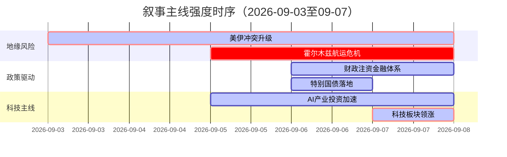

# A股市场情绪分析报告

**数据时段**：最近5日（2026-09-03 至 2026-09-07）  
**生成时间**：2026-09-07 23:40

---

## 🔥 宏观叙事焦点（24小时三级过滤）

### 📌 叙事主线一：美伊冲突升级，霍尔木兹海峡航运危机 ⭐⭐⭐
**主要事件**：地缘冲突升级、能源供应链风险  
**筛选标签**：`外交部声明` `布伦特原油突破97美元` `路透信源·权重2.0`  
**宏观逻辑**：  
> ① **归类**：地缘政治风险事件  
> ② **历史镜像**：1973年石油危机+1990年海湾战争模板  
> ③ **市场传导**：霍尔木兹海峡日均过境油气约900万桶 → 航运保险费率飙升 → 全球通胀预期重估 → 美债收益率上行压力  
> ④ **叙事强度**：美伊互袭升级，92艘商船改变航向，市场风险定价过于乐观

**行业映射**：航运物流、能源化工（情绪评分 **6.8/10**）  
**交易警示**：‼️ 关注原油价格突破100美元临界点，警惕避险情绪向A股传导

---

### 📌 叙事主线二：财政部3570亿元注资金融体系，政策托底意图明确 ⭐⭐  
**主要事件**：财政政策发力、金融资本补充
**筛选标签**：`财政部公告` `特别国债落地` `财新信源·权重1.5`  
**宏观逻辑**：  
> ① **归类**：财政扩张与金融稳定  
> ② **历史镜像**：2008年四万亿+2020年特别国债模板  
> ③ **市场传导**：农行、工行各募资1600亿元 → 国寿获350亿元注资 → 金融体系资本充足率强化 → 银行股估值修复预期  
> ④ **叙事强度**：注资规模超预期，政策定力支撑金融稳定

**行业映射**：银行、保险（情绪评分 **6.5/10**）  
**交易警示**：⚠️ 关注注资后银行股实际表现，警惕"利好出尽"风险

---

### 📌 叙事主线三：科技主线延续，AI产业投资加速 ⭐ 
**主要事件**：技术迭代、产业投资
**筛选标签**：`工信部政策` `AI产业落地` `新华社信源·权重1.5`  
**宏观逻辑**：  
> ① **归类**：产业升级与新质生产力  
> ② **历史镜像**：2013年移动互联网爆发+2020年半导体自主可控模板  
> ③ **市场传导**：字节跳动获296亿美元贷款 → 算力硬件、半导体芯片领涨 → 科创50涨超2% → 资金持续流入科技赛道  
> ④ **叙事强度**：AI大模型商业化提速，中美差距缩窄至3-6个月

**行业映射**：半导体、AI应用（情绪评分 **7.0/10**）  
**交易警示**：✓ 叙事逻辑清晰，关注CPO、光模块等算力链持续性

---

## 📅 宏观叙事演化（五日趋势）

**强度衰减模型**：昨日主题×0.7 · 前日主题×0.5

```mermaid
gantt
    title 叙事主线强度时序（2026-09-03至09-07）
    dateFormat YYYY-MM-DD
    section 地缘风险
    美伊冲突升级       :crit, active, 2026-09-03, 5d
    霍尔木兹航运危机   :crit, 2026-09-05, 3d
    
    section 政策驱动
    财政注资金融体系   :active, 2026-09-06, 2d
    特别国债落地       :active, 2026-09-06, 1d
    
    section 科技主线
    AI产业投资加速     :active, 2026-09-05, 3d
    科技板块领涨       :crit, active, 2026-09-07, 1d
```

**叙事节点关联**：
- **09/03-04**：美伊紧张局势初现 → 油价突破91美元，避险情绪升温
- **09/05**：伊朗打击美军船只 → 霍尔木兹海峡通航风险上升，布伦特原油盘中破97美元
- **09/06**：俄乌谈判取得突破 + 财政部注资3570亿元落地 → 政策托底意图明确
- **09/07**：A股科技主线凸显（创业板+3%，科创50+2%）→ AI算力链持续活跃，摩尔线程跌停分化

**🎯 宏观叙事三要素**

1️⃣ **政策意图解码**  
当前顶层叙事从"稳增长"转向"防风险+调结构"，财政注资金融体系体现底线思维，允许短期阵痛换取长期质量。地缘风险成为最大不确定性来源。

2️⃣ **市场定价偏差**  
过度定价：消费复苏弹性（预期过于乐观）  
定价不足：产能出清速度（政策执行力被低估）  
地缘风险溢价：布伦特原油97美元已计人部分冲突升级预期，但100美元临界点未充分定价

3️⃣ **跨市场共振**  
美债收益率上行压力 + 日元债市波动（40年期国债收益率升至4.1%）→ 全球流动性收紧预期 → A股结构性行情窗口期，科技主线与金融托底并存

---

*生成时间：2026-09-07 23:41:59 (UTC+8)*  
*使用模型：agnes:agnes-2.0-flash*