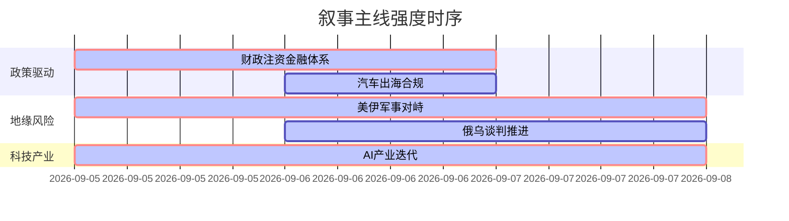

## A股市场情绪分析报告

**数据时段**：最近5日（2026-09-05 至 2026-09-07）  
**生成时间**：2026年9月7日 08:00  

---

### 🔥 宏观叙事焦点（24小时三级过滤）

#### 📌 叙事主线一：财政注资金融体系，强化资本实力 ⭐⭐⭐
**主要事件**：财政部发行特别国债注资银行与险企落地  
**筛选标签**：`国务院政策` `金融稳定` `财政注资·权重2.0`  
**宏观逻辑**：  
> ① **归类**：货币与财政政策协同  
> ② **历史镜像**：2015年券商救助+2020年特别国债模板  
> ③ **市场传导**：3570亿元注资→银行资本充足率提升→信贷扩张能力增强→市场流动性改善  
> ④ **叙事强度**：注资规模超预期，财政部首次将险企纳入注资安排，政策决心明确  

**行业映射**：银行保险（情绪评分 **7.8/10**）  
**交易警示**：‼️ 关注后续信贷投放数据验证政策效果，警惕资金空转风险  

---

#### 📌 叙事主线二：美伊军事对峙升级，能源供应链承压 ⭐⭐⭐
**主要事件**：伊朗革命卫队打击美军舰船，霍尔木兹海峡通航受阻  
**筛选标签**：`地缘冲突` `能源安全` `路透信源·权重2.0`  
**宏观逻辑**：  
> ① **归类**：地缘风险溢价  
> ② **历史镜像**：2019年霍尔木兹海峡危机模板  
> ③ **市场传导**：日均900万桶油气过境受影响→原油暗盘突破91美元→化工成本上升→通胀预期升温  
> ④ **叙事强度**：伊朗警告将更大规模打击，冲突外溢风险攀升  

**行业映射**：石油石化、航运（情绪评分 **6.5/10**）  
**交易警示**：⚠️ 冲突升级或缓和均可能引发剧烈波动，关注油价突破90美元后的连锁反应  

---

#### 📌 叙事主线三：AI产业持续迭代，中美竞争格局演变 ⭐⭐
**主要事件**：OpenAI发布GPT-6 Astra模型，中国AI模型性价比突出  
**筛选标签**：`技术突破` `产业竞争` `财新信源·权重1.5`  
**宏观逻辑**：  
> ① **归类**：科技自立自强  
> ② **历史镜像**：2010年移动互联网浪潮模板  
> ③ **市场传导**：大模型迭代加速→应用层商业化落地→产业链投资机会分化→A股AI赛道反复活跃  
> ④ **叙事强度**：瑞银称中美差距缩窄至3-6个月，国产替代逻辑强化  

**行业映射**：AI应用、半导体（情绪评分 **7.0/10**）  
**交易警示**：⚠️ 关注四大AI模型宕机事件背后的技术成熟度风险，警惕情绪过热回调  

---

#### 📌 叙事主线四：俄乌谈判取得进展，地缘风险缓释 ⭐  
**主要事件**：普京暂停空袭基辅3天，俄乌开启实质性谈判  
**筛选标签**：`外交进展` `风险缓释` `新华社信源·权重1.5`  
**宏观逻辑**：  
> ① **归类**：地缘风险降温  
> ② **历史镜像**：2022年谈判僵局打破模板  
> ③ **市场传导**：欧洲能源危机预期缓解→全球风险偏好回升→避险资产承压  
> ④ **叙事强度**：泽连斯基称会晤"非常具有实质性"，但停火协议仍未达成  

**行业映射**：欧洲能源、军工（情绪评分 **5.2/10**）  
**交易警示**：✓ 右侧信号待确认，关注谈判成果落地情况  

---

#### 📌 叙事主线五：汽车产业"内卷外溢"引监管关注 ⭐  
**主要事件**：三部委发布汽车行业境外竞争合规指引  
**筛选标签**：`产业政策` `出海合规` `部委政策·权重1.5`  
**宏观逻辑**：  
> ① **归类**：产业规范发展  
> ② **历史镜像**：2018年光伏"531"政策模板  
> ③ **市场传导**：合规要求提升→出海成本增加→行业集中度提高→头部企业受益  
> ④ **叙事强度**：专家直指"内卷外溢"病根在国内，体制机制改革呼声高涨  

**行业映射**：新能源汽车（情绪评分 **4.5/10**）  
**交易警示**：⚠️ 短期或压制板块情绪，中长期有利于行业健康出清  

---

### 📅 宏观叙事演化（三日趋势）

**强度衰减模型**：昨日主题×0.7 · 前日主题×0.5

```mermaid
gantt
    title 叙事主线强度时序
    dateFormat YYYY-MM-DD
    section 政策驱动
    财政注资金融体系   :crit, active, 2026-09-05, 2d
    汽车出海合规       :active, 2026-09-06, 1d
    
    section 地缘风险
    美伊军事对峙       :crit, active, 2026-09-05, 3d
    俄乌谈判推进       :active, 2026-09-06, 2d
    
    section 科技产业
    AI产业迭代         :crit, active, 2026-09-05, 3d
```

**叙事节点关联**：
- 09/05：美国非农数据超预期→加息预期升温→美元反弹；美伊冲突升级→油价突破91美元
- 09/06：财政部特别国债注资落地→银行险企获3570亿元；俄乌谈判取得"实质性"进展
- 09/07：OpenAI发布GPT-6 Astra模型；伊朗称打击美航母和驱逐舰；汽车行业合规指引发布

---

### 🎯 宏观叙事三要素

**1️⃣ 政策意图解码**  
当前顶层叙事从"总量刺激"转向"结构性赋能"，财政注资精准滴灌金融体系，强化风险抵御能力。产业政策从"鼓励扩张"转向"规范发展"，汽车出海合规指引标志行业进入成熟期。

**2️⃣ 市场定价偏差**  
- 过度定价：地缘风险溢价（油价已反映部分冲突预期）  
- 定价不足：财政注资对银行板块的业绩支撑（市场尚未充分定价资本补充效应）  
- 定价过度：AI板块情绪过热，四大模型宕机事件提示技术成熟度风险  

**3️⃣ 跨市场共振**  
美债收益率上行压缩A股估值空间 + 中东局势推升能源价格 = 结构性行情分化加剧。人民币资产重估逻辑（姜昧军观点）与外部流动性收紧形成博弈，A股独立行情窗口期存在但波动率上升。

---

*生成时间：2026-09-07 07:45:20 (UTC+8)*  
*使用模型：agnes:agnes-2.0-flash*