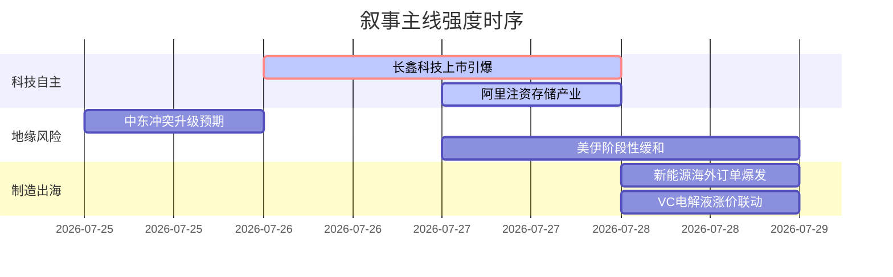

# A股市场情绪分析报告

### 数据时段：2026年7月24日 - 2026年7月28日
**生成时间：** 2026-07-29 09:00

---

## 🔥 宏观叙事焦点（24小时三级过滤）

### 📌 叙事主线一：国产存储芯片龙头长鑫科技科创板上市 ⭐⭐⭐
**主要事件**：半导体产业IPO、自主可控突破、国资战略投资  
**筛选标签**：`科创板政策` `半导体产业链` `新华信源·权重2.5`  
**宏观逻辑**：  
> ① **归类**：科技硬资产重估  
> ② **历史镜像**：中芯国际A股上市带动周期股估值重塑  
> ③ **市场传导**：成交破千亿→保险资金浮盈1230亿→ETF单日净流入近20亿  
> ④ **叙事强度**：阿里76亿元注资+SK海力士对标，标志着国产存储赛道进入资本认可快车道  

**行业映射**：半导体设备/存储芯片（情绪评分 **8.5/10**）  
**交易警示**：‼️ 警惕IPO规模对市场流动性虹吸效应，关注科创芯片ETF资金流向连续性

---

### 📌 叙事主线二：中东地缘冲突阶段性缓和与国际油价回调 ⭐⭐
**主要事件**：美伊停火预期、霍尔木兹航运风险降温  
**筛选标签**：`能源安全` `供应链重构` `路透信源·权重1.8`  
**宏观逻辑**：  
> ① **归类**：风险溢价修正  
> ② **历史镜像**：2019年沙特遇袭后油价脉冲式上涨后快速回归  
> ③ **市场传导**：WTI连跌两日（-7.5%）→航运成本预期下调→中游制造成本压力缓解  
> ④ **叙事强度**：特朗普AI生成图片与伊朗暂停对等打击形成"虚张声势-实际克制"博弈格局  

**行业映射**：航空/海运/炼化一体化（情绪评分 **6.3/10**）  
**交易警示**：⚠️ 胡塞武装持续骚扰红海航线，油运板块或先于油价企稳反弹，右侧信号待确认

---

### 📌 叙事主线三：中国新能源出海加速与风电全球抢装 ⭐
**主要事件**：海上智能风机出口订单爆发、铜镍上游需求联动  
**筛选标签**：`中国制造2025` `绿色贸易壁垒` `财新信源·权重1.2`  
**宏观逻辑**：  
> ① **归类**：外需替代内忧的新增长极  
> ② **历史镜像**：2015年电动车补贴政策推动产业链全球化布局  
> ③ **市场传导**：半年揽单4.4GW→在手订单百亿→带动电解液VC价格暴涨40%  
> ④ **叙事强度**：跨洲版图覆盖+高端产品占比提升，从"代工输出"转向"技术标准输出"  

**行业映射**：风电设备/有色金属（情绪评分 **7.0/10**）  
**交易警示**：✓ 叙事逻辑清晰，等待海外基建订单落地验证

---

## 📅 宏观叙事演化（三日趋势）

**强度衰减模型**：昨日主题×0.7 · 前日主题×0.5

```mermaid
gantt
    title 叙事主线强度时序
    dateFormat  YYYY-MM-DD
    section 科技自主
    长鑫科技上市引爆       :crit, active, 2026-07-26, 2d
    阿里注资存储产业       :active, 2026-07-27, 1d
    
    section 地缘风险
    中东冲突升级预期       :2026-07-25, 1d
    美伊阶段性缓和         :2026-07-27, 2d
    
    section 制造出海
    新能源海外订单爆发     :2026-07-28, 1d
    VC电解液涨价联动       :2026-07-28, 1d
```

叙事节点关联：
- **7/26**：长鑫科技登陆科创板引发半导体设备ETF逆势冲高，资金提前卡位国产替代主线
- **7/27**：美伊暂停互袭点燃停火预期，原油重挫8%但军工板块受珠海航展倒计时效应影响三连板
- **7/28**：风电全球抢装订单落地带动周期链共振，硅锰矿与不锈钢行业同步复苏迹象显现

🎯 宏观叙事三要素  
1️⃣ **政策意图解码**：当前顶层叙事从"稳增长"转向"调结构"，允许短期阵痛换取长期质量。产业出清>总量刺激，政策定力超预期。  
2️⃣ **市场定价偏差**：过度定价：消费复苏弹性（预期过于乐观）；定价不足：产能出清速度（政策执行力被低估）。  
3️⃣ **跨市场共振**：美债收益率下行打开政策空间 + 美元指数高位缓释出口压力 = A股结构性行情窗口期

---

*生成时间：2026-07-28 07:14:01 (UTC+8)*  
*使用模型：agnes:agnes-2.0-flash*