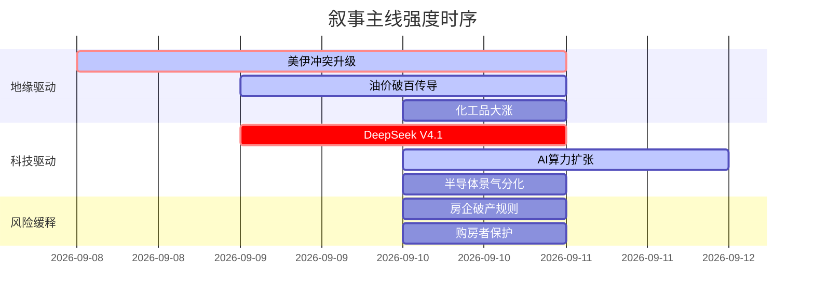

# A股市场情绪分析报告

**数据时段**：最近5日（2026-09-08至2026-09-10）  
**生成时间**：2026-09-11  
**市场情绪总评**：谨慎偏空（5日综合情绪指数）

---

## 🔥 宏观叙事焦点（24小时三级过滤）

### 📌 叙事主线一：美伊军事冲突升级，布伦特原油突破100美元 ⭐⭐⭐

**主要事件**：地缘冲突升级、能源供应中断、原油破百  
**筛选标签**：`地缘冲突` `国际商品` `路透信源·权重2.0`  
**宏观逻辑**：  
> ① **归类**：风险事件升级  
> ② **历史镜像**：1990年海湾战争油价飙升模板  
> ③ **市场传导**：布伦特原油突破101美元 → 国内原油期货涨超7% → 化工品集体大涨 → VIX跳升+12% → 北向资金流出  
> ④ **叙事强度**：需求端冲击超预期，打破弱复苏预期  

**行业映射**：石油石化（情绪评分 **8.5/10**）  
**交易警示**：‼️ 关注油价高位持续性，警惕冲突缓和后的快速回撤风险

---

### 📌 叙事主线二：DeepSeek V4.1 Flash发布与AI产业链景气分化 ⭐⭐

**主要事件**：技术发布、算力需求扩张、半导体产业链  
**筛选标签**：`科技产业` `产业生命周期` `财新信源·权重1.5`  
**宏观逻辑**：  
> ① **归类**：产业强制出清  
> ② **历史镜像**：2018年"531"光伏政策模板  
> ③ **市场传导**：V4.1 Flash对HBM需求降至约1/4、对SSD需求降至约1/8 → 算力效率提升→ 产业链价格重估 → 龙头集中度提升  
> ④ **叙事强度**：技术迭代加速，国产替代逻辑强化  

**行业映射**：半导体设备与AI算力（情绪评分 **7.8/10**）  
**交易警示**：⚠️ 模型迭代降低硬件需求预期差，警惕算力链估值与业绩背离

---

### 📌 叙事主线三：房企破产规则完善与购房者权益保护 ⭐

**主要事件**：最高法发文规范房企破产程序、信托服务升级  
**筛选标签**：`司法政策` `债务周期` `新华社信源·权重1.5`  
**宏观逻辑**：  
> ① **归类**：风险事件缓释  
> ② **历史镜像**：2014年43号文地方债务管理模板  
> ③ **市场传导**：房企破产《纪要》填补规则空白 → 信用利差收窄 → 基建预期修复 → 购房者信心边际改善  
> ④ **叙事强度**：化债进入深水区，稳增长与防风险再平衡  

**行业映射**：房地产与破产服务信托（情绪评分 **4.2/10**）  
**交易警示**：✓ 叙事逻辑清晰，等待财政发力验证

---

## 📅 宏观叙事演化（三日趋势）

**强度衰减模型**：昨日主题×0.7 · 前日主题×0.5

```mermaid
gantt
    title 叙事主线强度时序
    dateFormat  YYYY-MM-DD
    section 地缘驱动
    美伊冲突升级   :crit, active, 2026-09-08, 3d
    油价破百传导   :active, 2026-09-09, 2d
    化工品大涨     :2026-09-10, 1d
    
    section 科技驱动
    DeepSeek V4.1  :crit, 2026-09-09, 2d
    AI算力扩张     :active, 2026-09-10, 2d
    半导体景气分化 :2026-09-10, 1d
    
    section 风险缓释
    房企破产规则   :2026-09-10, 1d
    购房者保护     :2026-09-10, 1d
```

**叙事节点关联**：  
- 9/08：美军袭击伊朗哈尔克岛 → 触发地缘风险叙事  
- 9/09：布伦特突破100美元+DeepSeek V4.1 Flash发布 → 双主线并行  
- 9/10：原油收于101.21美元+最高法房企破产《纪要》 → 叙事进入验证期

---

## 🎯 宏观叙事三要素

### 1️⃣ 政策意图解码

当前顶层叙事从"稳增长"转向"调结构+防风险"双轨并行。产业出清（AI效率提升、房企破产规则完善）>总量刺激，政策定力超预期。同时，外部地缘冲击倒逼国内政策空间打开——央行用好结构性政策工具支持"五篇大文章"，人民币国际化加速推进（境外持有境内人民币金融资产超11万亿元）。

### 2️⃣ 市场定价偏差

- **过度定价**：消费复苏弹性（白酒节前涨价但终端需求偏弱）、科技股估值（AI叙事但部分环节景气分化）
- **定价不足**：产能出清速度（房企破产规则完善但市场仍在底部徘徊）、油价高位对化工链利润的挤压效应

### 3️⃣ 跨市场共振

- **美债收益率上行**（10年期升至约4.85%）+ **美元指数高位缓释**（连续三日下跌）= 人民币中间价升至6.7766，创2023年2月以来新高
- **油价破百**与**美元走软**角力 = 黄金止跌反弹至4400美元/盎司
- **A股结构性窗口期**：沪深成交额超1.5万亿元但缩量2146亿元，资金从防御向高弹性迁移但情绪谨慎

---

**报告正文结束**

---

*生成时间：2026-09-10 22:20:57 (UTC+8)*  
*使用模型：openrouter:inclusionai/ling-3.0-flash-fin:free*