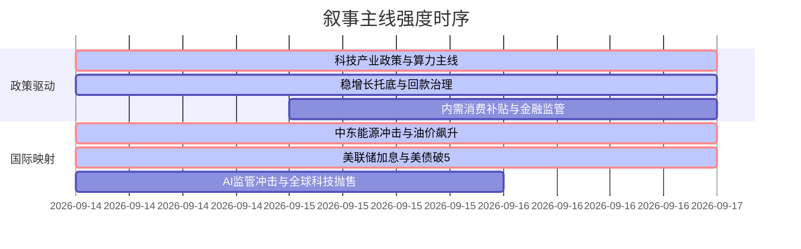

# A股市场情绪分析报告

**数据时段**：最近5日（BB文件快照覆盖：2026-09-14—2026-09-16）  
**生成时间**：2026-09-16 22:55:04 (UTC+8)+08:00

## 🔥 宏观叙事焦点（24小时三级过滤）

#### 📌 叙事主线一：中东能源冲击与美联储加息预期共振 ⭐⭐⭐
**主要事件**：霍尔木兹海峡/红海航运风险、沙特输油管道停运、国际油价飙升、美联储加息预期升温  
**筛选标签**：`中东地缘冲突` `原油供给冲击` `美债收益率破5` `美联储加息预期` `A股周期链影响` `BB聚合信源·权重2.0`  
**宏观逻辑**：  
> ① **归类**：外部通胀冲击 + 全球流动性收紧  
> ② **历史镜像**：2022年能源危机叠加美联储快速加息模板  
> ③ **市场传导**：霍尔木兹海峡通行受限 + 沙特输油管道停运 → 国际油价高位上行、国内原油期货突破900元/桶 → 化工/航空/交通成本压力抬升 → 10年期美债收益率破5% + 美联储加息概率约90% → 全球估值承压，A股高股息、能源、军工相对占优  
> ④ **叙事强度**：地缘供应冲击与利率定价共振，短期压制风险偏好，但强化周期链相对收益  

**行业映射**：油气开采、炼化化工、航运保险、高股息红利（情绪评分 **8.0/10**）  
**交易警示**：‼️ 油价与美债收益率对A股风险偏好压制较强；若中东缓和或美联储转鸽，能源与高股息交易可能快速均值回归  

---

#### 📌 叙事主线二：中国科技产业政策与AI/半导体硬件主线强化 ⭐⭐  
**主要事件**：工信部、发改委发布电子信息制造业2030年目标，AI大模型、算力、液冷、HBM、PCB、商业航天等产业投资活跃  
**筛选标签**：`工信部政策` `电子信息制造业规划` `AI算力` `半导体` `PCB` `BB聚合信源·权重1.5`  
**宏观逻辑**：  
> ① **归类**：产业政策推动 + 技术资本开支上行  
> ② **历史镜像**：2019年国产替代与半导体周期模板  
> ③ **市场传导**：电子信息制造业2030年营收目标明确 → 算力/HBM/液冷/覆铜板/PCB订单预期升温 → A股科技主线活跃 → PCB概念反复走强、AI智能体手机上市、商业火箭融资与发射催化  
> ④ **叙事强度**：政策确定性与产业趋势共振，但海外AI监管争议与美债高利率对估值形成约束  

**行业映射**：半导体、PCB/CCL、AI服务器/液冷、通信设备、商业航天（情绪评分 **7.5/10**）  
**交易警示**：⚠️ 关注产业规划落地与业绩兑现，防海外AI监管、美债利率冲击导致高波动  

---

#### 📌 叙事主线三：稳增长托底、回款治理与内需政策修复 ⭐  
**主要事件**：五部门治理中小企业回款难、央企带头及时支付账款、智能家居消费补贴、央行逆回购、人民币升值  
**筛选标签**：`国务院政策` `中小企业回款治理` `消费补贴` `央行流动性` `人民币升值` `BB聚合信源·权重1.0`  
**宏观逻辑**：  
> ① **归类**：稳增长 + 现金流修复 + 金融监管  
> ② **历史镜像**：2020年稳企业保就业与消费券政策模板  
> ③ **市场传导**：央企及时支付账款 → 中小企业回款改善 → 订单与信用预期修复；智能家居补贴 → 家电/家居链需求预期改善；央行逆回购与人民币升值 → 流动性与汇率预期边际改善 → 红利、消费、金融相对受益  
> ④ **叙事强度**：政策托底清晰，但需求端弹性仍需成交放量与社融结构改善验证  

**行业映射**：家电家居、医药疫苗、银行/非银、央国企红利（情绪评分 **6.0/10**）  
**交易警示**：✓ 政策底信号增强，但A股缩量低开、成交较前日此时缩量，需防预期兑现过快  

---

## 📅 宏观叙事演化（三日趋势）

**强度衰减模型**：昨日主题×0.7 · 前日主题×0.5

```mermaid
gantt
    title 叙事主线强度时序
    dateFormat  YYYY-MM-DD
    section 政策驱动
    科技产业政策与算力主线 :crit, active, 2026-09-14, 3d
    稳增长托底与回款治理 :active, 2026-09-14, 3d
    内需消费补贴与金融监管 :2026-09-15, 2d
    
    section 国际映射
    中东能源冲击与油价飙升 :crit, active, 2026-09-14, 3d
    美联储加息与美债破5 :crit, active, 2026-09-14, 3d
    AI监管冲击与全球科技抛售 :2026-09-14, 2d
```

叙事节点关联：  
09/14：霍尔木兹海峡通行受限、沙特输油管道停运 → 油价上行、化工成本压力升温；AI安全风波引发全球芯片调整；A股缩量但科技主线保持韧性  
09/15：10年期美债收益率破5%，美联储加息预期升温；A股高股息板块阶段性修复，覆铜板、半导体、PCB链活跃；五部门治理中小企业回款难、央企支付账款政策强化稳增长预期  
09/16：美联储决议与沃什政策叙事成为焦点；工信部、发改委明确电子信息制造业2030年目标；央行逆回购、人民币升值支撑风险偏好；A股缩量谨慎，酿酒与PCB局部活跃  

🎯 宏观叙事三要素  
1️⃣ **政策意图解码**  
当前顶层叙事从“单纯稳预期”转向“稳增长 + 调结构 + 安全韧性”并重。产业端强调电子信息、AI算力、半导体自主可控；需求端通过回款治理、智能家居补贴修复中小企业与消费预期；金融端兼顾流动性投放与监管规范。  

2️⃣ **市场定价偏差**  
过度定价：能源冲击持续性与美联储转鹰的单向交易，可能放大油价、美债与避险资产波动。  
定价不足：国内科技产业政策与现金流修复主线，尤其是电子信息制造、AI硬件、PCB/CCL、回款治理改善带来的中小企业受益。  

3️⃣ **跨市场共振**  
美债收益率破5%压制全球风险偏好，油价上行强化周期链相对收益；人民币升值、央行流动性投放与产业政策共振，为A股结构性行情提供缓冲。市场情绪总体表现为：缩量谨慎、科技活跃、红利占优、局部消费修复。

---

*生成时间：2026-09-16 22:55:04 (UTC+8)*  
*使用模型：openrouter:nex-agi/nex-n2.5-mini:free*