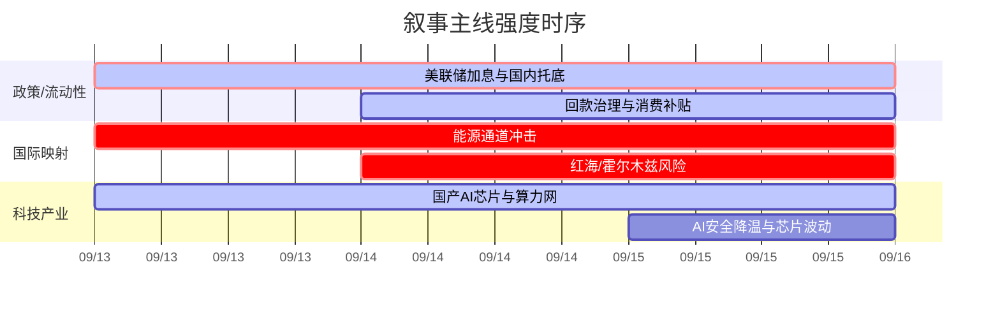

# A股市场情绪分析报告

**数据时段**：最近5日（2026-09-12—2026-09-15）  
**生成时间**：2026-09-15 00:19:20 (UTC+8)（北京时间）

## 核心内容

### 🔥 宏观叙事焦点（24小时三级过滤）

#### 📌 叙事主线一：中东能源通道受扰，油价突破102美元 ⭐⭐⭐
**主要事件**：胡塞武装强化红海控制、沙特关键输油管道关闭、美伊军事博弈升级、国内原油期货大幅上涨  
**筛选标签**：`地缘冲突` `国际商品` `BB重点信源·权重2.0`  
**宏观逻辑**：  
> ① **归类**：供给冲击与通胀再定价  
> ② **历史镜像**：2022年俄乌冲突能源价格冲击模板  
> ③ **市场传导**：霍尔木兹/红海风险 → 沙特输油管道关闭、WTI突破102美元 → 全球通胀与加息预期强化 → 油气/炼化/航运/化工受益，航空/下游成本承压  
> ④ **叙事强度**：能源通道风险从“谈判预期”转向“供应损失风险”，5日持续升温  

**行业映射**：油气开采、炼化、航运化工（情绪评分 **7.6/10**）  
**交易警示**：‼️ 油价高位与谈判反复并存，警惕成本冲击向盈利端扩散  

---

#### 📌 叙事主线二：美联储加息90%与国内流动性托底并行 ⭐⭐  
**主要事件**：美联储9月加息预期升至90%；央行开展5040亿元隔夜逆回购；五部门治理中小企业回款难；A股三大指数翻红  
**筛选标签**：`流动性政策` `沪深300影响` `BB重点信源·权重2.0`  
**宏观逻辑**：  
> ① **归类**：外部紧缩与国内稳增长托底并行  
> ② **历史镜像**：2022年美联储加息周期中“外紧内稳”模板  
> ③ **市场传导**：Fed加息90% + 油价上行 → 全球贴现率抬升/外资风险偏好承压 → 央行逆回购、ETF资金流入、宁德时代回购 → A股三大指数翻红但结构分化  
> ④ **叙事强度**：政策托底信号增强，但外部利率约束未解除  

**行业映射**：银行/高股息/消费复苏链（情绪评分 **6.4/10**）  
**交易警示**：⚠️ 关注美联储表态与国内政策落地一致性，警惕外部利率冲击通过汇率/资金渠道放大波动  

---

#### 📌 叙事主线三：国产AI芯片与算力网成科技主线 ⭐  
**主要事件**：国产AI芯片成为科技行情核心；中国算力网建设、光模块6.4T演进、北京“词元贷”落地；海外AI巨头呼吁减速  
**筛选标签**：`科技产业` `产业投资` `BB重点信源·权重1.5`  
**宏观逻辑**：  
> ① **归类**：国产替代与算力基础设施扩张  
> ② **历史镜像**：2023年CPO/算力行情与2019年半导体自主可控模板  
> ③ **市场传导**：算力网建设 + 光模块6.4T演进 + “词元贷” → 国产AI芯片/光模块/半导体机构关注 → 科技行情核心；海外AI降温带来估值扰动  
> ④ **叙事强度**：产业趋势强、交易拥挤度上升，高位股与监管核查增加波动  

**行业映射**：国产AI芯片、算力硬件、光模块（情绪评分 **6.8/10**）  
**交易警示**：✓ 叙事逻辑清晰但拥挤，关注业绩兑现与海外AI降温映射  

---

### 📅 宏观叙事演化（三日趋势）

**强度衰减模型**：昨日主题×0.7 · 前日主题×0.5

```mermaid
gantt
    title 叙事主线强度时序
    dateFormat  YYYY-MM-DD
    axisFormat  %m/%d
    section 政策/流动性
    美联储加息与国内托底 :crit, active, 2026-09-13, 3d
    回款治理与消费补贴 :active, 2026-09-14, 2d
    section 国际映射
    能源通道冲击 :crit, 2026-09-13, 3d
    红海/霍尔木兹风险 :crit, 2026-09-14, 2d
    section 科技产业
    国产AI芯片与算力网 :active, 2026-09-13, 3d
    AI安全降温与芯片波动 :2026-09-15, 1d
```

叙事节点关联：  
09/13：美联储加息概率90%、油价逼近/突破100美元 → 交易从“科技成长”切换至“宏观对冲”  
09/14：沙特输油管遇袭、美国能源部长提示霍尔木兹难突破 → 能源叙事强化，周期链相对占优  
09/15：胡塞强化红海、沙特管道关闭、WTI突破102美元；同时央行5040亿逆回购 + 五部门治理回款难，A股三大指数翻红；国产AI芯片接棒科技主线，龙版传媒跌停提示高位股退潮  

🎯 宏观叙事三要素  
1️⃣ **政策意图解码**  
当前国内政策从单纯总量刺激转向“现金流修复 + 结构性投资”：治理中小企业回款难、智能家居补贴、算力网建设、“词元贷”落地、政策金融工具支持“六张网”共同构成稳增长新框架；外部则受美联储加息90%预期压制，形成“内托底、外约束”的复合叙事。  

2️⃣ **市场定价偏差**  
过度定价：高位连板/重组题材与AI交易拥挤，龙版传媒复牌一字跌停、海外AI巨头呼吁减速均提示交易拥挤度升温。  
定价不足：能源供应损失风险与外部加息对估值的二次压缩；同时，回款治理对中小企业现金流改善的边际作用可能被低估。  

3️⃣ **跨市场共振**  
油价突破102美元、美债/欧债收益率高位、美联储加息预期90%压制全球风险偏好；国内央行逆回购、ETF资金借道流入、宁德时代回购、A股三大指数翻红提供内部托底。A股结构性行情窗口内，油气/化工/航运与国产AI芯片/算力硬件并存，银行/高股息承接稳健资金。

---

*生成时间：2026-09-15 00:19:20 (UTC+8)*  
*使用模型：openrouter:nex-agi/nex-n2.5-mini:free*