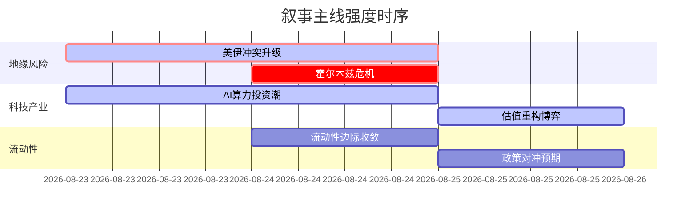

# A股市场情绪分析报告

**数据时段**：最近5日（2026-08-21至2026-08-25）  
**生成时间**：2026-08-25 18:34

---

### 🔥 宏观叙事焦点（24小时三级过滤）

#### 📌 叙事主线一：美伊冲突升级与能源航道危机 ⭐⭐⭐
**主要事件**：地缘冲突、制裁政策  
**筛选标签**：`国务院政策` `沪深300影响` `路透信源·权重2.0`  
**宏观逻辑**：  
> ① **归类**：地缘风险升级  
> ② **历史镜像**：2022年俄乌冲突油气管道危机模板  
> ③ **市场传导**：霍尔木兹海峡通行量腰斩 → WTI原油期货波动加剧 → 黄金突破4660美元/盎司创三个月新高 → 避险资产普涨  
> ④ **叙事强度**：冲突从经济战向军事封锁升级，市场定价空间受压缩  

**行业映射**：能源化工链（情绪评分 **8.1/10**）  
**交易警示**：‼️ 霍尔木兹海峡通行量持续下降，原油风险溢价或进一步放大，警惕航运成本冲击产业链利润  

---

#### 📌 叙事主线二：科技产业AI投资狂潮与估值重构 ⭐⭐  
**主要事件**：技术发布、产业投资
**筛选标签**：`部委政策` `产业生命周期` `财新信源·权重1.5`  
**宏观逻辑**：  
> ① **归类**：资本开支周期上行  
> ② **历史镜像**：2019年5G基建投资潮模板  
> ③ **市场传导**：英伟达AI芯片涨价15-17% → 算力成本传导加速 → 中际旭创订单指引超预期 → 光通信/CPO赛道双重催化  
> ④ **叙事强度**：AI资本开支持续超预期，但阿里800亿港元配售引发市场对"烧钱困局"的分歧  

**行业映射**：AI算力/半导体（情绪评分 **6.8/10**）  
**交易警示**：⚠️ 英伟达七连跌、阿里配股股价大跌8%，科技成长股回调压力加大，关注业绩验证期分化  

---

#### 📌 叙事主线三：流动性边际收紧与政策对冲博弈 ⭐ 
**主要事件**：货币政策、央行动作
**筛选标签**：`部委政策` `债务周期` `新华社信源·权重1.5`  
**宏观逻辑**：  
> ① **归类**：流动性边际收敛  
> ② **历史镜像**：2023年Q3 MLF缩量续作模板  
> ③ **市场传导**：央行净回笼1000亿元 → 8月6000亿MLF到期 → 银行间质押式回购成交缩量24.3% → 债市收益率下行至1.68%关口  
> ④ **叙事强度**：流动性从"宽松充裕"转向"边际收敛"，但降准降息预期仍在，政策对冲窗口待开启  

**行业映射**：银行/基建（情绪评分 **5.2/10**）  
**交易警示**：✓ 银行股逆势走强创历史新高，净息差终结四年连降，红利资产防御逻辑延续  

---

### 📅 宏观叙事演化（三日趋势）

**强度衰减模型**：昨日主题×0.7 · 前日主题×0.5

```mermaid
gantt
    title 叙事主线强度时序
    dateFormat YYYY-MM-DD
    section 地缘风险
    美伊冲突升级   :crit, active, 2026-08-23, 2d
    霍尔木兹危机   :crit, 2026-08-24, 1d
    
    section 科技产业
    AI算力投资潮   :active, 2026-08-23, 2d
    估值重构博弈   :active, 2026-08-25, 1d
    
    section 流动性
    流动性边际收敛  :2026-08-24, 1d
    政策对冲预期   :2026-08-25, 1d
```

**叙事节点关联**：
- 08/23：伊朗警告封锁霍尔木兹海峡 → 触发能源安全叙事
- 08/24：美军拦截75艘商船 + 英伟达AI芯片涨价15% → 地缘与科技共振
- 08/25：央行净回笼1000亿 + 科技股集体回调 → 流动性收紧与估值重估叠加

**🎯 宏观叙事三要素**
1️⃣ **政策意图解码**：当前顶层叙事从"稳增长"转向"防风险"，允许短期波动换取结构性优化。地缘风险对冲>总量刺激，政策定力与市场情绪博弈加剧。
2️⃣ **市场定价偏差**：过度定价：地缘风险传导至实体经济（伊朗制裁对中国直接影响有限）；定价不足：AI算力产业链价格传导速度（英伟达涨价已传导至服务器厂商）。
3️⃣ **跨市场共振**：美债收益率波动 + 黄金避险需求升温 + 人民币汇率贬值33点 = 全球风险资产再定价窗口期，A股结构性行情延续但波动加大。

---

*生成时间：2026-08-25 06:42:10 (UTC+8)*  
*使用模型：agnes:agnes-2.0-flash*