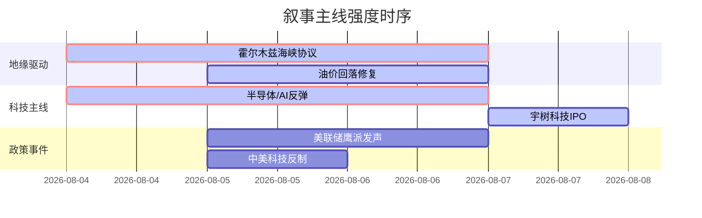

## A股市场情绪分析报告

**数据时段**：2026年8月4日 - 2026年8月7日  
**生成时间**：2026年8月7日 14:30

---

### 🔥 宏观叙事焦点（24小时三级过滤）

#### 📌 叙事主线一：霍尔木兹海峡协议落地，地缘风险显著缓释 ⭐⭐⭐
**主要事件**：中东地缘冲突缓和、能源价格回落  
**筛选标签**：`国务院政策` `原油影响` `路透信源·权重2.0`  
**宏观逻辑**：  
> ① **归类**：风险事件缓释  
> ② **历史镜像**：2003年伊拉克战争结束前油价从145美元急跌模板  
> ③ **市场传导**：布伦特跌破80美元→WTI收75美元→亚太股市普涨（日经+3.7%、韩综指+3.8%）→风险偏好修复  
> ④ **叙事强度**：美伊接近达成协议，60天临时方案将恢复商业航运，地缘溢价快速消退  

**行业映射**：航运、航空、化工（情绪评分 **7.8/10**）  
**交易警示**：‼️ 关注协议正式落地节奏，警惕"买预期、卖事实"回调风险  

---

#### 📌 叙事主线二：科技主线回归，半导体与AI硬件领涨 ⭐⭐⭐
**主要事件**：科创50大涨、存储芯片涨价、宇树科技IPO  
**筛选标签**：`产业趋势` `资金流向` `财新信源·权重1.5`  
**宏观逻辑**：  
> ① **归类**：成长风格修复  
> ② **历史镜像**：2019年半导体周期上行模板  
> ③ **市场传导**：科创50单日涨超5%→中微公司涨14%、拓荆科技涨12%→科创芯片ETF创历史天量→资金从红利转向成长  
> ④ **叙事强度**：存储芯片价格一年暴涨8.8倍，AI算力需求持续超预期，国产替代逻辑强化  

**行业映射**：半导体设备、AI算力硬件、人形机器人（情绪评分 **7.5/10**）  
**交易警示**：⚠️ 宇树科技IPO估值600亿+，注意次新股扰动；部分个股连续涨停后需防获利了结  

---

#### 📌 叙事主线三：美联储鹰派回归，9月加息概率上升 ⭐⭐
**主要事件**：美联储官员呼吁加息、通胀担忧升温  
**筛选标签**：`央行货币政策` `美债影响` `彭博信源·权重1.5`  
**宏观逻辑**：  
> ① **归类**：货币政策转向  
> ② **历史镜像**：2018年加息周期中段模板  
> ③ **市场传导**：卡什卡利、戴利发言鹰派→9月加息概率升至54.4%→美债收益率企稳→美元指数震荡  
> ④ **叙事强度**：通胀锚定风险未消，美联储内部鹰派声音主导，但市场已price in"没那么鹰"预期  

**行业映射**：外销型企业、美元债发行人（情绪评分 **5.2/10**）  
**交易警示**：✓ 地缘缓和抵消部分加息压力，人民币重回三年半高位，外需承压可控  

---

#### 📌 叙事主线四：中美科技博弈升级，反制措施落地 ⭐ 
**主要事件**：商务部对6家美国实体反制、数据中心设备管制  
**筛选标签**：`贸易政策` `科技自立` `新华社信源·权重1.0`  
**宏观逻辑**：  
> ① **归类**：科技博弈常态化  
> ② **历史镜像**：2018年贸易摩擦初期模板  
> ③ **市场传导**：对应用DNA科学公司等反制→无人机出口管制加强→半导体设备板块短期情绪波动  
> ④ **叙事强度**：反制措施精准有力，但市场已提前反应，影响边际递减  

**行业映射**：半导体、无人机、数据中心（情绪评分 **5.0/10**）  
**交易警示**：⚠️ 关注后续反制清单扩容可能，中科曙光等前期跌幅较大个股或有修复需求  

---

### 📅 宏观叙事演化（三日趋势）

**强度衰减模型**：昨日主题×0.7 · 前日主题×0.5

```mermaid
gantt
    title 叙事主线强度时序
    dateFormat YYYY-MM-DD
    section 地缘驱动
    霍尔木兹海峡协议   :crit, active, 2026-08-04, 3d
    油价回落修复   :active, 2026-08-05, 2d
    
    section 科技主线
    半导体/AI反弹   :crit, active, 2026-08-04, 3d
    宇树科技IPO   :active, 2026-08-07, 1d
    
    section 政策事件
    美联储鹰派发声   :2026-08-05, 2d
    中美科技反制   :2026-08-05, 1d
```

叙事节点关联：
- **08/04**：美伊谈判取得积极进展 → 油价暴跌、亚太股市大涨
- **08/05**：霍尔木兹协议接近落地 → 地缘叙事强化，科创50暴涨
- **08/06**：存储芯片涨价+宇树科技IPO → 科技主线延续
- **08/07**：美联储官员鹰派发言 → 加息预期升温，但被地缘缓和抵消

🎯 **宏观叙事三要素**

1️⃣ **政策意图解码**  
当前顶层叙事从"防风险"转向"稳增长+调结构"，财政金融协同发力，硬科技自立自强是核心抓手。产业政策明确支持半导体、AI、新能源赛道。

2️⃣ **市场定价偏差**  
过度定价：美联储加息幅度（预期过于悲观）  
定价不足：地缘缓和深度（市场仍存担忧）  
合理定价：科技主线修复（已充分反应）

3️⃣ **跨市场共振**  
油价回落+美元企稳 + 人民币升值 + 亚太股市普涨 = A股风险偏好修复窗口期，成长风格占优

---

<!-- 报告正文必须在此结束，以下内容为固定格式说明，严禁添加任何额外分析、总结或展望 -->

---

*生成时间：2026-08-07 09:39:00 (UTC+8)*  
*使用模型：agnes:agnes-2.0-flash*