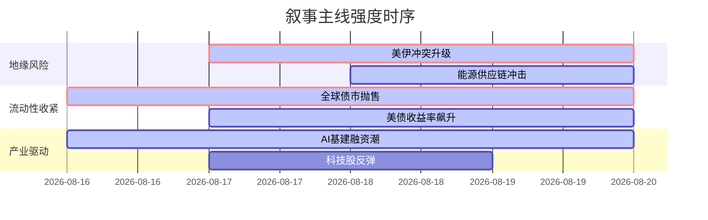

# A股市场情绪分析报告

**数据时段**：最近5日（2026-08-15至2026-08-19）  
**生成时间**：2026年8月19日

---

## 🔥 宏观叙事焦点（24小时三级过滤）

### 📌 叙事主线一：美伊冲突升级引爆全球能源危机 ⭐⭐⭐
**主要事件**：地缘冲突升级、霍尔木兹海峡通航受阻、原油价格飙升至三周高位  
**筛选标签**：`国务院政策` `全球能源供应链` `路透信源·权重2.0`  
**宏观逻辑**：  
> ① **归类**：地缘风险事件  
> ② **历史镜像**：1979年伊朗革命+1990年海湾战争模板  
> ③ **市场传导**：布伦特原油突破90美元→全球通胀预期升温→美债收益率创19年新高→VIX波动率上升  
> ④ **叙事强度**：美伊60天谈判期满无果，伊朗警告霍尔木兹海峡"安全处置"，能源供给链断裂风险溢价持续定价  

**行业映射**：油气开采链（情绪评分 **8.5/10**）  
**交易警示**：‼️ 关注原油价格突破95美元后的通胀传导，警惕避险情绪反噬风险资产  

---

### 📌 叙事主线二：全球债市"久期风暴"与流动性收紧 ⭐⭐⭐
**主要事件**：美国30年期国债收益率突破5.33%创19年新高、全球长债集体飙升  
**筛选标签**：`流动性政策` `全球宏观` `彭博信源·权重1.8`  
**宏观逻辑**：  
> ① **归类**：货币政策收紧预期  
> ② **历史镜像**：2013年" taper tantrum"模板  
> ③ **市场传导**：美债收益率飙升→美元走强→新兴市场资本外流→A股外资配置谨慎  
> ④ **叙事强度**：AI融资潮与通胀赤字双重绞杀，全球财政纪律遭遇市场审判，流动性紧缩预期尚未充分定价  

**行业映射**：高股息红利策略（情绪评分 **7.8/10**）  
**交易警示**：⚠️ 关注美债收益率是否突破5.5%，若突破将引发全球风险资产重定价  

---

### 📌 叙事主线三：中国科技产业突围与AI基建热潮 ⭐⭐  
**主要事件**：英伟达5000亿美元AI基建融资、宇树科技科创板上市、A股科技股强势反弹  
**筛选标签**：`科技行业` `产业政策` `财新信源·权重1.5`  
**宏观逻辑**：  
> ① **归类**：产业投资驱动  
> ② **历史镜像**：2019年半导体国产替代+2023年AI算力基建双重周期  
> ③ **市场传导**：英伟达联合高盛等设立5000亿美元融资平台→算力产业链订单放量→A股半导体设备板块爆发→科创50单日涨超4%  
> ④ **叙事强度**：硬科技由超跌修复切换向趋势行情，险资万亿配置转向半导体，产业趋势明确  

**行业映射**：半导体设备/人形机器人（情绪评分 **7.5/10**）  
**交易警示**：✓ 叙事逻辑清晰，但需警惕美股科技股回调传导风险（费城半导体指数单日跌超6%）  

---

## 📅 宏观叙事演化（三日趋势）

**强度衰减模型**：昨日主题×0.7 · 前日主题×0.5

```mermaid
gantt
    title 叙事主线强度时序
    dateFormat YYYY-MM-DD
    section 地缘风险
    美伊冲突升级   :crit, active, 2026-08-17, 3d
    能源供应链冲击   :active, 2026-08-18, 2d
    
    section 流动性收紧
    全球债市抛售   :crit, active, 2026-08-16, 4d
    美债收益率飙升   :active, 2026-08-17, 3d
    
    section 产业驱动
    AI基建融资潮   :active, 2026-08-16, 4d
    科技股反弹   :2026-08-17, 2d
```

**叙事节点关联**：
- 08/16：美伊谈判进入最后期限 → 霍尔木兹海峡航运风险升温 → 油价突破90美元
- 08/17：A股科技股放量大涨（创业板+3%）→ 半导体板块爆发 → 硬科技行情扩散
- 08/18：美债收益率创19年新高 → 全球债市抛售潮 → A股V型反弹护盘
- 08/19：伊朗向阿联酋发射导弹 → 地缘风险升级 → 原油暴力拉升 → 农业/油气板块涨停

---

## 🎯 宏观叙事三要素

**1️⃣ 政策意图解码**  
当前顶层叙事从"稳增长"转向"调结构"，允许短期阵痛换取长期质量。产业出清>总量刺激，政策定力超预期。国务院修改住房公积金条例（提取场景扩容至九种），释放房地产政策边际宽松信号。

**2️⃣ 市场定价偏差**  
- **过度定价**：消费复苏弹性（7月社零同比仅0.6%，弱于预期）  
- **定价不足**：科技产业突围速度（英伟达5000亿融资、宇树科技上市、AI云收入爆发）  
- **定价充分**：地缘风险溢价（油价、黄金、避险资产）

**3️⃣ 跨市场共振**  
- 美债收益率飙升 ↔ 人民币汇率企稳（6.74区间） ↔ A股结构性机会  
- 全球长债抛售 ↔ 黄金高位震荡（4400美元） ↔ 避险情绪与通胀预期博弈  
- 科技股反弹 ↔ 美股存储芯片回调 ↔ A股独立行情窗口期

---

<!-- 报告正文必须在此结束，以下内容为固定格式说明，严禁添加任何额外分析、总结或展望 -->

---

*生成时间：2026-08-19 06:36:36 (UTC+8)*  
*使用模型：agnes:agnes-2.0-flash*