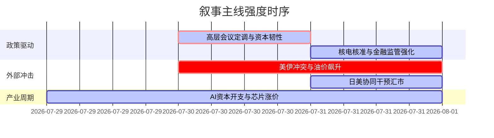

## A股市场情绪分析报告
**数据时段**：最近5日（2026-07-29至2026-08-01）
**生成时间**：2026年8月1日 10:00

### 🔥 宏观叙事焦点（24小时三级过滤）

#### 📌 叙事主线一：高层会议密集定调下半年经济，资本市场韧性建设提速 ⭐⭐⭐
**主要事件**：政治局会议与国常会部署逆周期调节、金融监管改革与核电批复
**筛选标签**：`国务院政策` `沪深300影响` `新华社信源·权重2.0`
**宏观逻辑**：
> ① **归类**：宏观政策转向托底
> ② **历史镜像**：2020年4月政治局会议“六稳六保”政策反转模板
> ③ **市场传导**：股票ETF单月净流入突破5400亿元创历史新高 → 抛压被中长期资金承接 → 创业板/科创50超跌后暴力反弹
> ④ **叙事强度**：顶层明确“适时调整”与“深化投融资综合改革”，政策底信号确立，打破此前对需求疲软的悲观定价

**行业映射**：大金融与红利资产（情绪评分 **7.5/10**）
**交易警示**：‼️ 关注财政发力节奏与存量政策集成效应，警惕利好兑现后的区间震荡

---

#### 📌 叙事主线二：美伊冲突升级推高能源成本，全球流动性博弈加剧 ⭐⭐
**主要事件**：中东战事恶化致布伦特原油突破91美元，日美协同干预汇市稳日元
**筛选标签**：`国际冲突` `能源成本冲击` `路透信源·权重1.5`
**宏观逻辑**：
> ① **归类**：外部供给冲击与汇率干预
> ② **历史镜像**：1973年石油危机与1990年代新兴市场汇率干预周期
> ③ **市场传导**：油价跳涨+美联储9:3维持利率不变 → 美债收益率高位钝化 → 全球风险资产定价重估与板块分化
> ④ **叙事强度**：地缘风险溢价快速攀升，但央行协同稳汇压制了通胀预期向全市场扩散的速度

**行业映射**：油气开采与贵金属（情绪评分 **6.2/10**）
**交易警示**：⚠️ 警惕油价高位对中游制造业成本端的侵蚀，右侧配置需等待霍尔木兹海峡通行恢复信号

---

#### 📌 叙事主线三：AI资本开支狂飙与产业链价格重估 ⭐
**主要事件**：美科技巨头承诺AI基建投资超2.4万亿美元，存储芯片价格“百年一遇”暴涨
**筛选标签**：`产业周期` `科技自主可控` `财新信源·权重1.5`
**宏观逻辑**：
> ① **归类**：技术革命驱动的产能周期
> ② **历史镜像**：2010年智能手机换机潮与2020年云基建扩张模板
> ③ **市场传导**：内存等关键零部件供应紧缺 → 算力硬件业绩兑现 → 资金从题材炒作向业绩龙头集中（韩国KOSPI去杠杆行情即为前置映射）
> ④ **叙事强度**：产业趋势确定性高，但短期估值已透支部分预期，去杠杆与再定价过程同步进行

**行业映射**：半导体设备与光模块（情绪评分 **5.8/10**）
**交易警示**：✓ 叙事逻辑清晰，等待财报季业绩验证，规避纯概念题材与高波动杠杆产品

---

### 📅 宏观叙事演化（三日趋势）

**强度衰减模型**：昨日主题×0.7 · 前日主题×0.5

```mermaid
gantt
    title 叙事主线强度时序
    dateFormat  YYYY-MM-DD
    section 政策驱动
    高层会议定调与资本韧性   :crit, active, 2026-07-30, 1d
    核电核准与金融监管强化   :active, 2026-07-31, 1d
    
    section 外部冲击
    美伊冲突与油价飙升       :crit, 2026-07-30, 2d
    日美协同干预汇市         :active, 2026-07-31, 1d
    
    section 产业周期
    AI资本开支与芯片涨价     :active, 2026-07-29, 3d
```

叙事节点关联：
- 07/30：政治局会议定调“适时调整”+ 韩国KOSPI史诗级暴跌12% → 风险资产去杠杆压力暴露，政策托底预期升温
- 07/31：国常会核准8台核电机组+ 美伊冲突升级致油价突破91美元 → 内需基建与能源安全叙事双共振，避险情绪抬头
- 08/01：股票ETF月内净流入超5400亿+ 科技巨头AI投资承诺落地 → 资金面夯实底部，产业主线进入业绩验证期

🎯 宏观叙事三要素
1️⃣ 政策意图解码
当前顶层叙事从“强监管去杠杆”转向“稳增长与防风险再平衡”，明确支持资本市场韧性建设。核电、电网、住房公积金等民生与基建项目加速落地，政策组合拳旨在以结构性发力对冲总量压力。
2️⃣ 市场定价偏差
过度定价：AI应用层估值（情绪与流动性透支，韩国去杠杆行情已给出警示）
定价不足：能源安全与红利底仓（地缘溢价尚未充分反映至A股油气/电力板块）
3️⃣ 跨市场共振
美联储维持利率但内部分歧加大 + 日本央行干预汇市常态化 = 全球流动性边际收紧但可控；A股在“政策底+资金面托底”双支撑下，结构性行情窗口期延续，指数级系统性风险显著收敛。

---

*生成时间：2026-08-01 07:17:49 (UTC+8)*  
*使用模型：agnes:agnes-2.0-flash*