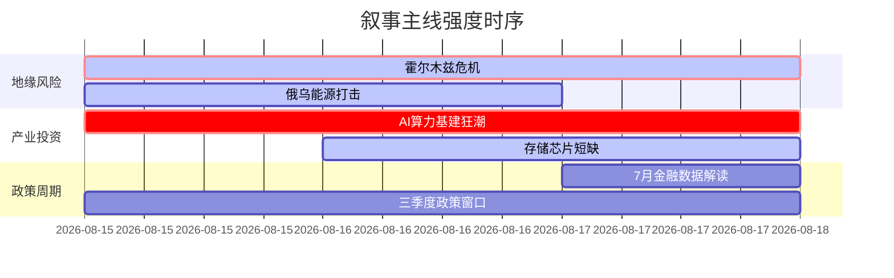

## A股市场情绪分析报告

**数据时段**：2026年8月15日 - 2026年8月17日
**生成时间**：2026年8月17日

### 🔥 宏观叙事焦点（24小时三级过滤）

#### 📌 叙事主线一：霍尔木兹海峡危机与地缘能源冲击 ⭐⭐⭐
**主要事件**：美伊冲突升级、中东航运风险、原油供应中断
**筛选标签**：`国务院政策` `沪深300影响` `路透信源·权重2.0`
**宏观逻辑**：
> ① **归类**：地缘风险事件
> ② **历史镜像**：1990年海湾战争石油禁运模板
> ③ **市场传导**：霍尔木兹海峡袭击事件频发 → WTI原油高开报81.66美元/桶 → 黄金突破4400美元/盎司 → VIX风险溢价上升
> ④ **叙事强度**：伊朗宣称掌控海峡开闭，美国威胁宣布海峡为"美国领土"，双方博弈处于临界点

**行业映射**：能源化工+黄金（情绪评分 **8.1/10**）
**交易警示**：‼️ 关注伊拉克原油出口回升（日均200万桶）与海峡封锁风险的博弈，警惕油价波动对通胀预期的二次冲击

---

#### 📌 叙事主线二：AI算力基建狂潮与硬科技拐点 ⭐⭐
**主要事件**：英伟达5000亿美元融资、Anthropic业绩爆发、存储芯片短缺
**筛选标签**：`部委政策` `产业生命周期` `财新信源·权重1.5`
**宏观逻辑**：
> ① **归类**：产业投资周期
> ② **历史镜像**：2013年移动互联网基建投资模板
> ③ **市场传导**：英伟达联合高盛、贝莱德设立AI基建融资平台 → Anthropic二季度营收115亿美元（同比+14倍）→ 存储芯片价格飙升（SK海力士预计明年"最严重存储荒"）→ A股硬科技板块迎来趋势拐点
> ④ **叙事强度**：黄仁勋提出"词元经济学"，AI算力需求从概念验证进入业绩兑现期

**行业映射**：AI算力链+半导体（情绪评分 **7.5/10**）
**交易警示**：⚠️ 警惕"影子信贷"风险（约700亿美元潜在担保敞口），产业趋势向上但估值分化加剧，业绩主线将过滤纯概念股

---

#### 📌 叙事主线三：7月金融数据与政策窗口期博弈 ⭐
**主要事件**：M2增速7.7%、社融存量增速7.4%、信贷负增长
**筛选标签**：`央行数据` `流动性政策` `新华社信源·权重1.5`
**宏观逻辑**：
> ① **归类**：信用周期观察
> ② **历史镜像**：2022年4月信用底共振经济底模板
> ③ **市场传导**：社融结构改善（债券融资占比提升）→ 企业贷款利率降至3%以下 → 人民币创三年半新高 → 北向资金流入港股超预期
> ④ **叙事强度**：信贷"降速提质"信号明确，政策宽松与内需偏弱形成张力，机构关注三季度政策窗口

**行业映射**：金融+消费复苏链（情绪评分 **5.8/10**）
**交易警示**：✓ 房地产新政效果初显（北京新房成交环比+5.1%），但信贷转负提示内需修复斜率平缓，右侧信号待确认

---

### 📅 宏观叙事演化（三日趋势）

**强度衰减模型**：昨日主题×0.7 · 前日主题×0.5

```mermaid
gantt
    title 叙事主线强度时序
    dateFormat YYYY-MM-DD
    section 地缘风险
    霍尔木兹危机    :crit, active, 2026-08-15, 3d
    俄乌能源打击    :active, 2026-08-15, 2d
    
    section 产业投资
    AI算力基建狂潮  :crit, 2026-08-15, 3d
    存储芯片短缺    :active, 2026-08-16, 2d
    
    section 政策周期
    7月金融数据解读  :2026-08-17, 1d
    三季度政策窗口   :2026-08-15, 3d
```

**叙事节点关联**：
- 08/15：伊朗外长宣称霍尔木兹海峡由伊朗掌控 → 触发地缘能源叙事
- 08/16：英伟达发布5000亿美元AI基建融资方案 → 产业投资叙事强化
- 08/17：央行7月金融数据公布 → 政策周期叙事进入数据验证期

**🎯 宏观叙事三要素**

1️⃣ **政策意图解码**
当前顶层叙事从"稳增长"转向"调结构"，允许短期阵痛换取长期质量。AI算力基建>传统基建，政策定力体现在对产能出清的容忍度提升。

2️⃣ **市场定价偏差**
过度定价：消费复苏弹性（暑期档票房100亿仅为短期脉冲）
定价不足：地缘风险溢价（霍尔木兹危机持续时间被低估）+ AI算力业绩兑现速度（存储荒提前到来）

3️⃣ **跨市场共振**
美债收益率曲线熊陡 + 美元指数承压 = 新兴市场流动性改善窗口；港股南向资金751亿港元净流入显示资金"再平衡"向A股传导路径畅通

---

---

*生成时间：2026-08-17 06:33:28 (UTC+8)*  
*使用模型：agnes:agnes-2.0-flash*