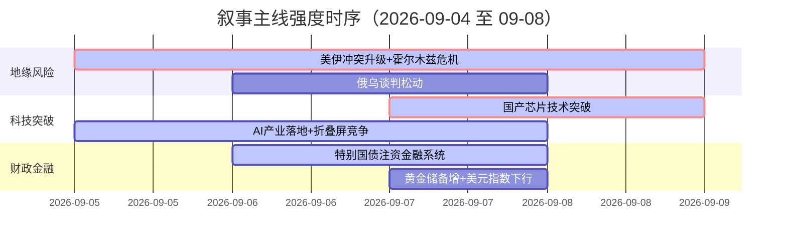

## A股市场情绪分析报告

**数据时段**：最近5日（2026-09-04 至 2026-09-08）  
**生成时间**：2026-09-08 10:00

---

### 🔥 宏观叙事焦点（24小时三级过滤）

#### 📌 叙事主线一：美伊冲突升级与霍尔木兹海峡航运危机 ⭐⭐⭐
**主要事件**：地缘冲突、能源供应链风险、大宗商品价格冲击  
**筛选标签**：`地缘政治` `霍尔木兹海峡` `布伦特原油突破97美元` `路透信源·权重2.0`  
**宏观逻辑**：  
> ① **归类**：地缘风险事件升级  
> ② **历史镜像**：1973年石油危机+2022年俄乌冲突能源冲击模板  
> ③ **市场传导**：美伊军事对峙→霍尔木兹航运中断→布伦特原油升至97美元→能源成本推高→ 周期板块分化+通胀预期升温  
> ④ **叙事强度**：冲突烈度超预期，海峡通航恢复时间不确定，能源风险溢价持续定价  

**行业映射**：能源化工、航运物流（情绪评分 **6.8/10**）  
**交易警示**：‼️ 关注油价突破100美元临界点，警惕通胀预期升温对成长股估值压制  

---

#### 📌 叙事主线二：国产芯片技术突破与科技自主叙事 ⭐⭐⭐
**主要事件**：技术突破、产业投资  
**筛选标签**：`国产替代` `华为麒麟9050 Pro` `科创50涨超2%` `财新信源·权重1.8`  
**宏观逻辑**：  
> ① **归类**：科技自立自强  
> ② **历史镜像**：2019年华为被制裁后的国产替代加速期  
> ③ **市场传导**：麒麟9050 Pro亮相→逻辑折叠技术突破→国产芯片信心提振→ 科创/半导体板块领涨（源杰科技涨超13%）  
> ④ **叙事强度**：技术突破落地+产品迭代加速，叙事从"预期"转向"兑现"  

**行业映射**：半导体芯片、算力硬件、消费电子（情绪评分 **7.5/10**）  
**交易警示**：⚠️ 摩尔线程解禁首日跌20%警示高位科技股筹码压力，分化加剧  

---

#### 📌 叙事主线三：金融系统资本补充与财政发力 ⭐⭐
**主要事件**：货币政策、财政注资  
**筛选标签**：`特别国债注资` `3570亿元金融资本补充` `央行增持黄金` `新华社信源·权重1.5`  
**宏观逻辑**：  
> ① **归类**：金融稳定与流动性管理  
> ② **历史镜像**：2015年股灾后补充券商资本金+2023年特别国债发行模板  
> ③ **市场传导**：财政部注资7家银行+4家险企→金融体系资本充足率强化→ 银行股估值修复+风险偏好改善  
> ④ **叙事强度**：注资规模超预期，政策定力明确，金融稳定底线思维强化  

**行业映射**：券商、银行、保险（情绪评分 **6.2/10**）  
**交易警示**：✓ 中金吸收合并获批开启券商行业整合周期，关注后续重组预期  

---

### 📅 宏观叙事演化（五日趋势）

**强度衰减模型**：昨日主题×0.7 · 前日主题×0.5

```mermaid
gantt
    title 叙事主线强度时序（2026-09-04 至 09-08）
    dateFormat YYYY-MM-DD
    section 地缘风险
    美伊冲突升级+霍尔木兹危机   :crit, active, 2026-09-05, 4d
    俄乌谈判松动               :2026-09-06, 2d
    
    section 科技突破
    国产芯片技术突破           :crit, active, 2026-09-07, 2d
    AI产业落地+折叠屏竞争      :active, 2026-09-05, 3d
    
    section 财政金融
    特别国债注资金融系统       :active, 2026-09-06, 2d
    黄金储备增+美元指数下行    :2026-09-07, 1d
```

叙事节点关联：
- **09/05**：美伊军事对峙升级→伊朗打击美关联船只→霍尔木兹航运风险定价
- **09/06**：俄乌谈判突破性进展→普京暂停空袭基辅3天→地缘风险局部缓释
- **09/06**：财政部注资3570亿元落地→金融系统资本补充超预期→银行险企行情启动
- **09/07**：华为麒麟9050 Pro发布+三大厂商折叠屏对决→科技主线强化
- **09/08**：伦铜创历史新高+美元指数跌破98→跨市场信号：全球通胀预期升温+美元信用动摇

🎯 宏观叙事三要素

**1️⃣ 政策意图解码**  
当前顶层叙事呈现"双轨并行"特征：对内强化金融稳定与科技自立（特别国债注资+国产芯片突破），对外应对地缘不确定性（黄金增持+外汇储备稳守）。政策定力明确，稳增长与防风险并重。

**2️⃣ 市场定价偏差**  
- **过度定价**：地缘风险对A股的传导（市场独立性强于历史经验）  
- **定价不足**：金融资本补充对券商板块估值的修复弹性、国产芯片突破的产业带动效应

**3️⃣ 跨市场共振**  
美元指数跌破98+伦铜历史新高+黄金周期低点确认 = 全球大宗商品通胀预期升温；A股创业板涨3.41%、科创50涨超2%，市场分化中科技主线突出，结构性行情窗口持续。

---

*报告正文至此结束*

---

*生成时间：2026-09-08 08:12:34 (UTC+8)*  
*使用模型：agnes:agnes-2.0-flash*