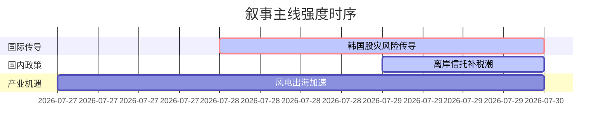

## A股市场情绪分析报告

**数据时段**：2026-07-24至2026-07-28（最近5日）  
**生成时间**：2026-07-30

---

### 🔥 宏观叙事焦点（24小时三级过滤）

#### 📌 叙事主线一：**韩国股灾与杠杆ETF风险传导** ⭐⭐⭐
**主要事件**：SK海力士业绩爆雷引发AI板块担忧，监管拟限制散户交易个股杠杆ETF  
**筛选标签**：`A股指数调整` `杠杆工具风险` `路透信源·权重2.0`  
**宏观逻辑**：  
> ① **归类**：估值修正潮  
> ② **历史镜像**：2022年纳斯达克AI泡沫破裂模板  
> ③ **市场传导**：KOSPI两日跌幅近20%触发两次熔断 → 科创50日内最大跌幅近5% → A股创业板指重挫7%  
> ④ **叙事强度**：科技成长股杀跌动能强，全球AI算力链波动情绪共振明显  

**行业映射**：半导体/计算机（情绪评分 **4.5/10**）  
**交易警示**：‼️ 警惕杠杆ETF风险外溢，关注超跌科技股反弹机会，但需防范盈利不及预期持续拖累估值

---

#### 📌 叙事主线二：**离岸信托"补税潮"震动财富圈** ⭐⭐
**主要事件**：财政部2026年第21号公告全透明税制穿透信托架构，存量信托追溯清缴  
**筛选标签**：`财税政策落地` `财富管理规范` `新华社信源·权重1.5`  
**宏观逻辑**：  
> ① **归类**：财税体制深化改革  
> ② **历史镜像**：2018年范冰冰"阴阳合同"补税事件模板  
> ③ **市场传导**：富豪级补税压力显现（黄峥500亿、吴亚军30亿等）→ 资本谨慎态度升温 → 港股IPO市场活跃度受考验  
> ④ **叙事强度**：监管信号明确，合规时代正式开启，财富传承模式被迫重构  

**行业映射**：金融服务/地产相关（情绪评分 **5.2/10**）  
**交易警示**：⚠️ 短期对高净值人群投资意愿形成压制，长期看规范化有利于资本市场健康发展

---

#### 📌 叙事主线三：**风电出海加速与绿色能源产业链** ⭐
**主要事件**：中国风电半年揽单4.4GW，在手订单超百亿，版图跨越三大洲  
**筛选标签**：`新能源产业` `政策支持导向` `财新信源·权重1.5`  
**宏观逻辑**：  
> ① **归类**：新质生产力培育  
> ② **历史镜像**：2013-2015年光伏海外扩张周期  
> ③ **市场传导**：海外订单爆发 → 铜镍等上游材料需求改善 → 电力设备板块估值修复  
> ④ **叙事强度**：产业竞争优势确立，出口驱动增长逻辑强化，具备持续发酵潜力  

**行业映射**：电力设备/机械（情绪评分 **6.8/10**）  
**交易警示**：✓ 叙事逻辑清晰，等待订单兑现验证业绩弹性

---

### 📅 宏观叙事演化（三日趋势）

**强度衰减模型**：昨日主题×0.7 · 前日主题×0.5

```mermaid
gantt
    title 叙事主线强度时序
    dateFormat  YYYY-MM-DD
    section 国际传导
    韩国股灾风险传导   :crit, active, 2026-07-28, 2d
    
    section 国内政策
    离岸信托补税潮     :active, 2026-07-29, 1d
    
    section 产业机遇
    风电出海加速       :2026-07-27, 3d
```

叙事节点关联：
- **7月27日**：长鑫科技上市带动国产存储关注度提升，风电出海订单强劲
- **7月28日**：SK海力士业绩爆雷引爆全球半导体抛售潮，A股创业板指重挫7%，科50日内最大跌幅近5%
- **7月29日**：财政部21号公告发布引发离岸信托补税震荡，同时央行开展2065亿元逆回购维护流动性

🎯 **宏观叙事三要素**
1️⃣ **政策意图解码**：监管层从"稳预期"转向"强规范"，通过离岸信托补税明确财富端改革决心；同时以逆回购操作维持流动性合理充裕。
2️⃣ **市场定价偏差**：过度定价：AI算力硬件估值（海外风险暴露后大幅回调）；定价不足：出海型制造龙头（风电订单未充分反映）。
3️⃣ **跨市场共振**：韩股暴跌冲击全球科技股估值 + 中东局势缓和油价回落 = 风险偏好受限但输入性通胀压力缓解，A股结构性分化行情窗口期。

---

*生成时间：2026-07-29 20:26:57 (UTC+8)*  
*使用模型：agnes:agnes-2.0-flash*