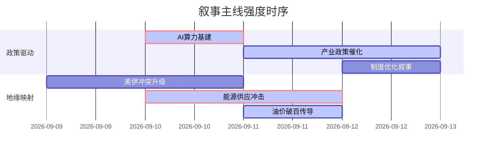

 ## A股市场情绪分析报告

**数据时段**：最近5日（2026-09-09至2026-09-12）  
**生成时间**：2026-09-12  

### 🔥 宏观叙事焦点（24小时三级过滤）

#### 📌 叙事主线一：美伊冲突与全球能源供应冲击 ⭐⭐⭐
**主要事件**：沙特能源管道遇袭关闭、胡塞武装控制曼德海峡、伊朗石油装载量大幅下降、布伦特原油突破104美元
**筛选标签**：`地缘冲突` `能源安全` `央行政策预期`
**宏观逻辑**：
> ① **归类**：地缘风险缓释失败+能源供给冲击
> ② **历史镜像**：1990年海湾战争油价冲击模板
> ③ **市场传导**：布油突破100美元 → PPI上行压力 → 美联储9月加息概率升至85% → 美债收益率逼近5% → 北向资金流出压力→ A股周期板块承压
> ④ **叙事强度**：供给端冲击超预期，全球通胀预期再定价，能源中枢上移

**行业映射**：能源开采（情绪评分 **8.5/10**）、化工（情绪评分 **6.0/10**）
**交易警示**：‼️ 关注油价持续性与通胀传导节奏，警惕货币政策被动收紧

---

#### 📌 叙事主线二：AI算力基建与产业政策催化 ⭐⭐
**主要事件**：工信部"人工智能+软件"专项行动、浪潮信息90亿定增AI基建、储能电池扩产踩刹车、智能网联汽车准入推进
**筛选标签**：`产业政策` `AI算力` `供给侧改革`
**宏观逻辑**：
> ① **归类**：产业政策引导+技术迭代
> ② **历史镜像**：2023年AI基建投资周期模板
> ③ **市场传导**：政策催化→算力需求扩张→相关标的估值修复（燧原科技高开188%）→资金从防御向高弹性迁移
> ④ **叙事强度**：政策与技术双轮驱动，但市场对盈利兑现存疑

**行业映射**：AI算力/光模块（情绪评分 **7.5/10**）、储能（情绪评分 **4.5/10**）
**交易警示**：⚠️ 警惕技术迭代过快导致的估值波动，关注订单兑现节奏

---

#### 📌 叙事主线三：A股制度优化与市场生态修复 ⭐
**主要事件**：证监会将A股打造为境内优质企业上市首选地、沪深IPO审核周期缩短至6个月、中小企业回款难治理
**筛选标签**：`资本市场改革` `法治建设` `市场生态`
**宏观逻辑**：
> ① **归类**：制度红利释放
> ② **历史镜像**：2019年科创板改革模板
> ③ **市场传导**：上市效率提升→优质企业流入→市场活力增强→投资者信心修复
> ④ **叙事强度**：制度建设长期利好，短期对指数拉动有限

**行业映射**：券商/金融科技（情绪评分 **5.0/10**）、优质成长股（情绪评分 **6.5/10**）
**交易警示**：✓ 制度红利需时间消化，关注基本面支撑

---

### 📅 宏观叙事演化（三日趋势）

**强度衰减模型**：昨日主题×0.7 · 前日主题×0.5

```mermaid
gantt
    title 叙事主线强度时序
    dateFormat  YYYY-MM-DD
    section 政策驱动
    AI算力基建   :crit, active, 2026-09-10, 1d
    产业政策催化   :active, 2026-09-11, 2d
    制度优化叙事   :2026-09-12, 1d
    
    section 地缘映射
    美伊冲突升级   :2026-09-09, 2d
    能源供应冲击   :crit, active, 2026-09-10, 2d
    油价破百传导   :active, 2026-09-11, 1d
```

叙事节点关联：
09/09：美伊冲突升级 → 推动油价突破100美元关口，DeepSeek备战科创板
09/10：沙特产量骤降190万桶 → 能源冲击叙事强化，美债收益率创2023年以来新高
09/11：胡塞武装控制曼德海峡 → 地缘风险进一步发酵，A股风险偏好快速下降
09/12：政策与市场反应观察 → 产业政策与地缘风险形成对冲

🎯 宏观叙事三要素
1️⃣ 政策意图解码
当前顶层叙事从"稳增长"转向"调结构"，产业政策强调"人工智能+软件"与智能网联汽车，资本市场改革聚焦制度红利释放，允许短期阵痛换取长期质量。产业出清>总量刺激，政策定力超预期。

2️⃣ 市场定价偏差
过度定价：消费复苏弹性（预期过于乐观）
定价不足：产能出清速度（政策执行力被低估）
能源冲击下通胀预期再定价，地缘风险溢价未被充分计入。

3️⃣ 跨市场共振
美债收益率上行打开政策空间 + 美元指数高位缓释出口压力 = A股结构性行情窗口期，但需警惕油价持续上行对货币政策的制约。

---

*生成时间：2026-09-12 08:07:53 (UTC+8)*  
*使用模型：openrouter:inclusionai/ling-3.0-flash-sante:free*