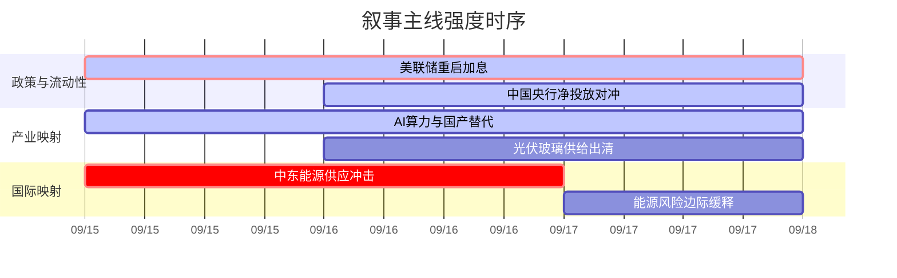

# A股市场情绪分析报告

**数据时段**：最近5日（5期BB文件，新闻覆盖2026-09-14—2026-09-17）  
**生成时间**：2026-09-17 22:52:58 (UTC+8)（北京时间）

### 🔥 宏观叙事焦点（24小时三级过滤）

#### 📌 叙事主线一：美联储重启加息，全球流动性重新定价 ⭐⭐⭐
**主要事件**：央行货币政策、全球风险资产重定价与跨境资本约束  
**筛选标签**：`美联储加息` `全球流动性收紧` `BB文件·权重2.0`  
**宏观逻辑**：  
> ① **归类**：货币政策收紧  
> ② **历史镜像**：2022年美联储加息与美债收益率上行模板  
> ③ **市场传导**：联邦基金利率上调25bp至3.75%—4% → 两年期美债收益率升至约4.60%、十年期一度突破5% → 黄金与美股承压、亚洲货币走弱 → A股成交缩量并偏向高股息防御  
> ④ **叙事强度**：点阵图暗示年内或再加息，外部折现率压力成为5日最强宏观变量；央行净投放形成局部对冲，但尚未改变全球紧缩主导逻辑  

**行业映射**：高股息防御链（情绪评分 **5.8/10**）  
**交易警示**：‼️ 关注美债收益率、美元与人民币汇率共振，警惕海外波动向A股成长风格二次传导  

---

#### 📌 叙事主线二：先进制造业规划升级，AI算力与国产替代共振 ⭐⭐
**主要事件**：产业政策、技术发布与产业投资  
**筛选标签**：`部委规划` `产业生命周期` `BB文件·权重1.8`  
**宏观逻辑**：  
> ① **归类**：产业升级与自主可控  
> ② **历史镜像**：2019—2020年半导体国产替代与算力基础设施投资模板  
> ③ **市场传导**：电子信息制造业2030年营收目标超30万亿元 → 芯片、HBM、光互联及液冷资本开支扩张 → 算力ETF、机器人供应链审厂与前沿科技融资落地 → 电子、半导体及光通信主线强化  
> ④ **叙事强度**：顶层指示、“十五五”规划、产品发布与量产验证形成政策—产业闭环；但HBM供给、订单回款及海外利率仍约束估值扩张  

**行业映射**：电子、半导体与算力（情绪评分 **8.0/10**）  
**交易警示**：⚠️ 关注订单、现金流与产能利用率验证，警惕主题拥挤及海外技术限制升级  

---

#### 📌 叙事主线三：中东能源冲击先强后弱，贸易摩擦抬升尾部风险 ⭐
**主要事件**：国际冲突、能源制裁与关税政策  
**筛选标签**：`地缘冲突` `能源安全` `BB文件·权重1.5`  
**宏观逻辑**：  
> ① **归类**：风险事件冲高回落  
> ② **历史镜像**：2019年沙特能源设施遇袭模板  
> ③ **市场传导**：霍尔木兹通行量下降、沙特输油管道停运 → 国际油价突破105美元、国内原油及化工品上涨 → 通胀与加息预期升温 → 原油单日跌逾6%、纯苯跌停 → 价格确认转弱  
> ④ **叙事强度**：对俄石油关税、美欧贸易威胁仍保留尾部风险，但能源价格反转表明供应冲击叙事已由一级驱动降为二级风险  

**行业映射**：石油石化与化工（情绪评分 **4.2/10**）  
**交易警示**：‼️ 事件热度与价格信号出现背离，避免追涨，关注航运恢复、库存变化及制裁实际落地  

---

### 📅 宏观叙事演化（三日趋势）

**强度衰减模型**：昨日主题×0.7 · 前日主题×0.5

```mermaid
gantt
    title 叙事主线强度时序
    dateFormat  YYYY-MM-DD
    axisFormat  %m/%d
    section 政策与流动性
    美联储重启加息       :crit, active, 2026-09-15, 3d
    中国央行净投放对冲   :active, 2026-09-16, 2d
    
    section 产业映射
    AI算力与国产替代     :active, 2026-09-15, 3d
    光伏玻璃供给出清     :2026-09-16, 2d
    
    section 国际映射
    中东能源供应冲击     :crit, 2026-09-15, 2d
    能源风险边际缓释     :2026-09-17, 1d
```
叙事节点关联：  
09/15：霍尔木兹与沙特管道风险升温、美联储加息概率升至约90% → 能源冲击与紧缩叙事同步增强  
09/16：美联储加息25bp落地、电子信息制造业规划明确 → 外部压力得到确认，国产算力主线同步强化  
09/17：点阵图指向年内再收紧、央行净投放1590亿元，原油跌逾6% → 流动性压制延续，能源叙事边际衰减  

🎯 宏观叙事三要素  
1️⃣ 政策意图解码  
外部政策以抗通胀和防风险为先，国内政策以先进制造业、长期资金及金融服务实体经济稳定预期；总量流动性保持充裕，但信用扩张更强调结构、效率与风险约束。  
2️⃣ 市场定价偏差  
过度定价：中东供应中断的持续性、AI主题短期弹性  
定价不足：美联储年内再次加息的概率、HBM等先进存储瓶颈及企业回款压力  
3️⃣ 跨市场共振  
美债收益率与美元高位压制黄金、亚洲货币及A股成长估值；国内净投放、基金发行超8000亿元与产业规划支撑高股息和算力方向；油化价格反转则确认能源风险叙事边际衰减。

---

*生成时间：2026-09-17 22:52:58 (UTC+8)*  
*使用模型：openrouter:nex-agi/nex-n2.5-pro:free*